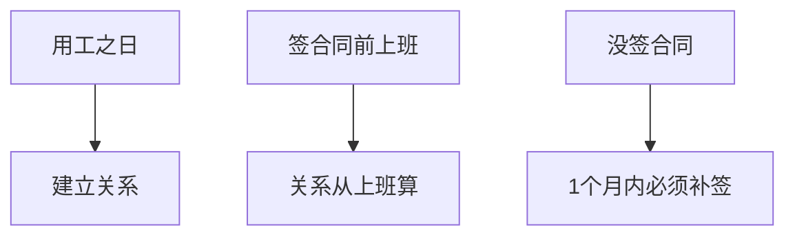
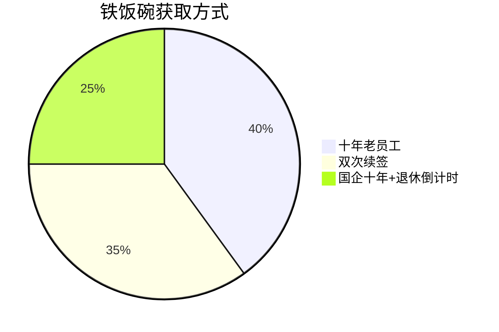
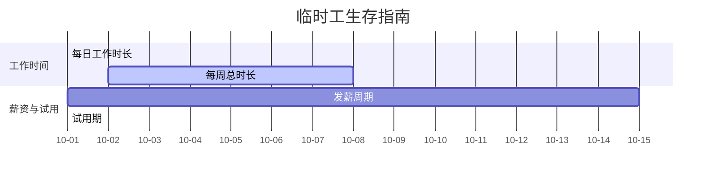
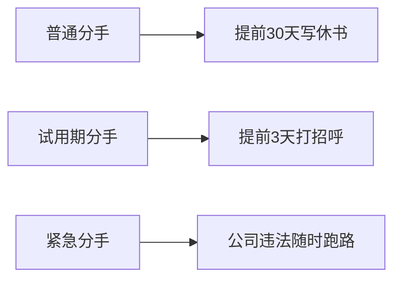
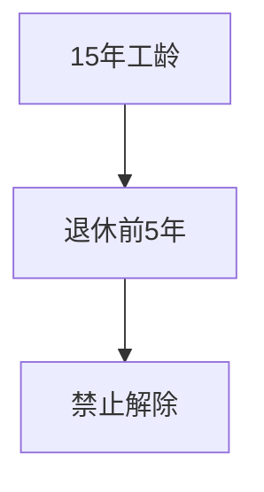
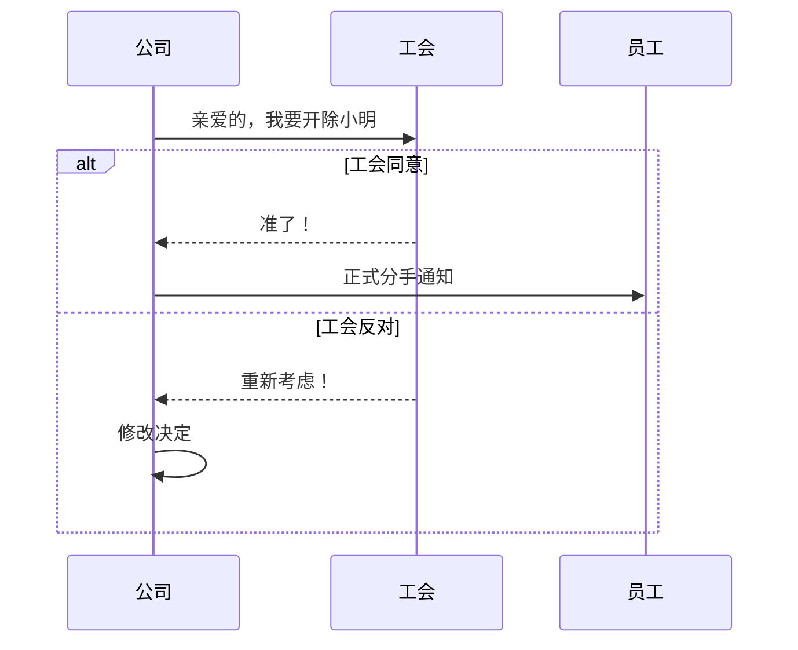

## 📜合同签订三原则

重点考点：
- 🔥劳动关系从实际搬砖开始，不是签合同时间。
- 💡就像先同居后领证，法律从同居日开始保护。

## 🕰️合同类型大比拼 - 无固定期限合同触发条件

记忆口诀："十年熬成婆，续约两次跑不脱，国企养老有政策"

## 🧪试用期避坑指南 - 试用期时长对照表
|合同期限|试用期上限|类比|
|----|----|----|
|3月~1年|1个月|闪婚冷静期|
|1~3年|2个月|婚前同居期|
|3年以上|6个月|超长待机模式|
|临时工|禁止试用|一见钟情型|

重点陷阱：
- ⚠️同一公司只能试用一次！复婚不用再试婚。
- 💸试用期工资 ≥ 正式工资80% ≥ 最低工资。

## 🕵️♂️竞业禁止小剧场
适用人群：👨💼高管 👩🔬技术大牛 🤫保密岗位（保洁阿姨不用签，放心跳槽）

重点考点：
- 🔥离职后最长禁业2年 → 像离婚后的冷静期plus。

## ⏱️非全日制用工快闪族

特色服务：
- 🗣️口头协议即可。
- 💨随时说拜拜。
- 💰没有分手费。

## 📦劳务派遣三限令
|限制类型|具体要求|类比|
|----|----|----|
|岗位限制|临时/辅助/替代性|备胎岗位|
|合同限制|≥2年固定合同|超长待机|
|薪资保障|无业期间发最低工资|失业救济金|

重点考点：
- 🔥派遣工要同工同酬 → 正式工喝奶茶你也有份。

## 💔劳动合同分手大全
### 员工辞职姿势

### 公司开除红绿灯
|情形|处理方式|赔偿|
|----|----|----|
|员工犯错|立即开除|无赔偿|
|能力不足|培训+调岗+提前30天通知|要给钱|
|客观情况变化|协商不成+提前30天通知|要给钱|

### 公司不得开除的护身符
- 🏥职业病观察期（体检没做完别想跑）
- 🤕工伤致残（搬砖受伤要养一辈子）
- 🤰三期女员工（孕妇Buff无敌）

## 🚫 公司不得开除的"金钟罩"
### 新增第五条护体神功

记忆梗：
- 👴 老司机保护条款 → 就像游戏里的"濒死保护"，熬到15年+退休前5年自动获得无敌buff

### 五重防护总结表
|防护类型|类比|有效期|
|----|----|----|
|职业病检查期|拆弹专家排雷中|检查完成前|
|工伤致残|终身VIP会员卡|永久|
|医疗期内|病假护身符|医疗期|
|三期女员工|孕产哺乳金钟罩|孕期+产假+哺乳期|
|十五年+临退休|老员工终身成就奖|退休前5年|

## 💸 分手费计算指南
### 经济补偿金公式
补偿月数 = 工作年限 × 月工资（就像信用卡积分，每满1年积1分，零头四舍五入）

### 计算示例
|工龄|计算方式|实得补偿|
|----|----|----|
|3年2个月|3个月工资|🥉|
|5年7个月|6个月工资|🥇（半年以上按1年算）|
|2年4个月|2.5个月工资|🥈|

重点考点：
- 🔥 月工资指离职前12个月平均工资（含奖金补贴）
- ⚠️ 高收入者最多按3倍社平工资计算

## 📢 解除合同必备流程

记忆口诀："分手要报居委会，单方面离婚无效！"

### 易错点警示
- ⚠️ 医疗期≠治疗期（医疗期长短与工龄挂钩）
- ⚠️ 月工资包含奖金补贴（不是基本工资！）
- ⚠️ 工会通知是必经程序（跳过直接开除属违法）
