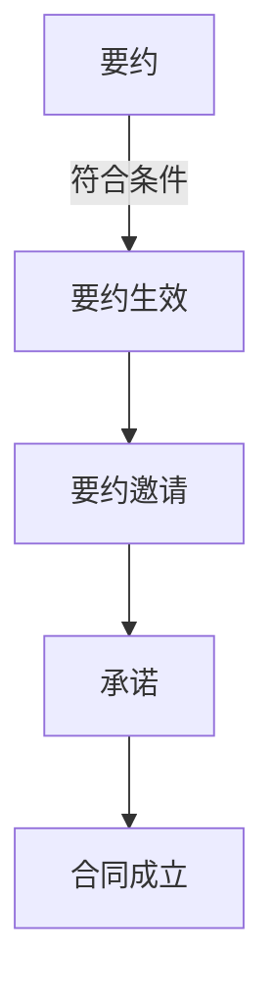
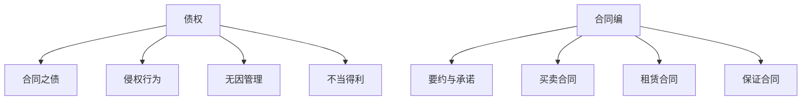
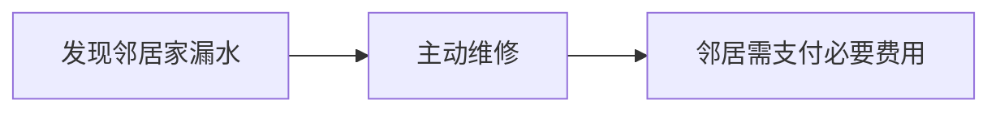
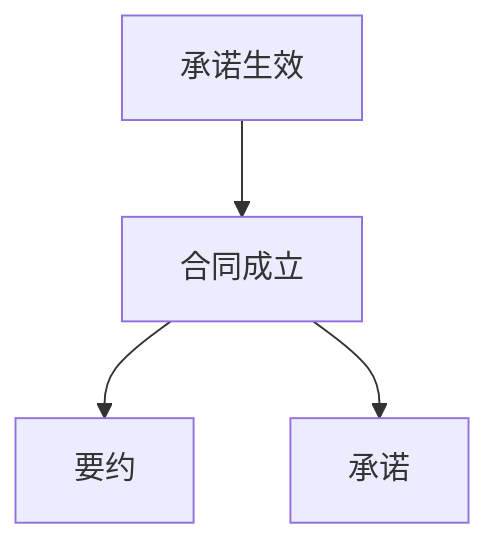

# 第二部分 债权 💼

## 一、债权的概念 🌟

债权是因合同、侵权行为、无因管理、不当得利以及法律的其他规定，权利人请求特定义务人为或者不为一定行为的权利。享有权利的人是债权人，负有义务的人是债务人。🤝

## 二、债的产生原因 🛠️

### （一）合同之债 📜
合同之债是最常见的债产生原因，合同双方约定好了你做什么我做什么，大家各司其职。

### （二）侵权行为 🚫
侵权行为是指一方因为违法行为导致另一方受到损害，受害方可以要求赔偿。

### （三）无因管理 👨‍🔧
#### 1. 无因管理的概念
管理人没有法定的或者约定的义务，为避免他人利益受损失而管理他人事务的，可以请求受益人偿还因管理事务而支出的必要费用；管理人因管理事务受到损失的，可以请求受益人给予适当补偿。比如你帮邻居看管他家的花园，邻居回来就得给你报销花肥钱。🌷

#### 2. 无因管理之债的效力
- 管理人有权请求本人支付管理过程中支付的必要费用。
- 管理人有权请求本人补偿因管理事务而遭受的损失。

### （四）不当得利 💸
#### 1. 不当得利的成立要件
- 一方取得财产利益；
- 一方受有损失；
- 取得利益与所受损失间有因果关系；
- 没有法律上的根据。

#### 2. 不当得利的效力
返还的不当利益，应当包括原物和原物所生的孳息。比如你误打误撞取了别人的银行转账，这笔钱和利息都得还回去。💰

## 三、民法典中的合同编 📜

合同是民事主体之间设立、变更、终止民事法律关系的协议。

### （一）要约、要约邀请和承诺 💌
#### 1. 要约
要约是希望与他人订立合同的意思表示，该意思表示应当符合下列条件：
- 内容具体确定；
- 表明经受要约人承诺，要约人即受该意思表示约束。

#### 2. 要约邀请
要约邀请是希望他人向自己发出要约的表示。拍卖公告、招标公告、商业广告等为要约邀请。📣

#### 3. 承诺
承诺是受要约人同意要约的意思表示。承诺生效时合同成立，但是法律另有规定或者当事人另有约定的除外。承诺的内容应当与要约的内容一致。📝

### （二）买卖合同 🛒
#### 1. 分期付款的买卖合同
买受人在合理期限内未支付到期价款的数额达到全部价款的五分之一，出卖人可以请求支付全部价款或者解除合同。

#### 2. 试用买卖合同
试用买卖的买受人在试用期内可以购买标的物，也可以拒绝购买。试用期限届满，买受人对是否购买标的物未作表示的，视为购买。🛍️

### （三）赠与合同 🎁
#### 1. 赠与人的任意撤销权
赠与人在赠与财产的权利转移之前可以撤销赠与。经过公证的赠与合同或者依法不得撤销的具有救灾、扶贫、助残等公益性质的赠与合同，不适用前款规定。🎀

### （四）借款合同 💸
自然人之间的借款合同，自贷款人提供借款时成立。禁止高利放贷，借款的利率不得违反国家有关规定。借款合同对支付利息没有约定的，视为没有利息。💵

### （五）保证合同 🔒
保证合同是主债权债务合同的从合同。主债权债务合同无效的，保证合同无效。机关法人不得为保证人，但经国务院批准为使用外国政府或者国际经济组织贷款进行转贷的除外。以公益为目的的非营利法人、非法人组织不得为保证人。

#### 1. 保证方式
保证的方式包括一般保证和连带责任保证。当事人在保证合同中对保证方式没有约定或者约定不明确的，按照一般保证承担保证责任。

#### 2. 保证期间
保证期间为主债务履行期限届满之日起六个月。📅

### （六）租赁合同 🏠
#### 1. 租赁期限
租赁期限不得超过二十年。超过二十年的，超过部分无效。租赁期限届满，当事人可以续订租赁合同；但续订的租赁期限不得超过二十年。

#### 2. 维修义务
出租人应当履行租赁物的维修义务，承租人可以请求维修。出租人不履行维修义务的，承租人可以自行维修，费用由出租人负担。因维修影响使用的，应当相应减少租金或延长租期。

#### 3. 买卖不破租赁
租赁物在承租人按照租赁合同占有期间发生所有权变动的，不影响租赁合同的效力。⚖️

#### 4. 优先购买权 vs 优先承租权
出租人出卖租赁房屋的，应当在出卖之前通知承租人，承租人享有以同等条件优先购买的权利。租赁期限届满，承租人享有以同等条件优先承租的权利。🏘️

### （七）其他 📝
#### 1. 保理合同
保理合同是应收账款债权人将现有的或者将有的应收账款转让给保理人，保理人提供资金融通、应收账款管理或者催收、应收账款债务人付款担保等服务的合同。💳

#### 2. 物业服务合同
物业服务合同是物业服务人在物业服务区域内，为业主提供建筑物及其附属设施的维修养护、环境卫生和相关秩序的管理维护等物业服务，业主支付物业费的合同。🏢

#### 3. 合伙合同
合伙人应当按照约定的出资方式、数额和缴付期限，履行出资义务。一个或者数个合伙人不履行出资义务的，其他合伙人不能因此拒绝出资。🤝

#### 4. 中介合同
委托人在接受中介人的服务后，利用中介人提供的交易机会或者媒介服务，绕开中介人直接订立合同的，应当向中介人支付报酬。💼



# 债权与合同编核心笔记 📚



---

## 一、债权核心概念 🔍
**债权**：权利人请求特定义务人为或不为一定行为的权利  
- 👤 **债权人**：权利方（如借钱的人）
- 👥 **债务人**：义务方（如欠钱的人）

---

## 二、债的产生原因 💡

### 1. 合同之债 📝
- **典型场景**：签订购房合同后，买方有权要求交房

### 2. 侵权行为 ⚖️
- **例子**：开车撞坏他人围墙需赔偿 → 产生赔偿之债

### 3. 无因管理 🛠️

- **构成要件**：
  1. 无法律/约定义务
  2. 主观为避免他人损失
  3. 管理他人事务
- **效力**：
  - 🚩 管理人可索要必要费用
  - 🚩 管理人受损可请求补偿

### 4. 不当得利 💰
| 要件 | 示例 |
|------|------|
| 一方获利 | 银行误转10万到账户 |
| 他方受损 | 银行资金减少 |
| 因果关系 | 转账直接导致损失 |
| 无法律依据 | 无合同约定 |

---

## 三、合同编重点突破 🏗️

### 1. 要约 vs 要约邀请 🎯
| 类型 | 特点 | 示例 |
|------|------|------|
| 要约 | 内容具体+受约束 | "5000元卖手机，限今天" |
| 要约邀请 | 引诱他人发要约 | 商场促销广告 |

### 2. 承诺关键规则 ✅
- **生效即合同成立**（网购提交订单成功时合同成立）
- **实质性变更**：价格/履行方式等变动 → 视为新要约

---

## 四、高频考点速记 🚩

### 1. 买卖合同
- **分期付款**：未付达1/5 → 可解除合同+收使用费
- **试用买卖**：到期不表态=购买

### 2. 借款合同
- **自然人借款**：提供借款时成立
- **利息规则**：
  ```mermaid
  graph LR
    A[未约定利息] --> B[视为无息]
    C[约定不明] --> D[自然人=无息]
  ```

### 3. 保证合同
- **保证方式**：未约定 → **一般保证**（先诉抗辩权）
- **保证期间**：主债务期满后6个月 ⏳

### 4. 租赁合同
| 规则 | 要点 |
|------|------|
| 最长20年 | 超期部分无效 |
| 维修义务 | 出租人负责（承租人过错除外） |
| 买卖不破租赁 | 🏠所有权变动不影响租赁效力 |

---

## 五、记忆口诀 📌
- **无因管理**：无义务、为他人、可要钱
- **保证期间**：主债期满六个月
- **租赁维修**：房东修，租客错了自己扛

---

## 六、真题示例 💯
【2021年真题】  
甲将房屋租给乙，租期25年。下列说法正确的是：  
A. 合同全部无效  
B. 前20年有效，后5年无效  
C. 可续订一次使总期限达40年  
✅ **答案**：B（租赁超20年部分无效）

---



