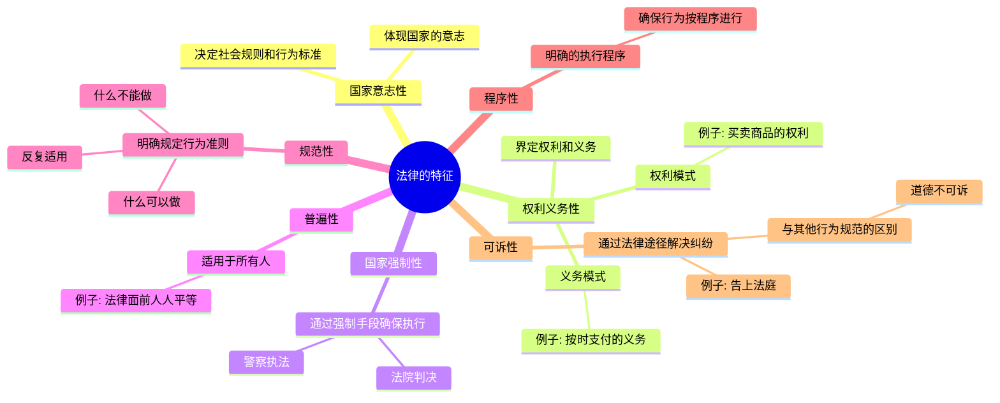
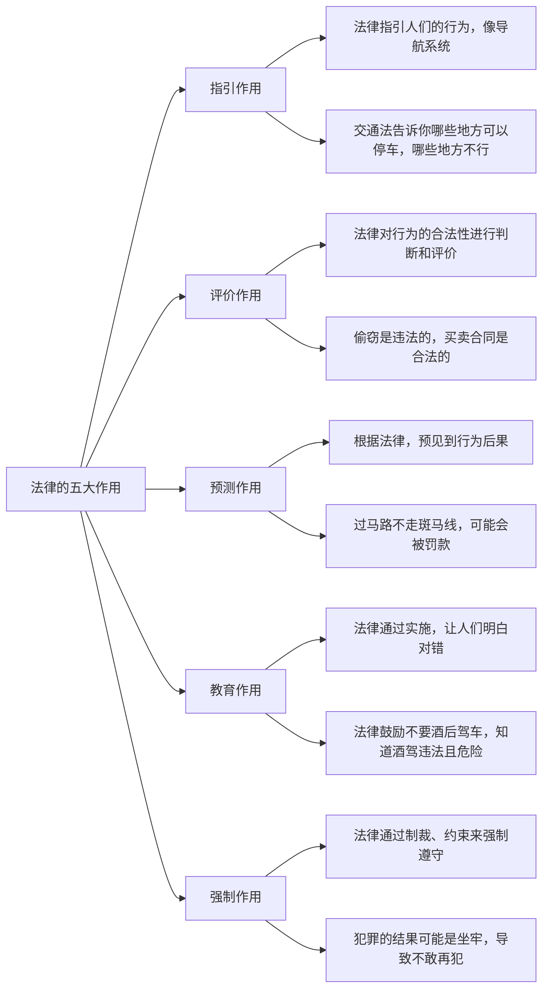

# 📜 **法的概念**  

## 一、法的含义与特征  

### （一）法的含义  
法是由国家**制定、认可并依靠**国家强制力**保证实施的行为规范体系。其主要内容包括**权利**和**义务，调整的是人们的行为关系，反映的是由特定社会条件所决定的统治阶级或人民的意志。  

- **简单来说**：法就像国家的“游戏规则”，它通过强制手段确保大家都遵守，保证社会秩序和公平。

### （二）法的特征  

1. **国家意志性**  
   法体现了国家的意志，就像国家的“心情”，它决定了社会规则和大家的行为标准。

2. **权利义务性**  
   法是为了界定每个人的**权利**和**义务**，设定了“权利模式”和“义务模式”。  
   - **例子**：你有买卖商品的权利，但也有按时支付的义务。

3. **国家强制性**  
   法不只是说说而已，还能通过强制手段（比如法院判决、警察执法）确保执行。

4. **普遍性**  
   法适用于所有人，不能偏袒任何一方。  
   - **比如**：无论你是普通市民还是大老板，法律面前都是平等的。

5. **规范性**  
   法明确规定了**什么可以做**，**什么不能做**，且这些规定能够反复适用。

6. **程序性**  
   法有一套明确的执行程序，确保每个人都能按照既定程序来进行行为。

7. **可诉性**  
   法具有“可诉性”，意味着如果有人违反了法，可以通过法律途径来解决（告上法庭）。  
   - **“可诉性”是法与其他行为规范的最大区别**，道德不可以告上法庭！

## 二、法与社会  

### （一）法与政策  
**法与党的政策密切相关**，党的政策对法的建设具有指导作用，法则是实现政策的工具。  
- **例子**：法律会在党的政策基础上逐步完善，最终使得党制定的政策能够在实践中更好地实现。

### （二）法与道德  
法律与道德的关系可以看作**法**是“硬性规定”，而**道德**是“内心自律”。  
- **对比**：法律主要关注行为的外在表现，而道德关注的是内心动机。  
  - 法：你偷了东西，我能判你刑；  
  - 道德：你偷了东西，社会舆论会让你心里不舒服。

| 比较       | 法律           | 道德          |
| -------- | ------------ | ----------- |
| **创制**   | 由国家有权机关制定    | 自然演进、无明确规定  |
| **强制性**  | 外在强制（警察、法院等） | 内心约束（良知、舆论） |
| **解决方式** | 可诉性、裁决       | 无法诉讼，靠社会评价  |

---

## 三、法的作用  

法的作用是**影响社会生活的力量**。  
根据法的作用方式和内容，可以分为**规范作用**和**社会作用**。  

### （一）规范作用 （考这个） 

- **指引作用**  
   - 法指引人们的行为，像**导航系统**一样告诉你**哪里能去，哪里不能去**。  
   - **例子**：交通法告诉你哪些地方可以停车，哪些地方不行。

- **评价作用**  
   - 法对行为的合法性进行**判断和评价**，比如“违法”还是“合规”**。  
   - **例子**：偷窃是违法的，买卖合同是合法的。

- **预测作用**  
   - 根据法律，你可以预见到自己或他人的行为后果。  
   - **比如**：如果你过马路不走斑马线，可能会被罚款。

- **教育作用**  
   - 法通过实施，让人们逐渐明白**什么是对的，什么是错的**，潜移默化地影响大家的行为。  
   - **例如**：法律鼓励大家不要酒后驾车，让你知道酒驾不仅危险，还会违法。

- **强制作用**  
   - 法能够通过**制裁**、**约束**来强制人们遵守，类似警察“看见你做错事就抓你”一样。  
   - **例子**：犯罪的结果可能是坐牢，导致你不敢再犯。

### （二）社会作用  

- **政治职能**  
   - 法有阶级统治的职能，通过法来维护统治阶级的利益。  
   - **举个例子**：刑法就是保护国家和社会秩序的一种工具。

- **社会职能**  
   - 法执行社会公共事务，确保公共利益得到保障。  
   - **例如**：劳动法保护工人的权益，确保大家按时拿工资。

---

## 四、法律体系和法的分类  

### （一）法律体系  

**法律体系**是所有现行有效法律规范的整体，通常分为不同的法律部门。  
- 例如：宪法、民法、刑法、行政法等都是不同的法律部门，统筹形成统一的法律体系。

#### **中国特色社会主义法律体系**  
它由宪法为统帅，围绕它的多个法律部门形成有机统一的整体，像**国家的法治“架构师”**。  

### （二）法的分类  

- **国内法与国际法**  
   - **国内法**：只适用于一个国家内部的法律规范。  
   - **国际法**：调整国家与国家之间关系的法律规范。

- **成文法与不成文法**  
   - **成文法**：有明确文字规定的法律，比如宪法、法律、条例等。  
   - **不成文法**：没有明确文字规定的，比如习惯法。

- **根本法与普通法**  
   - **根本法**：宪法这种具有最高法律效力的法律。  
   - **普通法**：其他普通法律，如刑法、民法等。

- **一般法与特别法**  
   - **一般法**：适用于普通公众的法律。  
   - **特别法**：针对特定人群、事项或区域的法律。

- **实体法与程序法**  
   - **实体法**：规定人们权利和义务的法律。  
   - **程序法**：规定如何执行和实现权利义务的法律，比如诉讼法。

---

## 📌 **考试重点总结**  

- **法的特征**：要记住“国家强制性”和“普遍性”，这两个是法律最显著的特征！  
- **法的作用**：**规范作用**和**社会作用**的区分，尤其是法的**强制性**作用。  
- **法律体系分类**：多掌握几种分类方法，尤其是**国内法 vs 国际法**，**成文法 vs 不成文法**。
