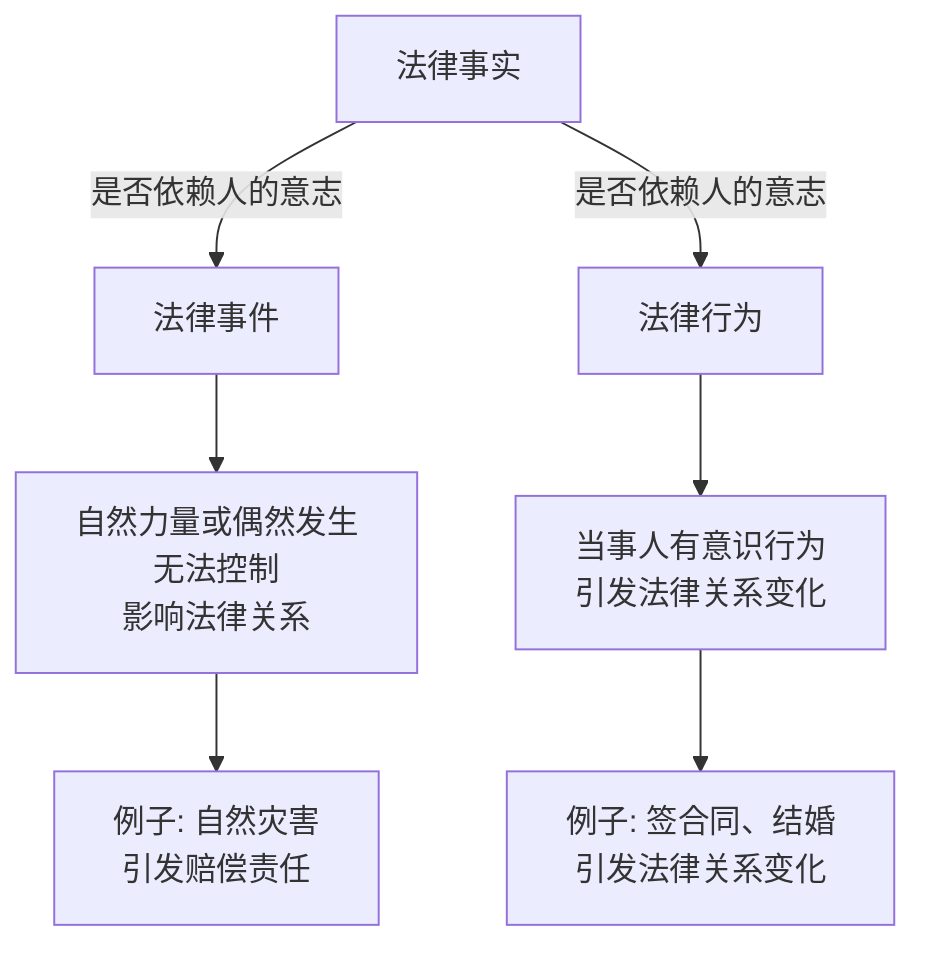
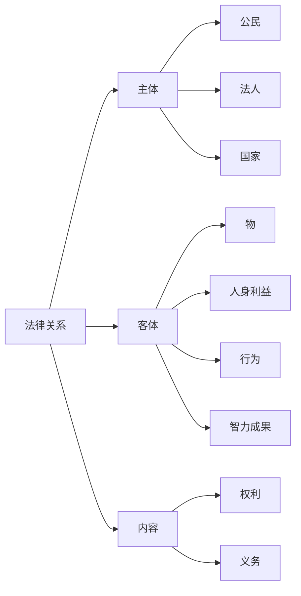

### 📜 法律关系与构成要素

---

## 一、法律关系概述

### （一）含义

法律关系是指**法律调整**人们行为时，形成的**权利义务关系**。  
- **简而言之**：法律关系就像是一张**合同**，定义了参与者之间的权利与义务，确保大家的行为是**合法**的。

### （二）[[法律事实]]——法律关系的产生、变更和消灭

法律事实是指**能引发法律关系产生、变更或消失的客观事实**。它是法律关系的“催化剂”。  

1. **概念**  
   法律事实就像**触发器**，能让法律“启动”，改变或结束某些法律关系。

2. **分类**  
   法律事实根据是否依赖人的意志，可以分为两大类：  
   - **法律事件**：这些事件由自然力量或偶然发生，无法控制，发生后直接影响法律关系的变化。
     - **例子**：自然灾害，发生后可能引起赔偿责任等。
   - **法律行为**：由当事人有意识地做出某些行为，导致法律关系发生变化。
     - **例子**：签合同、结婚，都会引发法律关系的变化。

---

## 二、法律关系的构成要素

法律关系由**主体**、**客体**和**内容**三大要素构成。

### （一）主体

**主体**是参与法律关系的“主角”，即**享有权利**和**承担义务**的人。  
- **谁能当“主角”？**  
  - **公民（自然人）**：我们每个人。
  - **法人**：如公司、组织等被当作“人”的单位。
  - **国家**：作为法律关系的一方，参与相关法律行为。

- **主体的能力**  
  1. **权利能力**：你能**合法地享有权利**和**承担义务**。
     - **例子**：你一出生就有权利能力，可以享有基本的生命和财产权利。
  2. **行为能力**：你能通过自己的行为来**获得权利**或**履行义务**。
     - **例子**：年满18岁后，你具备行为能力，可以合法签订合同。

- **权利能力 vs 行为能力**  
  1. 权利能力是行为能力的前提，**没有权利能力就无法享有行为能力**。
  2. 权利能力和行为能力是可以分开的。例如，未满18岁的人有权利能力，但可能没有行为能力（如不能自己签合同）。

---

### （二）客体

**客体**是法律关系中的**对象**，即权利与义务的指向物。  
- **简单来说**：客体就是法律关系中的“目标”，可以是**物**、**行为**或**智力成果**等。

- **客体种类**：  
  - **物**：物权关系中的对象，如电视、房产等。
  - **人身利益**：人身权关系中的对象，如健康、名誉。
  - **行为**：债权关系中的对象，如履行合同的行为。
  - **智力成果**：知识产权关系中的对象，如文章、发明等。
  - **权利本身**：例如在质押权关系中，质押的**权利**本身就是客体。

---

### （三）内容

**内容**是法律关系的**核心**，指的是**主体之间的权利与义务**。  
- **简单来说**：法律关系的内容就是**谁做什么**。比如：“我借你钱，你还我钱”，这就是内容的体现。

---

## 🎯 **考点总结**  
- **法律关系的三要素**：记住**主体**、**客体**、**内容**是构成法律关系的基础框架，考试中经常考查。
- **法律事实的分类**：明确**法律事件**和**法律行为**的不同，前者不可控制，后者由人的行为引起。
- **主体的能力**：搞清楚**权利能力**和**行为能力**的顺序和相互关系，影响一个人是否能合法参与法律关系。

---

### 📝 **例子**：

- **权利能力**：你从出生那一刻起，就拥有生命、自由和财产等基本权利——这就是权利能力。
- **行为能力**：你18岁时，可以独立签订合同，行使法律权利——这就是行为能力。

---

### 📊 **总结图示**：

---

