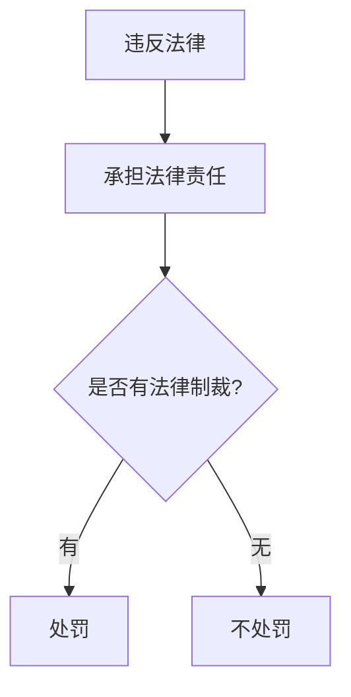
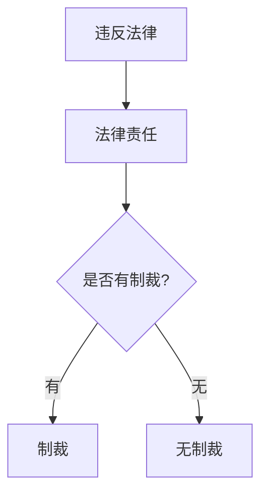

## 一、**法律责任的概念**  
法律责任是指**行为人**因违法行为、违约行为或法律规定的行为应承受的不利后果。  
- **简单来说**：做错事就得负责！法律说了算，违法就要有后果。🤷‍♂️

## 二、**法律责任的分类**  
根据行为所违反的法律性质，法律责任大致分为以下四类：

### 1. **民事责任**  
指因违反**民事法律**或**违约**而产生的法律后果。  
- **举个例子**：如果你没有按时交货，可能会被要求**赔偿损失**、**支付违约金**，甚至**赔礼道歉**。
- **具体表现**：  
  - 停止侵害、消除危险  
  - 返还财产、恢复原状  
  - 修理、重作、更换  
  - 赔偿损失、支付违约金、恢复名誉等。

### 2. **刑事责任**  
指因**犯罪行为**所必须承担的法律后果。由司法机关代表国家来执行。  
- **刑事责任的后果**：  
  - **主刑**：管制、拘役、有期徒刑、无期徒刑、死刑。
  - **附加刑**：罚金、剥夺政治权利、没收财产、驱逐出境。  
- **例子**：偷窃、贪污等行为，可能面临监禁、罚款或更严重的处罚。

### 3. **行政责任**  
因违反**行政法**或行政规定而应承担的法律责任。  
- **行政责任的后果**：  
  - **行政处分**：警告、降级、开除等。  
  - **行政处罚**：罚款、没收财物、停产停业等。  
- **例如**：公司违反环保法，可能会被罚款或停业整顿。

### 4. **违宪责任**  
因违反**宪法**规定的行为而承担的责任。  
- **举例**：国家机关制定的法律与宪法相冲突，相关责任人可能需要承担违宪责任。

## 三、**责任免除的情形**  
有些情况下，即使行为人实施了违法行为，依照法律特别规定，可以**免除**部分或全部责任。  

### **免除方式**：
1. **时效免责**：超过法律规定的时间期限，无法追究责任。
2. **不诉免责**：受害人未提起诉讼，无法追责。
3. **自首、立功免责**：主动交代或协助破案，可以减轻或免除处罚。
4. **有效补救免责**：及时纠正违法行为，减少损害，免除责任。
5. **协议免责或意定免责**：当事人协议约定免责条款。
6. **自助免责**：紧急情况下，行为人为了保护自己或他人的利益，采取必要的措施。  
   - **例如**：为了保护自己，没来得及报警就扣押了嫌疑人的财物。
7. **人道主义免责**：在权利方无法履行责任的情况下，出于人道考虑，可以免除或减轻责任。

---

## 四、**法律制裁**  
### 1. **法律制裁的概念**  
**法律制裁**是指**特定机关**根据行为人的违法行为，依法实施的**强制性惩罚**措施。  
- **简而言之**：做错事，国家罚你！⚖️
- **先有法律责任，才有法律制裁**
- 法律责任**不等于**法律制裁
- 有法律责任**不一定**有法律制裁

##### 1. **先有法律责任，才有法律制裁**
###### 举例：
假设你开车闯红灯，违反了交通法。在这种情况下，**先有法律责任**，因为你违反了交通规则，应该承担相应的责任（如罚款、扣分）。只有在你承担了这种责任后，相关的**法律制裁**才会被实施——比如罚款、扣驾驶分等。

##### 2. **法律责任不等于法律制裁**

###### 举例：
假设某个人驾驶车辆超速，虽然他违反了交通规则，承担了法律责任，但如果他在法律上被判定为“初犯”，或者可以支付罚款而避免其他惩罚，他可能不会受到其他严重的法律制裁。

##### 3. **有法律责任不一定有法律制裁**

###### 举例：
假设有人因轻微犯罪被判定有法律责任，但法院决定依据具体情况给予缓刑处理，没有立即实施制裁。这意味着有法律责任，但没有直接的法律制裁。

### 2. **法律制裁的种类**  
法律制裁通常有以下几种形式：  
- **刑事制裁**  
- **民事制裁**  
- **行政制裁**  
- **违宪制裁**

### 3. **法律制裁与法律责任的关系**  
- **法律责任是前提**，法律制裁是**结果**。  
  - **例如**：如果你违反了法律，法律责任是你必须承担不利后果，而法律制裁是对你违法行为的**具体惩罚**。
  
- **法律制裁和法律责任的区别**：  
  - 有法律责任**不等于**必定会有法律制裁。  
  - **例如**：民事纠纷可能不会涉及刑事制裁，但依然需要承担民事责任。
