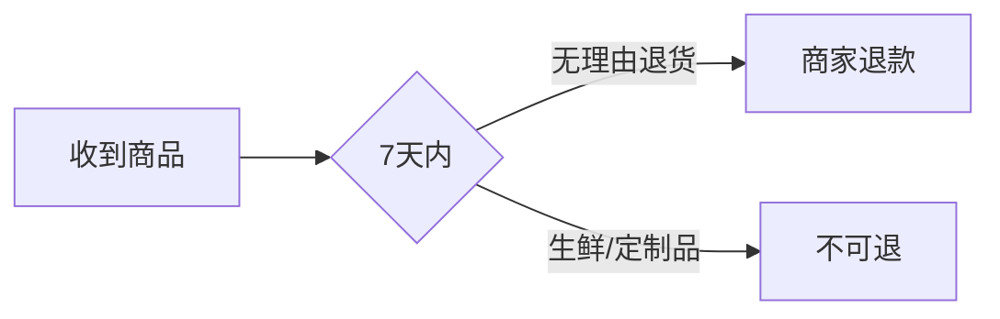

## 一、消费者的九大权利 🛡️
### 1. 人身财产安全权 🚨
- **重点**：商品/服务不能让我受伤或财产受损！
- **例子**：买个电水壶炸了？商家必须赔！
- **考点**：经营者未尽安全保障义务→全责！

### 2. 知情权 🔍
- **重点**：价格、成分、售后必须透明！
- **例子**：奶茶用植脂末冒充牛奶？告他！
- **表情包**：🙅♂️ "别想蒙我！"

### 3. 自主选择权 🛒
- **重点**：买不买、选哪家，我说了算！
- **例子**：进店不买被店员白眼？违法！
- **表情包**：🙄 "你管我买不买？"

### 4. 公平交易权 ⚖️
- **重点**：质量合格、价格公道、不缺斤少两！
- **例子**：买一斤苹果只有八两？退货+赔偿！
- **考点**：计量错误→直接维权！

### 5. 求偿权 💸
- **重点**：受伤/损失必须赔钱！
- **例子**：吃外卖拉肚子？医药费+误工费！
- **表情包**：🤢 "赔钱！立刻！马上！"

### 6. 社团权 👥
- **重点**：组队维权，力量更大！
- **例子**：成立“反坑爹消费者联盟”合法！

### 7. 获得知识权 📖
- **重点**：学防坑技巧是权利！
- **例子**：商家有义务教你识别假货！

### 8. 获得尊重权 🙏
- **重点**：人格尊严 + 民族习惯必须尊重！
- **例子**：因口音被餐厅歧视？投诉！

### 9. 监督权 🕵️♂️
- **重点**：发现问题可举报/批评！
- **例子**：发现地沟油？举报有奖！

## 二、经营者的义务 🏪🔧
### 1. 安全保障义务
- **重点**：场所安全，摔倒了商家赔！
- **例子**：商场地板太滑致骨折→赔医药费！

### 2. 召回费用承担 🔄
- **重点**：召回商品，费用商家出！
- **例子**：汽车缺陷召回，修车费不用掏！

### 3. 必须开发票 🧾
- **重点**：索要发票，商家必须给！
- **表情包**：😠 "不开发票？税务局见！"

### 4. 举证责任倒置 📦
- **重点**：半年内商品出问题，商家自证清白！
- **例子**：新手机一个月就坏？商家举证！
- **考点**：耐用商品6个月内→商家举证！

### 5. 格式条款提醒 🔔
- **重点**：合同小字必须显眼标出！
- **例子**：“不退不换”用红字标出才算数！

### 6. 禁止霸王条款 🚫
- **重点**：“最终解释权归本店”无效！
- **表情包**：🤬 "你这条款，无效！"

### 7. 网购七日无理由退货 📦↩️
- **重点**：7天随便退！生鲜、定制品除外！
- **例子**：衣服不合身？退！运费自己出~
- **mermaid流程图**：

## 三、争议解决途径 ⚔️
1. **协商和解** 🤝→ 2. **消协调解** 👩⚖️→ 3. **投诉** 📞→ 4. **仲裁** ⚖️→ 5. **诉讼** 🏛️
- **考点**：顺序可跳跃，但诉讼是最终手段！

## 四、惩罚性赔偿 💰💥
- **重点**：欺诈行为→假一赔三，最低500元！
- **例子**：买到假茅台？赔3倍！不足500按500算！
- **表情包**：🤑 "血赚！"

## 五、考试重点标记 📌
1. **七日无理由退货**（哪些商品除外？）
2. **三倍赔偿规则**（最低500元！）
3. **举证责任倒置**（6个月内商家举证）
4. **格式条款无效情形**（霸王条款）

## 六、总结表格 📊
| 权利/义务         | 关键词                  | 例子                  |
|--------------------|-------------------------|-----------------------|
| 知情权             | 价格透明                | 奶茶成分造假          |
| 举证责任倒置       | 6个月商家举证           | 新手机故障            |
| 七日退货           | 非生鲜/定制品           | 网购衣服退货          |
| 三倍赔偿           | 欺诈行为 + 最低500      | 假茅台赔偿            |