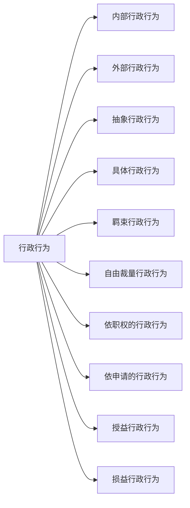

# 第五章 行政法 📜

## 第一节 行政法概述 📝

### 一、行政法的基本原则 📏

#### 1. 合法行政原则 ✅
所有的行政行为都必须有法律依据，不能随心所欲。

#### 2. 合理行政原则 🤔
行政行为要合理合情，不能偏颇或荒谬。

#### 3. 行政应急性原则 🚨
在紧急情况下，行政机关可以采取特别措施，即使这些措施没有明确法律依据或与通常法律相抵触。此时，行政机关不必承担法律责任。这是合法性原则的例外。

#### 4. 程序正当原则 🛤️
- **行政公开原则**：行政行为应公开透明，让公众知情。
- **公众参与原则**：公众有权参与行政决策。
- **回避原则**：行政人员如果与行政事项有利害关系，应主动回避。

#### 5. 高效便民原则 🚀
行政行为应高效，方便群众。

#### 6. 诚实守信原则 🤝
- **行政信息真实原则**：行政机关发布的信息应真实可信。
- **保护公民信赖利益原则**：行政机关应保护公民对其行为的合理信赖。

#### 7. 权责统一原则 ⚖️
行政机关行使权力的同时，也要承担相应的责任。

## 二、行政法律关系主体 👥
**行政法律关系主体**是指在行政法律关系中享有权利和承担义务的当事人。

---

## 第二节 行政行为 🏛️

### 一、行政行为的概念和特征 🧩

#### （一）行政行为概念
行政行为是指行政主体行使行政职权，做出的能够产生行政法律效果的行为。

#### （二）行政行为的特征
1. **主体是行政主体**：必须是具有行政职权的机关或组织。
2. **行为必须是行使行政职权的行为**：不能是个人行为或其他非行政行为。

### 二、行政行为的分类 🎭

行政行为可以根据不同的标准进行分类。主要分类有：

#### （一）内部行政行为与外部行政行为 📜
- **内部行政行为**：如行政处分等，适用于行政机关内部。
- **外部行政行为**：如行政许可行为等，适用于社会公众。

#### （二）抽象行政行为与具体行政行为 🧾
- **抽象行政行为**：如制定行政法规、行政规章等，不针对特定对象。
- **具体行政行为**：如行政许可行为、行政处罚行为等，针对特定对象。

#### （三）羁束行政行为与自由裁量行政行为 🕹️
- **羁束行政行为**：如税务机关征税，严格依照法律规定。
- **自由裁量行政行为**：行政机关在法律允许范围内有一定自主权。

#### （四）依职权的行政行为与依申请的行政行为 📝
- **依职权的行政行为**：如税务机关的征税行为，主动作为。
- **依申请的行政行为**：如颁发营业执照、经营许可证等，需要申请人提出申请。

#### （五）授益行政行为与损益行政行为 🎁
- **授益行政行为**：对行政相对人有利的行为，如发放补贴。
- **损益行政行为**：对行政相对人不利的行为，如罚款。

# 行政法概述

## 一、行政法的概念🧐
- **定义**
    - 行政法就是调整行政机关在行使职权过程中发生的各种社会关系的法律规范的总称。简单说，就是管政府怎么办事、怎么对待咱老百姓的那些规矩😎。
- **举例**
    - 比如说你开了一家小饭馆，市场监管部门（行政机关）来检查卫生情况。行政法就规定了他们能怎么检查（比如要提前通知、不能随意乱翻东西等），也规定了如果发现问题该怎么处理（是警告、罚款还是吊销执照），同时如果他们检查的时候违反了规定，你也知道该怎么维护自己的权益🧐。

## 二、行政法的渊源📚
|渊源类型|解释|例子|
|----|----|----|
|宪法|国家的根本大法，包含一些关于行政权力的组织、运行等基本原则。|我国宪法规定了国务院和地方各级人民政府的性质、地位、职权等，这是行政法最根本的渊源。就像房子的地基一样重要😏。|
|法律|全国人大及其常委会制定的有关行政管理的法律。|《行政处罚法》规定了行政机关如何对违法行为进行处罚，什么样的行为该罚，罚多少，都得按照这个法律来🧐。|
|行政法规|国务院制定的规范性文件。|比如国务院制定的《快递暂行条例》，专门针对快递行业的行政管理制定的规则🤵。|
|地方性法规|省、自治区、直辖市等地方人大及其常委会制定的适用于本地区的规范性文件。|某沿海城市为了管理海洋渔业资源，制定本地的渔业管理条例，这就是地方性法规啦🐟。|
|规章|包括部门规章（国务院各部门制定）和地方政府规章（地方政府制定）。|公安部制定的关于交通管理的规章，像规定驾驶证的考取、车辆年检等规则；某市政府制定的关于城市环境卫生管理的规章，像垃圾分类的具体要求等😜。|

## 三、行政法的基本原则🤔
### （一）合法行政原则📏
- **解释**
    - 行政机关必须遵守现行有效的法律，并且行政机关应当依照法律授权活动。这就好比开车得遵守交通规则一样，不能想怎么开就怎么开🚗。
- **例子**
    - 税务机关征税必须按照税法规定的税率、税目等来征收，如果随意更改税率，那就是违反了合法行政原则，就像司机闯红灯要被处罚一样😒。

### （二）合理行政原则⚖️
- **解释**
    - 行政机关实施行政管理，应当遵循公平、公正的原则。要平等对待行政管理相对人，不偏私、不歧视。行使自由裁量权应当符合法律目的，排除不相关因素的干扰；所采取的措施和手段应当必要、适当。
- **例子**
    - 城市管理部门在拆除违章建筑时，不能因为违章建筑的业主是熟人就从轻处罚，也不能对不同地段、不同性质的违章建筑采用完全不同的拆除标准。如果对一个占地10平米的小仓库违章建筑和一座占地1000平米的大工厂违章建筑都只给予同样的警告处罚，而没有考虑到实际情况的差异，就是没有遵循合理行政原则🧐。

### （三）程序正当原则📋
- **解释**
    - 包括行政公开（除涉及国家秘密、商业秘密和个人隐私外，行政机关实施行政管理应当公开）、公众参与（行政机关作出重要规定或者决定，应当听取公民、法人和其他组织的意见）、回避（行政机关工作人员履行职责，与行政管理相对人存在利害关系时，应当回避）等内容。
- **例子**
    - 政府要修建一条高速公路，在规划阶段就要公开路线图、环境影响评估报告等信息（行政公开）；并且要听取沿线居民、企业等的意见（公众参与）。如果在项目审批过程中，负责审批的工作人员发现自己的亲戚是其中一个项目的投标方，那他就得回避，不能参与审批（回避）😉。

### （四）高效便民原则💨
- **解释**
    - 行政机关实施行政管理，应当遵守法定时限，积极履行法定职责，提高办事效率，提供优质服务，方便公民、法人和其他组织。
- **例子**
    - 现在很多地方的政务服务大厅推行“一站式”服务，以前办个企业注册可能要在好几个部门之间来回跑，现在在一个大厅里就能把所有手续办完，大大提高了办事效率，方便了创业者（高效便民）👍。

### （五）诚实守信原则🤝
- **解释**
    - 包括行政信息真实（行政机关公布的信息应当全面、准确、真实）和保护公民信赖利益（非因法定事由并经法定程序，行政机关不得撤销、变更已经生效的行政决定）。
- **例子**
    - 政府部门发布了一个关于某区域拆迁补偿标准的公告，这个公告里的补偿标准就得是真实准确的。如果已经按照这个标准跟居民签订了拆迁协议，后来又因为想节省成本而随意降低补偿标准，这就是违背了诚实守信原则，居民可以通过法律途径维护自己的权益😤。

### （六）权责统一原则⚖️
- **解释**
    - 行政机关的职权和职责相统一，行政机关违法或者不当行使职权，应当依法承担法律责任。
- **例子**
    - 派出所民警如果滥用职权，非法限制公民人身自由，不仅要受到内部的纪律处分，还可能面临外部的行政诉讼，承担赔偿责任，这就是权责统一，权力越大责任越大嘛😏。

## 四、行政主体🧑‍⚖️
- **定义**
    - 行政主体就是能以自己的名义行使行政职权并独立承担法律责任的组织。简单说就是有权管事还得能对自己做的事负责的那些单位🤨。
- **分类**
    |类型|解释|例子|
    |----|----|----|
    |行政机关|各级人民政府及其职能部门。|比如市政府、公安局等，它们有明确的行政职权，可以作出行政行为，像公安局可以对违反治安管理的人进行处罚🧐。|
    |被授权组织|一些非行政机关的组织，经过法律、法规的授权后，可以行使特定的行政职权。|比如高校，本来是事业单位，但经过教育法律法规授权，可以对学生进行学籍管理、颁发学位证书等行政行为，这时候它就是一个被授权组织😎。|

## 五、行政相对人👤
- **定义**
    - 行政相对人就是在行政法律关系中与行政主体相对应的另一方当事人，也就是受到行政机关管理的个人或者组织。可以把它想象成行政管理的“小对象”🤣。
- **举例**
    - 当交警对闯红灯的行人进行处罚时，这个行人就是行政相对人；当税务机关对企业征收税款时，这个企业就是行政相对人😉。

## 六、重点考点总结📝
- **重点**
    - 行政法的基本原则是常考内容，尤其是合法行政、合理行政、程序正当这几个原则，要理解每个原则的内涵并能结合例子分析。
    - 行政主体的分类和判断，要清楚行政机关和被授权组织的区别。
    - 行政相对人的概念，要能在具体案例中准确识别。
- **考点示例**
    - 给出一个行政机关的行为，判断是否违反合法行政、合理行政等原则。例如：某市场监管局在没有法律依据的情况下，对一家小型超市处以高额罚款，问是否违反行政法基本原则？（答案：违反合法行政原则，因为没有法律依据就不能进行处罚）
    - 给出一个组织，判断是否为行政主体。如：某行业协会对本行业企业进行排名并给予表彰，问该行业协会是否为行政主体？（答案：不是，行业协会不是行政机关，也没有法律法规的明确授权，不属于行政主体）

🎯 **考试重点总结：**
1. 行政法的基本原则，尤其是合法行政原则和程序正当原则。
2. 行政行为的概念和特征，明确行政行为应由行政主体做出且必须行使行政职权。
3. 行政行为的分类，掌握不同标准下的分类方法及其例子。
