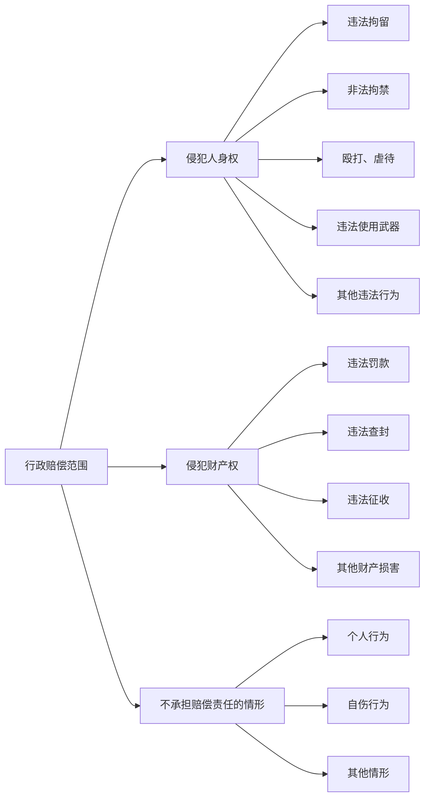
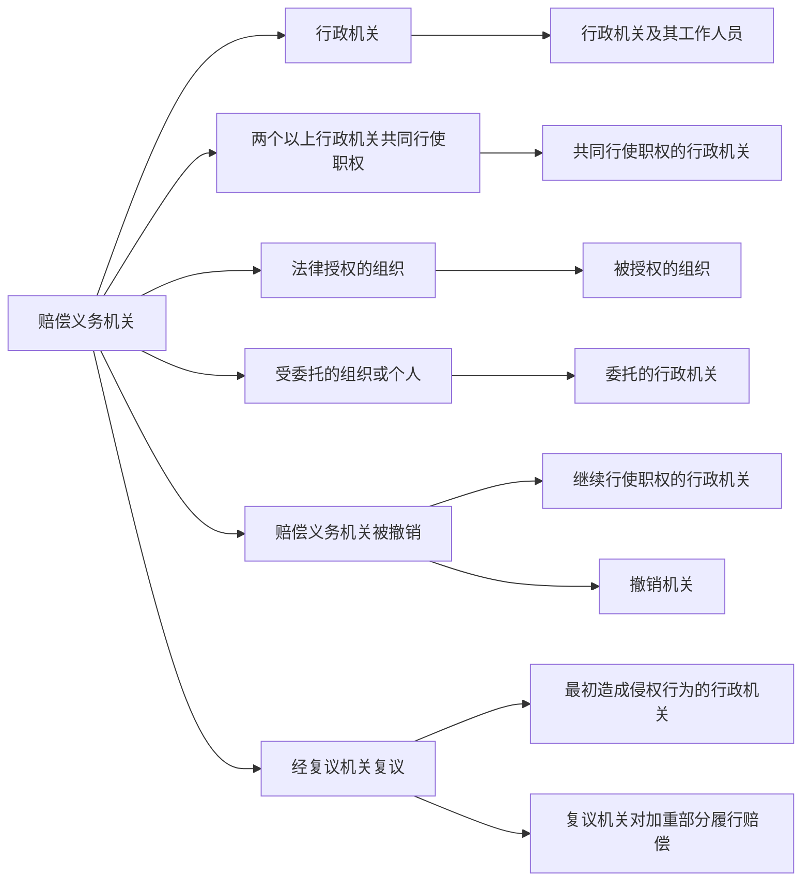
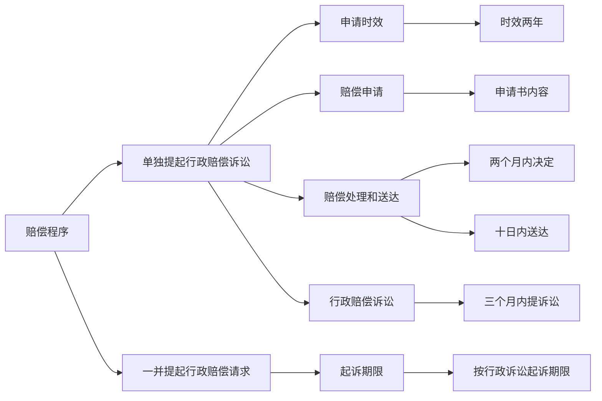

# 第七节 国家赔偿法 👨‍⚖️

## 一、国家赔偿的概念 🏛️
国家赔偿是指国家机关和国家机关工作人员在行使职权时，侵犯公民、法人和其他组织的合法权益，造成损害的，受害人有权取得国家赔偿。国家赔偿主要可以分为行政赔偿和司法赔偿。

## 二、行政赔偿 🏢

### （一）行政赔偿的概念
行政赔偿是指国家行政机关及其工作人员在行使职权的过程中，侵犯公民、法人或其他组织的合法权益并造成损害，由国家承担赔偿责任的制度。

### （二）赔偿范围 🖋️
1. **侵犯人身权**：
   - 违法拘留或采取限制公民人身自由的行政强制措施。
   - 非法拘禁或以其他方法非法剥夺公民人身自由。
   - 殴打、虐待等行为造成公民身体伤害或死亡。
   - 违法使用武器、警械造成公民身体伤害或死亡。
   - 其他违法行为造成公民身体伤害或死亡。

2. **侵犯财产权**：
   - 违法实施罚款、吊销许可证和执照、责令停产停业、没收财物等行政处罚。
   - 违法对财产采取查封、扣押、冻结等行政强制措施。
   - 违法征收、征用财产。
   - 其他违法行为造成财产损害。

3. **不承担赔偿责任的情形**：
   - 与职权无关的个人行为。
   - 因公民、法人和其他组织自己的行为致使损害发生。
   - 法律规定的其他情形。

### 习题
1. 根据《国家赔偿法》的规定，下列情形不属于国家赔偿的是（ ）
   - A. 某地政府为挽救当地一濒临倒闭的国有企业，强令另一企业与该国有企业订立订购合同，该企业不服，政府将其银行账户冻结
   - B. 税务局工作人员钱某与个体户赵某素有矛盾，以赵某偷税为名借税务局名义没收其 5000 元的财物
   - C. 狱警李某的朋友被犯人张某打伤，李某指使同监犯人将张某打伤
   - D. 工商局孙某骑自行车上班途中与人相撞，发生争执后将人打伤

2. 根据《国家赔偿法》的规定，不能要求国家赔偿的是（ ）。
   - A. 非法拘禁
   - B. 非法扣押、冻结财产
   - C. 非法限制选举权
   - D. 违反国家规定摊派费用

3. 下列情形中，属于国家赔偿范围的是（ ）。
   - A. 市场监督管理局的钱某因琐事殴打其子的班主任致其轻微脑震荡
   - B. 税务局赵某未经合法程序扣押了某企业价值相当于应纳税款的商品
   - C. 某市公安交通执法大队队长张某在休假期间暂扣了贾某机动车驾驶证
   - D. 交警小石对醉酒驾驶的王某采取强制措施时王某自行跳车导致尾骨摔伤

## 三、赔偿请求人和赔偿义务机关 👥

### （一）赔偿请求人
1. 受害的公民、法人和其他组织有权要求赔偿。
2. 受害的公民死亡，其继承人和其他有扶养关系的亲属有权要求赔偿。
3. 受害的法人或者其他组织终止的，其权利承受人有权要求赔偿。

### （二）赔偿义务机关
行政机关及其工作人员行使行政职权侵犯公民、法人和其他组织的合法权益造成损害的，该行政机关为赔偿义务机关。

### 习题
1. 某公安派出所工作人员张某违法采取了限制公民刘某人身自由的行政强制措施。根据《国家赔偿法》的规定，应对刘某履行赔偿义务的是（ ）。
   - A. 张某
   - B. 该派出所
   - C. 派出该派出所的公安局
   - D. 派出该派出所的公安局所属政府

2. 依据《国家赔偿法》的规定，公安机关的工作人员违法使用武器、警械造成公民身体伤害或者死亡的，（ ）为赔偿义务机关。
   - A. 国家财政部门
   - B. 公安机关
   - C. 该工作人员
   - D. 该工作人员的主管领导

## 四、赔偿程序 📋

### （一）单独提起行政赔偿诉讼
1. **申请时效**：赔偿请求人请求国家赔偿的时效为两年，自其知道或应当知道国家机关及其工作人员行使职权时的行为侵犯其人身权、财产权之日起计算。
2. **赔偿申请**：申请书应当载明受害人的姓名、性别、年龄、工作单位和住所，法人或其他组织的名称、住所和法定代表人或主要负责人的姓名、职务；具体的要求、事实根据和理由；申请的年、月、日。
3. **赔偿处理和送达**：赔偿义务机关应当自收到申请之日起两个月内，作出是否赔偿的决定。赔偿义务机关决定赔偿的，应当制作赔偿决定书，并自作出决定之日起十日内送达赔偿请求人。
4. **行政赔偿诉讼**：赔偿义务机关在规定期限内未作出是否赔偿的决定，赔偿请求人可以自期限届满之日起三个月内，向人民法院提起诉讼。

### （二）一并提起行政赔偿请求
公民、法人或其他组织在提起行政诉讼的同时一并提出行政赔偿请求的，其起诉期限按照行政诉讼起诉期限的规定执行。

### 习题
1. 下列关于国家赔偿中行政赔偿的说法，正确的是（ ）。
   - A. 受害的公民死亡，其近亲属有权要求赔偿
   - B. 法律、法规授权的组织在行使授予的行政权力时侵犯公民、法人和其他组织的合法权益造成损害的，授权的组织为赔偿义务机关
   - C. 赔偿请求人要求赔偿，只能先向赔偿义务机关提出
   - D. 受行政机关委托的组织或者个人在行使受委托的行政权力时侵犯公民、法人和其他组织的合法权益造成损害的，委托的行政机关为赔偿义务机关

2. 在行政赔偿中，赔偿义务机关采取行政拘留或者限制人身自由的强制措施期间，被限制人身自由的人死亡的，赔偿义务机关的行为与被限制人身自由的人的死亡是否存在因果关系，应当（ ）。
   - A. 由赔偿请求人提供证据证明
   - B. 由赔偿义务机关提供证据证明
   - C. 推定有因果关系
   - D. 推定没有因果关系

## 五、刑事赔偿 🔒

### （一）赔偿范围 📜
1. **侵犯人身权**：
   - 违法拘留或逮捕。
   - 刑讯逼供或殴打、虐待。
   - 违法使用武器、警械。

2. **侵犯财产权**：
   - 违法查封、扣押、冻结、追缴等措施。
   - 依照审判监督程序再审改判无罪，原判罚金、没收财产已经执行的。

3. **国家不赔偿情形**：
   - 因公民自己故意作虚伪供述，或伪造其他有罪证据被羁押或被判处刑罚的。
   - 行使侦查、检察、审判职权的机关及其工作人员与行使职权无关的个人行为。
   - 因公民自伤、自残等故意行为致使损害发生的。
   - 法律规定的其他情形。

### （二）赔偿请求人和赔偿义务机关 👥

### 1. 赔偿请求人
赔偿请求人的确定依照本法第六条的规定（参照行政赔偿的请求人规定）。

### 2. 赔偿义务机关
- 行使侦查、检察、审判职权的机关以及看守所、监狱管理机关及其工作人员在行使职权时侵犯公民、法人和其他组织的合法权益造成损害的，该机关为赔偿义务机关。
- 对公民采取拘留措施，依照本法的规定应当给予国家赔偿的，作出拘留决定的机关为赔偿义务机关。
- 对公民采取逮捕措施后决定撤销案件、不起诉或者判决宣告无罪的，作出逮捕决定的机关为赔偿义务机关。
- 再审改判无罪的，作出原生效判决的人民法院为赔偿义务机关。二审改判无罪，以及二审发回重审后作无罪处理的，作出一审有罪判决的人民法院为赔偿义务机关。

### 习题
1. 县公安局以涉嫌盗窃犯罪为由将甲拘留，县人民检察院批准对甲的逮捕。3 个月后，经甲的亲属暗中查访并向公安机关提供线索，公安机关抓获了真正的罪犯，县人民检察院对甲作出不起诉决定，甲遂请求国家赔偿。下列说法正确的是（ ）
   - A. 县公安局和人民检察院没有违法行为，国家对甲不承担赔偿责任
   - B. 县公安局和人民检察院为共同赔偿义务机关
   - C. 县人民检察院作出不起诉决定是对错捕行为的确认
   - D. 县公安局应当对错误拘留造成的损失承担赔偿责任

2. 下列情形中，国家不承担刑事赔偿责任的是（ ）。
   - A. 检察机关对“情节显著轻微，危害不大，不认为是犯罪的”人作出不起诉决定，该被不起诉人被羁押的
   - B. 检察机关对没有事实证明有犯罪重大嫌疑的人决定拘留的
   - C. 检察机关工作人员在行使职权时，违法使用武器造成公民身体伤害的
   - D. 检察机关工作人员在行使职权时，以殴打等暴力行为造成公民死亡的

## 六、赔偿程序 📋

### （一）前置程序
赔偿请求人要求赔偿，应当先向赔偿义务机关提出。

### （二）赔偿义务机关处理时间
赔偿义务机关应当自收到申请之日起两个月内，作出是否赔偿的决定。赔偿义务机关决定赔偿的，应当充分听取赔偿请求人的意见，并可以与赔偿请求人就赔偿方式、赔偿项目和赔偿数额依照规定进行协商。

### （三）赔偿复议机关
赔偿义务机关在规定期限内未作出是否赔偿的决定，赔偿请求人可以自期限届满之日起三十日内向赔偿义务机关的上一级机关申请复议。

### （四）复议机关的处理时间
复议机关应当自收到申请之日起两个月内作出决定。

### （五）复议后不服
赔偿请求人不服复议决定的，可以在收到复议决定之日起三十日内向复议机关所在地的同级人民法院赔偿委员会申请作出赔偿决定。

### （六）举证责任
人民法院赔偿委员会处理赔偿请求，赔偿请求人和赔偿义务机关对自己提出的主张，应当提供证据。

### （七）审查原则
人民法院赔偿委员会处理赔偿请求，采取书面审查的办法。必要时，可以向有关单位和人员调查情况、收集证据。

### （八）赔偿委员会处理时间
人民法院赔偿委员会应当自收到赔偿申请之日起三个月内作出决定。

## 七、赔偿方式及费用 💰

### （一）赔偿方式
国家赔偿以支付赔偿金为主要方式。能够返还财产或恢复原状的，予以返还财产或恢复原状。致人精神损害的，应当在侵权行为影响的范围内，为受害人消除影响，恢复名誉，赔礼道歉；造成严重后果的，应当支付相应的精神损害抚慰金。

### 习题
1. 根据《国家赔偿法》的规定，国家赔偿的主要方式是（ ）。
   - A. 支付赔偿金
   - B. 返还财产
   - C. 消除影响
   - D. 恢复原状

2. 根据《国家赔偿法》的规定，下列行为受害人无权获得精神损害赔偿的是（ ）。
   - A. 违法使用武器、警械造成公民身体伤害或死亡
   - B. 违法对公民财产采取查封、扣押、冻结等措施
   - C. 对公民采取逮捕措施后，决定撤销案件、不起诉或判决宣告无罪终止追究刑事责任
   - D. 非法拘禁或以其他方法非法剥夺公民人身自由

3. 我国《国家赔偿法》规定了我国国家赔偿的方式，甲申请国家赔偿后，乙赔偿机关做出了下列行为，其中属于国家赔偿方式的有（ ）。
   - A. 向甲赔礼道歉
   - B. 向甲支付 1 万元的赔偿金
   - C. 返还了没收甲的 5 万元
   - D. 将砸坏的甲的厂房进行恢复原状

### （二）计算标准
1. **侵犯人身自由**：每日赔偿金按照国家上年度职工日平均工资计算。
2. **侵犯公民生命健康权**：赔偿金包括医疗费、护理费，及因误工减少的收入。减少的收入每日的赔偿金按照国家上年度职工日平均工资计算，最高额为国家上年度职工年平均工资的五倍。
3. **侵犯财产权**：返还财产或恢复原状，不能恢复原状的，按照损害程度给付相应的赔偿金。

### （三）其他
1. 赔偿费用列入各级财政预算。
2. 赔偿请求人凭生效的判决书、复议决定书、赔偿决定书或调解书，向赔偿义务机关申请支付赔偿金。
3. 赔偿义务机关应当自收到支付赔偿金申请之日起七日内，向有关财政部门提出支付申请。财政部门应在收到支付申请之日起十五日内支付赔偿金。
4. 赔偿