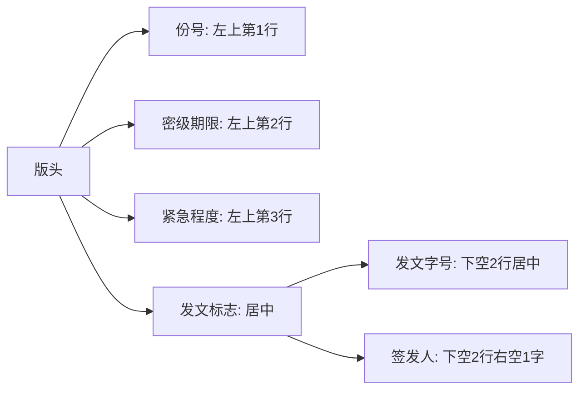

### 一、公文的文面格式：三大块

公文格式分成**版头**（头顶）、**主体**（身子）、**版记**（脚底），每个部分都有“零件”。《党政机关公文格式》规定了这些细节，咱们一步步拆解！

#### 总结构
- **版头**：红色反线（党的机关加五角星⭐）以上的部分，像“抬头纹”。  
- **主体**：正文和核心内容，像“心脏”。  
- **版记**：结尾的说明，像“鞋底”。  

- **完整组成**：份号、密级保密期限、紧急程度、发文机关标志、发文字号、签发人、标题、主送机关、正文、附件说明、发文机关署名、成文日期、印章、附注、附件、抄送机关、印发机关和印发日期、页码。

---

### 1. 🎩 版头部分：头顶的讲究

版头是公文“脸面”，得整齐严肃，红色反线以上全归它管！

#### （1）份号
- **啥是份号**：公文印几份，每份有个编号，像“身份证号”。  
- **用在哪**：绝密/机密或需要清退的公文。  
- **怎么写**：6位3号阿拉伯数字（000001），左上角第1行顶格。  
- **例子**：绝密文件标“000005”，方便查。

#### （2）密级和保密期限
- **啥意思**：告诉你是“秘密”还是“绝密”，能保密多久。  
- **类型**：绝密、机密、秘密+保密期限（比如“秘密★10年”）。  
- **怎么写**：3号黑体，左上角第2行顶格，期限用阿拉伯数字。  
- **例子**：标“机密★5年”，5年后解密。

#### （3）紧急程度
- **啥意思**：这公文急不急，得多快办。  
- **类型**：特急、加急（电报还有特提、平急）。  
- **怎么写**：3号黑体，左上角排，顺序是份号→密级→紧急程度。  
- **例子**：标“特急”，赶紧办！

#### （4）发文机关标志
- **啥是这**：写谁发的文，通常是“XX机关文件”。  
- **写法**：全称或简称+“文件”，居中，上边缘距版心35mm，小标宋体红色字。  
- **联合行文**：主办机关在前，或只写主办机关。  
- **例子**：*“国务院文件”*，红彤彤居中。

#### （5）发文字号
- **啥意思**：公文的“编号牌”，机关代字+年份+序号。  
- **写法**：居中，发文机关标志下空2行，年份用“〔2023〕”，不加“第”。  
- **上行文**：左空1字，与签发人同排。  
- **例子**：*“国发〔2023〕15号”*。

#### （6）签发人
- **啥用**：上行文标谁签的，像“负责人签名”。  
- **写法**：右空1字，“签发人：XXX”，3号仿宋+楷体，每行2人均匀排。  
- **例子**：*“签发人：张三 李四”*。

- **Mermaid图表**：版头排列

- **考试重点⭐**：份号、密级、发文字号的顺序和格式常考！

---

### 2. 💪 主体部分：公文的“心脏”

主体是公文“干货”，从标题到正文再到附件，得写得明白！

#### （1）标题
- **组成**：发文机关+事由+文种（文种不能省）。  
- **省略**：上行文可省机关，命令/公告可省事由，公告/通知可全省。  
- **写法**：2号小标宋，红色分隔线下空2行，居中，梯形/菱形排。  
- **例子**：*“国务院关于教育改革的通知”*，简洁明了。

#### （2）主送机关
- **啥是这**：发给谁，谁得办！  
- **写法**：标题下空1行，左顶格，全称或简称，最后加冒号。  
- **特例**：太多时移到版记。  
- **例子**：*“教育部：”*。

#### （3）正文
- **核心**：公文想说啥，全在这儿。  
- **写法**：3号仿宋，主送下1行，每段空2字，层次用“一、”“（一）”“1.”“（1）”。  
- **例子**：*“一、加强管理…”*。

#### （4）附件说明
- **啥用**：说明有啥“配件”。  
- **写法**：正文下空1行，左空2字，“附件：1. XXX”。  
- **例子**：*“附件：1. 数据表”*。

#### （5）发文机关署名+成文日期+印章
- **署名**：谁发的，全称或简称。  
- **日期**：啥时候发的，右空4字。  
- **印章**：盖章对齐署名+日期，联合行文多章整齐排。  
- **例子**：*“教育部 2023年10月1日”*+红章。

#### （6）附注
- **啥用**：加个小说明，比如联系人。  
- **写法**：成文日期下1行，左空2字加括号。  
- **例子**：*“（联系人：张三 12345678）”*。

#### （7）附件
- **啥是这**：正文的“帮手”，另页排。  
- **写法**：3号黑体“附件：1”，标题居中第3行。  
- **例子**：另页标*“国发〔2023〕15号附件1”*。

- **考试重点⭐**：标题组成、省略规则常考！

---

### 3. 👟 版记部分：脚底的收尾

版记是公文“收工”部分，放抄送和印发信息。

#### （1）抄送机关
- **啥用**：告诉其他单位“看看”。  
- **写法**：4号仿宋，印发上1行，左右空1字，“抄送：XX”+句号。  
- **例子**：*“抄送：财政部。”*。

#### （2）印发机关和印发日期
- **啥意思**：谁印的，啥时候印。  
- **写法**：4号仿宋，末条分隔线上，左空1字+右空1字，年月日全写+“印发”。  
- **例子**：*“教育部 2023年10月1日印发”*。

#### （3）分隔线
- **规则**：首条粗线（0.35mm），中间细线（0.25mm），末条粗线与版心下边缘重合。

---

### 4. 🔢 页码：别乱了顺序

- **啥用**：标页数，像“书的脚注”。  
- **写法**：4号半角宋，版心下7mm，单页右空1字，双页左空1字，加一字线。  
- **例子**：*“-1-”*。

---

## 📊 表格总结：格式要素
| 部分 | 要素                     | 位置与格式                   |
|------|-------------------------|-----------------------------|
| 版头 | 份号                   | 左上第1行，6位数字         |
|      | 密级期限               | 左上第2行，3号黑体         |
|      | 紧急程度               | 左上第3行，3号黑体         |
|      | 发文标志               | 居中，红色小标宋           |
|      | 发文字号               | 下空2行居中               |
|      | 签发人                 | 右空1字，仿宋+楷体         |
| 主体 | 标题                   | 分隔线下2行，2号小标宋     |
|      | 主送机关               | 标题下1行，左顶格          |
|      | 正文                   | 主送下1行，3号仿宋         |
|      | 附件说明               | 正文下1行，左空2字         |
|      | 署名+日期+印章         | 日期右空4字，章压署名+日期 |
|      | 附注                   | 日期下1行，括号            |
|      | 附件                   | 另页，黑体+标题居中        |
| 版记 | 抄送机关               | 印发上1行，4号仿宋         |
|      | 印发机关+日期          | 末条线上，左右空1字         |
| 页码 |                        | 版心下7mm，加一字线        |

