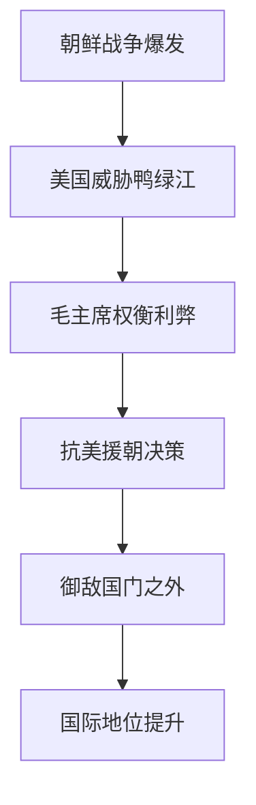
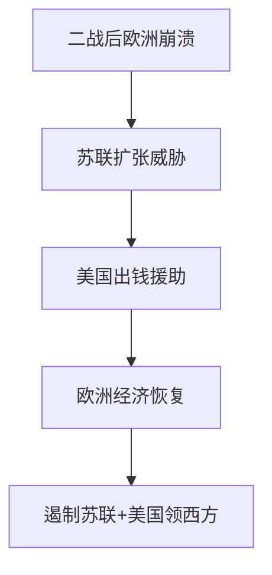
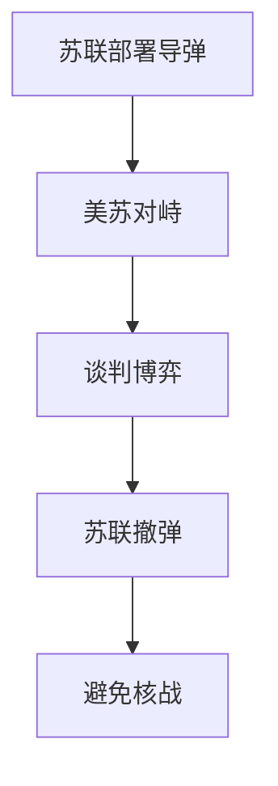

## 🌟 战略决策：定大局，谋长远

战略决策是大佬们拍脑袋定的大方向，影响国家命运。以下三个案例，考试常考，记牢时间和意义！

### 1. 🇨🇳 中国抗美援朝决策
- **时间**：1950年10月  
- **背景**：朝鲜战争打起来，美国把战火烧到鸭绿江边，威胁中国安全。毛主席顶住压力，力排众议，决定出兵。  
- **内容**：抗美援朝，保家卫国，把敌人挡在国门外。  
- **意义**：  
  - 🚨 保安全：避免美国威胁长期化。  
  - 🕊️ 争和平：为新中国争取建设时间。  
  - 🌍 提地位：国际上站稳脚跟。  
- **生动讲解**：就像邻居打架，火烧到你家门口，不出手等着被揍吗？毛主席说：“干！打出去！”结果新中国硬气了，美国也不敢小瞧。  
- **📌 考试重点**：时间（1950）、目的（保家卫国）、结果（国际地位提升）。  
- **记忆口诀**：五零抗美鸭绿边，保家卫国地位坚。

#### Mermaid图表：决策过程

---

### 2. 🇨🇳 中国改革开放决策
- **时间**：1978年12月（十一届三中全会）  
- **背景**：70年代末，中国经济慢得像乌龟，世界差距拉大，闭关锁国不行了。  
- **内容**：对内改革生产关系，对外开放引进技术资金，和世界做生意。  
- **意义**：  
  - 💡 解放生产力：经济从乌龟变火箭。  
  - 🌐 融入世界：中国成全球第二大经济体。  
  - 🤑 人民富裕：日子越过越好。  
- **生动讲解**：就像家里穷得叮当响，邓小平说：“别窝着了，开门做买卖吧！”结果中国从穷小子变富豪。  
- **📌 考试重点**：时间（1978）、核心（改革开放）、成就（第二大经济体）。  
- **记忆口诀**：七八改革开国门，经济腾飞富人民。

#### 例子：深圳前与后
| **时期** | **状态**   |
| ------ | -------- |
| 改革开放前  | 小渔村，穷得掉渣 |
| 改革开放后  | 特区，高楼林立  |

---

### 3. 🇺🇸 美国马歇尔计划
- **时间**：1948-1951年  
- **背景**：二战后，欧洲经济崩了，社会乱，美国怕苏联趁机扩张。  
- **内容**：掏钱帮欧洲修经济，稳政权。  
- **意义**：  
  - 🛡️ 遏制苏联：冷战打基础。  
  - 💸 繁荣美国：欧洲买美国货。  
  - 🌍 领西方：美国当老大。  
- **生动讲解**：欧洲像个破房子，美国扔钱修好，顺便拉帮结派防苏联，还赚了票子。  
- **📌 考试重点**：时间（1948）、目的（遏制苏联）、影响（冷战格局）。  
- **记忆口诀**：四八马歇救欧洲，美国领西防苏修。

#### Mermaid图表：战略目标

---

#### 战略决策总结表
| **事件** | **时间**    | **核心** | **意义**    |
| ------ | --------- | ------ | --------- |
| 抗美援朝   | 1950      | 保家卫国   | 安全+地位     |
| 改革开放   | 1978      | 改革+开放  | 经济腾飞+融入世界 |
| 马歇尔计划  | 1948-1951 | 援助欧洲   | 遏苏+领西     |

---

## ⚔️ 战术决策：小招数，赢局部

战术决策是战略下的具体操作，像下棋的每一步。以下三个案例，考试爱出细节题，记清时间和过程！

### 1. 🇨🇳 中国炮击金门
- **时间**：1958年8月23日  
- **背景**：美国扶蒋介石，蒋喊“反攻大陆”，美还打黎巴嫩，毛主席看不下去。  
- **内容**：炮击金门（台湾岛屿），原计划7月25日，后改8月23日大打，9月4日停三天。  
- **意义**：  
  - 👊 打蒋气焰：反攻梦碎。  
  - 🌏 牵美军：中东压力减。  
  - 🛡️ 保主权：台海稳住。  
- **生动讲解**：蒋介石嚷着要打回来，毛主席说：“炮轰金门吓吓他！”结果蒋老实了，美国也分心了。  
- **📌 考试重点**：时间（1958.8.23）、节奏（停三天）、目的（支援中东+保主权）。  
- **记忆口诀**：五八炮击震金门，蒋梦碎美分神。

#### 例子：炮击节奏
- 8月23日：大轰，吓蒋。  
- 9月4日：停三天，灵活调整。

---

### 2. 🇷🇺 古巴导弹危机苏联撤弹
- **时间**：1962年10月  
- **背景**：苏联在古巴放导弹，美国急了，差点核战。  
- **内容**：苏联跟美国谈，撤导弹，避免硬碰硬。  
- **意义**：  
  - ☮️ 避核战：世界松口气。  
  - 🤝 以退为进：保古巴利益+换条件。  
- **生动讲解**：苏联在古巴放导弹，美国喊“你敢放我敢炸！”苏联说：“算了，撤了，别打了。”结果大家都活下来了。  
- **📌 考试重点**：时间（1962）、决策（撤弹）、结果（避战）。  
- **记忆口诀**：六二导弹古巴撤，核战免谈退一步。

#### Mermaid图表：博弈过程

---

### 3. 🇬🇧 英国马岛战争登陆作战
- **时间**：1982年5月21日  
- **背景**：阿根廷占马尔维纳斯群岛（马岛），英国要抢回来。  
- **内容**：选圣卡洛斯港登陆，防御弱，地形好，突袭建阵地，步步推进。  
- **意义**：  
  - 🏝️ 夺岛成功：英国赢了。  
  - ⚡ 战术精准：选对地方和时机。  
- **生动讲解**：英国像打游戏选了个弱点登陆，偷偷上岸站稳脚跟，一步步把岛抢回来。  
- **📌 考试重点**：时间（1982）、地点（圣卡洛斯港）、过程（突袭推进）。  
- **记忆口诀**：八二登陆圣卡洛，马岛归英战术妙。

#### 例子：登陆优势
- **圣卡洛斯港**：防御薄，地形平，英军一上岸就站住了。

---

#### 战术决策总结表
| **事件** | **时间**    | **核心**  | **意义** |
| ------ | --------- | ------- | ------ |
| 炮击金门   | 1958.8.23 | 炮轰+节奏调整 | 打蒋+援中东 |
| 苏联撤弹   | 1962.10   | 撤导弹妥协   | 避战+保利益 |
| 马岛登陆   | 1982.5.21 | 突袭圣卡洛斯港 | 夺岛成功   |

---

## 🎯 重点与考点总结

### 战略 vs 战术
- **战略**：大局，长远，定方向（如抗美援朝）。  
- **战术**：局部，短期，出奇招（如炮击金门）。  

#### 考试常考点
1. **时间线**：记住年份和关键日期。  
2. **背景与意义**：为啥做？结果咋样？  
3. **决策过程**：谁拍板？怎么执行？  

#### 真题示例
- **题型**：抗美援朝决策反映了什么战略思维？  
  - **答案**：御敌于外，保家卫国，提升地位。

