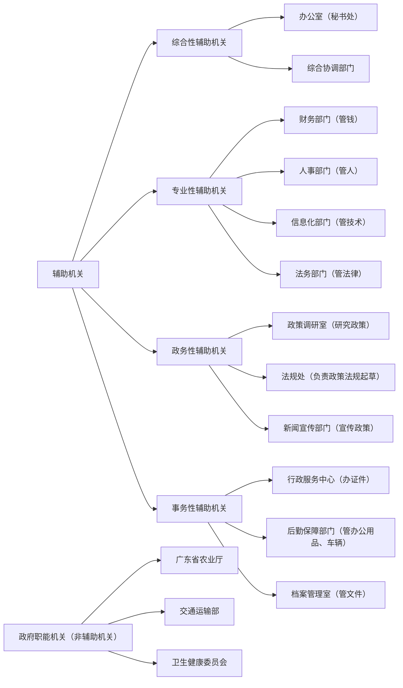

🔹 详细解释（结合例子）
1️⃣ 综合性辅助机关（统筹协调，啥都管点）
- 办公室（秘书处）：负责文件起草、会议安排、协调各部门工作。
- 综合协调部门：类似于“大管家”，负责统筹全局，比如政府办公厅、党委办公室。

2️⃣ 专业性辅助机关（负责某个领域的专业事务）
- 财务部门：负责预算、资金管理，比如财政处、财务科。
- 人事部门：负责干部考核、招聘，比如人事处、组织科。
- 信息化部门：负责政府内部的计算机、网络，比如信息中心。
- 法务部门：负责法律事务，比如政府法制办。

3️⃣ 政务性辅助机关（专门研究、制定政策，提供决策支持）
- 政策调研室：调查社会问题，给领导提供政策建议。
- 法规处：起草法律、法规，比如国务院法制办。
- 新闻宣传部门：负责政策宣传，比如宣传部、新闻办。

4️⃣ 事务性辅助机关（跑腿、服务性质的）
- 行政服务中心：处理户籍、营业执照等事务，比如政务大厅。
- 后勤保障部门：管理办公用品、车辆，比如机关事务管理局。
- 档案管理室：存放文件、合同，比如档案馆。

❌ 哪些不是辅助机关？
政府的职能机关，比如：
✅ 广东省农业厅（专门负责农业）
✅ 交通运输部（管理交通）
✅ 卫生健康委员会（管医疗）
它们直接行使管理职能，不是辅助机关！

