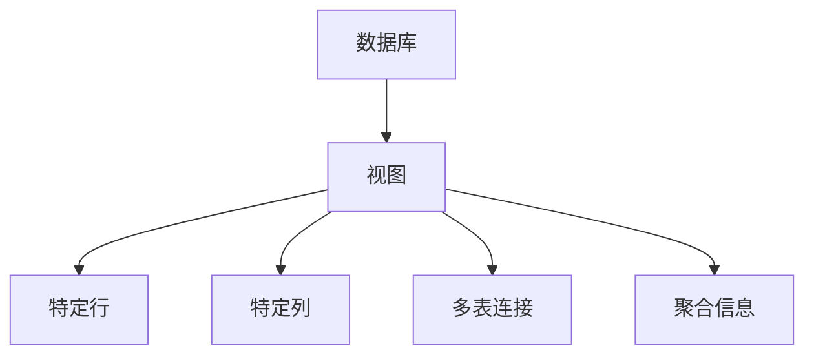
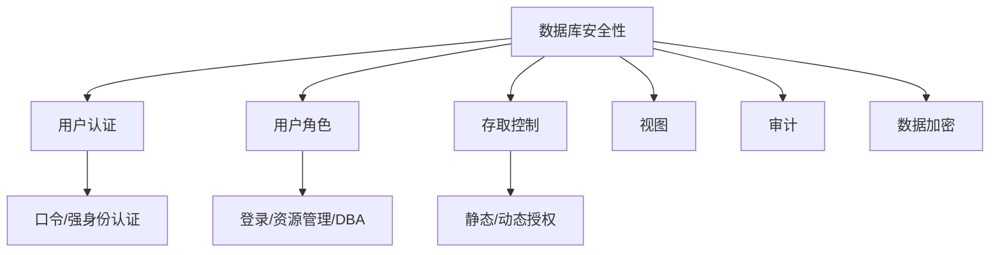

### ​**事务管理学习笔记**​

#### ​**一、事务的基本概念**​

​**1. 定义**​  
事务（Transaction）是一组**不可分割**的数据库操作指令，要么**全部执行成功**，要么**全部不执行**​（回滚）。

​**举例**​：银行转账（A转200元给B）：

- A账户减200元
- B账户加200元  
    ​**要么都成功，要么都失败**，不能只执行一半。

---

#### ​**二、事务的四大特性（ACID）​**​

|​**特性**​|​**解释**​|​**例子**​|
|---|---|---|
|​**原子性**​|事务是一个整体，不可分割（要么全做，要么全不做）|转账时A扣款和B收款必须同时完成|
|​**一致性**​|事务执行后，数据库从一个一致状态变为另一个一致状态|转账前后总金额不变（A+B=1500元）|
|​**隔离性**​|并发事务之间互不干扰（一个事务的执行不应影响其他事务）|事务A转账时，事务B不能同时修改A余额|
|​**持久性**​|事务提交后，结果永久保存（即使系统崩溃也不丢失）|转账成功后，余额变化永久生效|

---

#### ​**三、事务控制语句**​

- ​`BEGIN TRANSACTION`​：开始事务
- ​`COMMIT`：提交事务（成功执行）
- ​`ROLLBACK`​：回滚事务（失败时恢复原始状态）

​**示例**​：

```sql
BEGIN TRANSACTION;  -- 开始事务
UPDATE Account SET balance = balance - 200 WHERE id = 'A';  -- A扣款
UPDATE Account SET balance = balance + 200 WHERE id = 'B';  -- B收款
COMMIT;  -- 提交事务（若失败则自动ROLLBACK）
```

---

#### ​**四、并发操作的问题**​

​**1. 丢失更新（Lost Update）​**​

- ​**问题**​：两个事务同时修改同一数据，后提交的覆盖前提交的结果。
- ​**例子**​：A和B同时读取余额为100元，A减10元（90），B减20元（80），最终余额错误（应为70元）。

​**2. 不可重复读（Non-Repeatable Read）​**​

- ​**问题**​：同一事务内两次读取同一数据，结果不同（因其他事务修改了数据）。
- ​**例子**​：事务A第一次读余额为100元，事务B修改为80元后，事务A第二次读变为80元。

​**3. 脏读（Dirty Read）​**​

- ​**问题**​：读取到其他事务未提交的临时数据（可能被回滚）。
- ​**例子**​：事务A修改余额为200元（未提交），事务B读到200元后，事务A回滚，实际余额仍为100元。

---

#### ​**五、并发控制：封锁技术**​

​**1. 锁的类型**​

|​**锁**​|​**作用**​|
|---|---|
|​**排他锁（X锁）​**​|事务独占数据（其他事务不能读或写）|
|​**共享锁（S锁）​**​|允许多事务同时读取，但禁止修改（保证读一致性）|

​**2. 封锁协议**​

|​**协议**​|​**规则**​|​**解决的问题**​|
|---|---|---|
|​**一级封锁**​|写数据前加X锁，事务结束释放|丢失更新|
|​**二级封锁**​|读数据前加S锁，读完立即释放；写数据前加X锁|丢失更新 + 脏读|
|​**三级封锁**​|读数据前加S锁，事务结束释放；写数据前加X锁|丢失更新 + 脏读 + 不可重复读|
|​**两段锁协议**​|事务分为两个阶段：​**加锁阶段**​（只加锁）和**解锁阶段**​（只释放锁）|保证可串行化调度|

​**示例（两段锁协议）​**​：


```sql
-- 加锁阶段
LOCK(A, X);  -- 对A加排他锁
LOCK(B, S);  -- 对B加共享锁
-- 操作阶段
UPDATE A SET value = 100;
SELECT * FROM B;
-- 解锁阶段
UNLOCK(A);
UNLOCK(B);  -- 之后不能再申请新锁
```

---

#### ​**六、封锁粒度**​

- ​**细粒度锁**​（如行锁）：并发性高，但管理开销大。
- ​**粗粒度锁**​（如表锁）：并发性低，但简单高效。

​**选择原则**​：根据业务场景权衡（高并发选行锁，大批量操作选表锁）。

---

#### ​**七、总结**​

|​**核心问题**​|​**解决方案**​|​**关键点**​|
|---|---|---|
|事务的原子性|`COMMIT`/`ROLLBACK`|要么全做，要么全不做|
|并发数据冲突|封锁协议（X锁/S锁）|一级防丢失更新，三级防脏读和不可重复读|
|保证可串行化调度|两段锁协议|加锁阶段 → 解锁阶段|

​**应用场景**​：银行系统、电商订单（高并发需严格事务控制）。


### ​**数据库备份与恢复学习笔记**​

#### ​**一、数据库故障类型**​

1. ​**事务内部故障**​
    
    - ​**可预测**​：如余额不足、违反约束（主键冲突）。
    - ​**不可预测**​：如数据溢出（INT类型存超32767）、死锁。
2. ​**系统故障**​
    
    - 断电、操作系统崩溃、内存错误等导致数据库服务中断。
3. ​**介质故障**​
    
    - 磁盘损坏、存储设备物理损坏。
4. ​**计算机病毒/人为错误**​
    
    - 误删数据、恶意攻击等。

---

#### ​**二、数据库恢复原理**​

​**核心思想**​：​**冗余备份**​ + ​**日志记录**​

- ​**没有备份 = 无法恢复**​（如毕业论文未备份，丢失后无法找回）。
- ​**恢复工具**​：
    - ​**数据转储（备份）​**​：定期保存数据库副本。
    - ​**日志文件**​：记录所有数据修改操作（如转账记录）。

---

#### ​**三、数据转储（备份）​**​

​**1. 静态转储 vs 动态转储**​

|​**类型**​|​**特点**​|​**适用场景**​|
|---|---|---|
|​**静态转储**​|备份时暂停数据库服务|对一致性要求高的系统（如银行对账）|
|​**动态转储**​|备份时允许数据库继续运行|高可用系统（如电商平台）|

​**2. 海量转储 vs 增量转储**​

|​**类型**​|​**特点**​|​**优缺点**​|
|---|---|---|
|​**海量转储**​|每次备份全部数据|恢复快，但占用空间大、耗时长|
|​**增量转储**​|仅备份上次备份后变化的数据|节省空间，但恢复需合并多次备份|

​**示例**​：

- 海量转储：每周日全量备份10GB数据库。
- 增量转储：每天备份新增的100MB数据。

---

#### ​**四、日志文件（Log File）​**​

​**1. 日志的作用**​

- 记录所有事务操作（如INSERT、UPDATE、DELETE），用于故障恢复。
- ​**必须与备份配合使用**​（动态转储时，备份后数据变化需通过日志恢复）。

​**2. 日志记录原则**​

- ​**顺序性**​：严格按事务执行时间顺序记录。
- ​**先写日志，后写数据库**​：
    - ​**原因**​：若先修改数据库后写日志，系统崩溃会导致数据丢失且无法追溯。
    - ​**例子**​：转账时先记录日志“A减200”，再实际扣款；若扣款后崩溃，恢复时根据日志回滚。

​**3. 日志内容**​  
每条日志包含：

- 事务ID
- 操作类型（增/删/改）
- 数据修改前后的值（用于回滚或重做）

---

#### ​**五、故障恢复策略**​

|​**故障类型**​|​**恢复方法**​|​**关键步骤**​|
|---|---|---|
|​**事务故障**​|撤销（UNDO）未完成的事务|1. 反向扫描日志，找到事务操作；  <br>2. 执行逆操作（如DELETE→INSERT）。|
|​**系统故障**​|1. 撤销未完成的事务；  <br>2. 重做（REDO）已提交但未写入磁盘的事务。|重启时自动完成。|
|​**介质故障**​|1. 装入最新备份；  <br>2. 重做备份后的所有日志操作。|需人工干预（如更换磁盘）。|

​**示例（介质故障恢复）​**​：

1. 使用9月28日的备份恢复数据库。
2. 重做28日至30日的日志（如转账记录），使数据恢复到故障前状态。

---

#### ​**六、数据库镜像（Mirroring）​**​

​**作用**​：

1. ​**快速恢复**​：主数据库损坏时，立即切换镜像。
2. ​**负载均衡**​：读写请求分摊到主库和镜像库，提升性能。

​**实现方式**​：

- ​**同步镜像**​：主库和镜像库实时同步（强一致性，性能较低）。
- ​**异步镜像**​：主库操作后延迟同步到镜像（高性能，可能丢数据）。

---

#### ​**七、总结**​

|​**核心要点**​|​**关键技术**​|​**应用场景**​|
|---|---|---|
|​**备份策略**​|静态/动态转储、海量/增量备份|定期全量备份 + 每日增量备份|
|​**日志管理**​|先写日志后写库、严格时序记录|所有涉及数据修改的操作|
|​**故障恢复**​|UNDO（撤销）、REDO（重做）|事务回滚、系统崩溃后自动恢复|
|​**高可用方案**​|数据库镜像|金融系统、实时交易平台|

​**一句话口诀**​：  
​**​“备份防丢失，日志保一致；故障要恢复，镜像提性能。”​**​

​**注**​：实际运维中需结合工具（如MySQL的`mysqldump`、二进制日志`binlog`）实现自动化备份与恢复。

# 数据库安全性与完整性

## 概述

**数据库安全性**是保护信息系统数据的重要环节，防止未经授权的访问、修改或泄露。安全性通过以下两种方式实现：

1. **DBMS功能**：用户认证、视图、权限控制。
2. **应用程序控制**：限制数据库访问权限，管理操作行为。

> [!info] 核心目标  
> 确保数据保密性、完整性和可用性，防止非法访问和操作。

## 安全措施

### 1. 用户认证

用户认证是DBMS使用的第一道防线，防止未授权访问。主要方法：

- **口令认证**：用户名+密码，简单但易被窃取。
- **强身份认证**：
    - 用户证书（如银行数字证书）。
    - 智能卡（如U盾）。
    - 生物识别（指纹、虹膜、声音）。

> [!warning] 注意事项  
> 口令认证安全性较低，建议结合强身份认证（如U盾或指纹）。

### 2. 用户角色与权限

不同用户登录系统后，拥有不同操作权限，分为以下类别：

- **登录权限**：只读，无法修改。
- **资源管理权限**：可管理部分资源（如授权、删除、修改）。
- **DBA权限**：数据库管理员，拥有全部资源管理权。

> [!tip] 角色划分
> 
> - 学生：仅查询个人成绩。
> - 老师：查询班级成绩。
> - 教务处：查询全院学生信息。

### 3. 存取控制（数据授权）

授权分为两类：

- **静态授权**：表或文件创建者默认拥有全部权限。
- **动态授权**：所有者或DBA可将增删改查权限授予指定用户。

**授权粒度**（从大到小）：

1. 数据库级别：整个数据库的增删改查。
2. 表级别：特定表的操作权限。
3. 记录（行）级别：仅访问部分行（如学生只能看自己成绩）。
4. 属性（列）级别：仅访问部分列（如只看数学成绩）。
5. 聚合信息：只能查看统计数据（如班级平均分），而非详细记录。

> [!summary] 授权示例
> 
> - 学生查询成绩：记录级授权，仅限本人成绩。
> - 班干部查询统计：聚合信息授权，仅限平均分、最高分。

### 4. 视图

视图通过限制数据访问范围提升安全性，功能包括：

- 限定用户访问特定行或列。
- 多表连接，呈现单一表视图。
- 提供聚合信息，隐藏详细信息。



### 5. 审计

审计记录系统运行状况和用户操作，用于事后审查。主要类型：

- **数据备份审计**：检查热备份操作。
- **操作审计**：记录敏感操作（如INSERT、DELETE）。
- **应用审计**：审查应用系统的控制逻辑。
- **攻击审计**：分析数据库遭受的攻击行为。

> [!warning] 审计重要性  
> 未授权删除记录可能隐藏违规操作，审计可追溯问题。

### 6. 数据加密

数据加密保护存储和传输中的敏感信息，防止泄露。

- 未加密：数据被攻破后直接可读（如用户名、密码）。
- 加密：数据为密文，未解密前无意义。

> [!tip] 加密实践  
> 开发应用时，敏感信息（如个人收入）需加密存储和传输，读取时解密。

## 安全措施关系图



