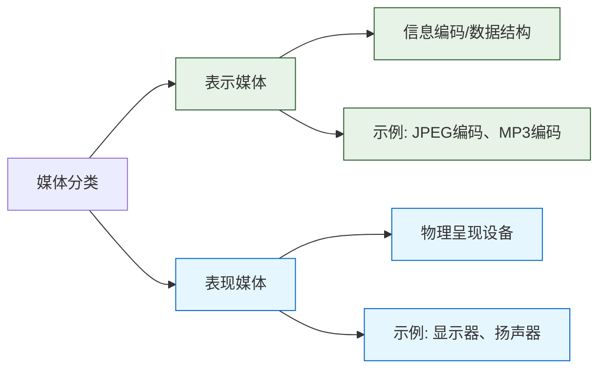

### **媒体分类题目解析**

> ​**📌 媒体分类核心笔记**​
> 
> ​**1. 表示媒体（Representation Media）​**​
> ▸ 本质：信息的数字化表示形式  
> ▸ 典型例子：  
>    ✓ 图像编码（JPEG/PNG）  
>    ✓ 音频编码（MP3/WAV）  
>    ✓ 文本编码（ASCII/Unicode）  
> ▸ 题目答案：​**B.图像编码**​ ✅
>
> ​**2. 表现媒体（Presentation Media）​**​
> ▸ 本质：信息输出的物理载体  
> ▸ 典型例子：  
>    ✓ 显示器（呈现图像）  
>    ✓ 扬声器（呈现声音）  
>    ✓ 打印机（呈现文本）  
> ▸ 题目选项缺陷：无严格匹配项（鼠标是输入设备）⚠️
>
> ​**3. 易混淆概念排除**​
> ✖ A.图像 → 感觉媒体  
> ✖ C.电磁波 → 传输媒体  
> ✖ D.鼠标 → 输入设备
>
> ​**记忆锚点**​：  
> 🔍 "编码表心意，设备显真形"
> 🔍 "图像编码是表示，显示器才是表现"

