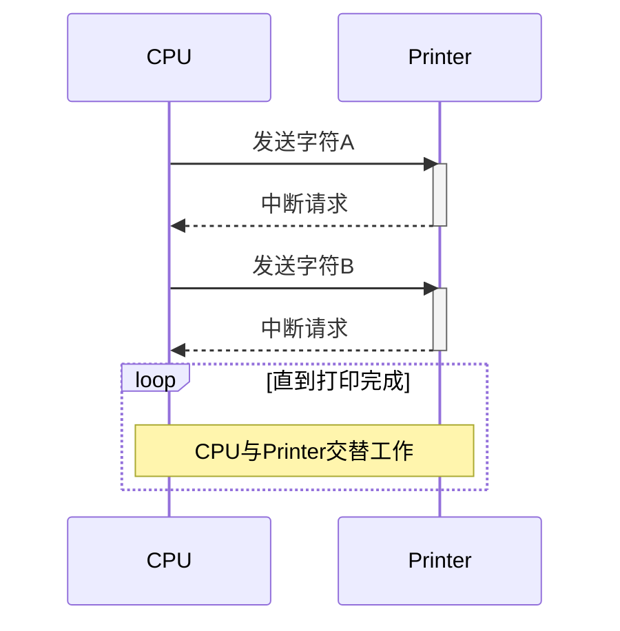
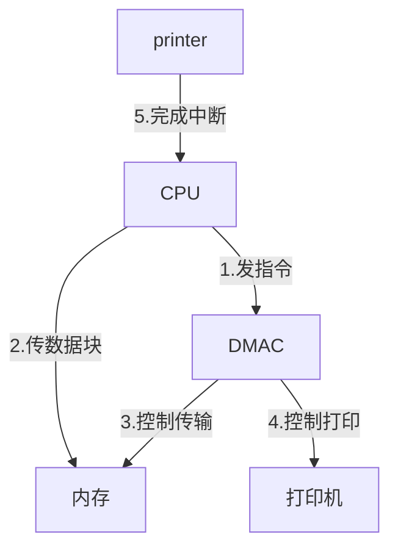

# 计算机输入输出控制方式详解

> **📌 核心考点提示**  
> 1. **CPU参与程度**：从完全参与到完全不参与  
> 2. **并行性**：串行 → 并行  
> 3. **中断频率**：无中断 → 高频中断 → 低频中断  
> 分值：上午选择题2分左右

## 1. 直接程序控制（程序查询方式）

> **🔍 特点总结**  
> - **CPU参与**：全程参与每个字符传送  
> - **工作方式**：CPU与外设**串行工作**  
> - **性能**：CPU利用率低（忙等待）  
> - **类比**：像亲自盯着打印机，送一个字打一个字  

## 2. 中断驱动方式

> **💡 关键改进**  
> - **CPU参与**：仍参与每个字符传送，但可处理其他任务  
> - **并行性**：CPU与外设**部分并行**  
> - **中断**：每个字符打印都触发中断（高频）  
> - **缺点**：中断处理开销大  

## 3. DMA方式（直接存储器存取）

> **🚀 技术飞跃**  
> - **CPU参与**：仅开始和结束参与  
> - **数据传输**：由**DMA控制器**直接管理  
> - **并行性**：CPU与外设**完全并行**  
> - **中断**：仅结束时触发1次中断  
> - **应用场景**：硬盘读写、网络数据传输  

## 对比总结
| 控制方式         | CPU参与度       | 并行性       | 中断频率     | 典型应用         |
|------------------|----------------|-------------|-------------|------------------|
| 程序查询         | 100%           | 串行        | 无中断       | 简单嵌入式系统   |
| 中断驱动         | 每个字符        | 部分并行    | 高频中断     | 低速外设（键盘） |
| DMA              | 仅首尾         | 完全并行    | 低频中断     | 高速设备（磁盘） |

**记忆口诀**：  
> "查询串行累，中断能偷闲，DMA真省心，CPU笑开颜"

---

### **输入输出控制方式对比表格**  

| **分类**     | **概念**                              | **特点**                                                             |
| ---------- | ----------------------------------- | ------------------------------------------------------------------ |
| **程序查询方式** | 在程序中不断检测输入/输出设备的当前状态，控制一个输入输出操作的完成。 | 一直占用CPU，浪费CPU的时间（串行工作，效率低）。           |
| **中断驱动方式** | 输入/输出操作完成后，相应的设备向CPU发出中断，通知CPU处理。   | CPU不必等待外部设备，可以执行其他任务（部分并行，但中断频繁）。     |
| **DMA方式**  | 让DMA控制器代替CPU，完成输入/输出设备与内存之间的数据传送。   | 释放CPU去执行其他任务，减少中断次数（完全并行，仅首尾参与，效率最高）。 |

---

### **📌 核心总结**  
1. **CPU参与度**：  
   - **程序查询**：全程占用 ❌  
   - **中断驱动**：每个操作后响应中断 ⚠️  
   - **DMA**：仅开始和结束参与 ✅  

2. **适用场景**：  
   - **程序查询**：简单嵌入式系统（如单片机）  
   - **中断驱动**：低速设备（键盘、鼠标）  
   - **DMA**：高速设备（硬盘、网卡）  

3. **优化方向**：  
   > **“减少CPU干预，提高并行性”**  

