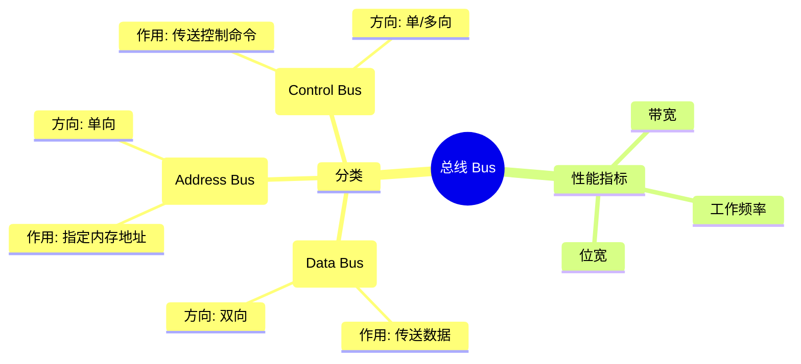

## ⭐ CPU 的性能指标
- 主频
- 字长
- CPU 缓存
- 核心数量

## ⭐ 总线的分类
- 数据总线
- 控制总线
- 地址总线

## ⭐ 总线的性能指标
- 带宽
- 位宽
- 工作频率

## ⭐ BIOS/CMOS
- BIOS：Basic Input Output System（基本输入输出系统）
- CMOS：存储 BIOS 设置，如启动顺序等
- RAM（随机存储器）、ROM（只读存储器）

## ⭐ 系统性能评测方法
- 时钟频率
- 指令执行速度
- 等效指令速度法
- 数据处理速率（PDR）
- 核心程序法
- 基准测试程序

> 📌 MIPS（Million Instructions Per Second）：每秒百万条指令  
> 📌 带宽、频率、位宽 是衡量总线性能的关键指标

---

## 🧠 总线（Bus）系统详解笔记

### 一、总线的基本概念

- 总线是各个部件之间**传输信息的公共通道**。
    
- 特点：**同一时刻只允许一个设备发送**，但可以**允许多个设备接收**。
    

---

### 二、总线的分类（三种）

|类型|英文名|作用说明|传输方向|备注说明|
|---|---|---|---|---|
|🟡 数据总线|Data Bus|在 CPU 和 RAM 之间传送**数据本身**|**双向**|既可读也可写（读入/写出）|
|🟢 地址总线|Address Bus|指定 RAM 中存储数据的**地址位置**|**单向**|由 CPU 发出地址信号|
|🔴 控制总线|Control Bus|传送控制信号，如读/写/中断等|**单向/多向**|控制器 → 内存/外设方向为主|

---

### 三、口诀辅助记忆：

- **数据总线（双向）**：数据来来去去，双向沟通；
    
- **地址总线（单向）**：地址由 CPU 发出，外设只接收；
    
- **控制总线（单向/多向）**：像“司令”一样下达命令！
    

---

### 四、控制总线包含的典型信号：

- **读/写信号（Read/Write）**
    
- **时钟信号（Clock）**
    
- **中断信号（Interrupt）**
    
- **复位信号（Reset）**
    

---

### 五、总线的性能指标

|指标|含义解释|
|---|---|
|**带宽**|总线一次传输数据的最大位数|
|**位宽**|指数据总线的宽度，如32位/64位等|
|**工作频率**|总线传输数据的速度，用Hz表示|

---

### 六、思维导图结构建议（简易版）：

---

### 题目回顾
题目给出以下信息：
- **总线宽度**：32 bit
- **时钟频率**：200 MHz
- **数据传输方式**：每5个时钟周期传送一个32 bit的字
- **问题**：计算总线的带宽，单位为MB/S（兆字节每秒）
- **选项**：A. 40  B. 80  C. 160  D. 200

### 带宽的定义
总线带宽是指单位时间内总线能够传输的数据量，通常用MB/S（兆字节每秒）表示。计算带宽的核心是确定每秒能传输多少数据。

### 计算步骤
1. **确定每次传输的数据量**：
   - 总线宽度为32 bit，即每次传输的数据量是32 bit。
   - 由于题目明确“传送一个32 bit的字”，因此每次传输的数据量就是32 bit。

2. **将bit转换为字节**：
   - 1字节（Byte）= 8 bit
   - 因此，32 bit = 32 / 8 = 4 Byte

3. **确定每次传输所需的时间**：
   - 时钟频率为200 MHz，即每秒有200,000,000个时钟周期。
   - 每5个时钟周期传输一次数据，因此每秒的传输次数为：

$$
\begin{aligned}
\text{传输次数} &= \frac{200 \text{MHz}}{5} = 40 \times 10^6 \text{次/秒} \\
\text{带宽} &= 4 \text{Byte} \times 40 \times 10^6 = 160 \text{MB/s}
\end{aligned}
$$

4. **计算每秒传输的数据量（带宽）**：
$$
\text{传输次数} = \frac{\text{时钟频率}}{\text{传输周期}} = \frac{200\,\text{MHz}}{5} = \frac{200 \times 10^6}{5} = 40 \times 10^6\,\text{次/秒}
$$

计算每秒传输的数据量（带宽）：
每次传输的数据量为 4 Byte，每秒传输 $40 \times 10^6$ 次。
因此，带宽为：
$$
\text{带宽} = \text{每次传输的数据量} \times \text{传输次数} = 4\,\text{Byte} \times 40 \times 10^6 = 160 \times 10^6\,\text{Byte/S}
$$
 将单位转换为 MB/S（1 MB = $10^6$ Byte）：
$$
\text{带宽} = 160\,\text{MB/S}
$$

### 验证选项
计算结果是160 MB/S，对应选项C。

### 常见误区
1. **忽略单位转换**：
   - 题目要求MB/S，而总线宽度是bit，需要除以8转换为Byte。
   - 如果忘记转换，可能会误算为32 bit × 40 MHz = 1280 Mbit/S = 160 MB/S（虽然结果正确，但中间步骤容易混淆）。
2. **混淆传输周期**：
   - 题目是“每5个时钟周期传输一次”，而不是“每个时钟周期传输5次”。
   - 如果误认为是后者，会得到错误结果。
3. **直接相乘忽略细节**：
   - 有人可能会直接用总线宽度（32 bit）乘以时钟频率（200 MHz），忽略传输周期和单位转换，导致错误。

### 总结
- 每次传输数据量：32 bit = 4 Byte
- 每秒传输次数：200 MHz / 5 = 40 MHz
- 带宽：4 Byte × 40 MHz = 160 MB/S

### 最终答案
**C. 160**