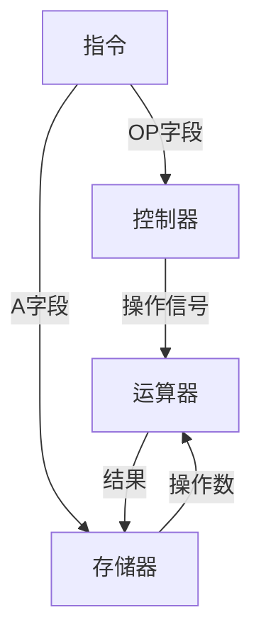
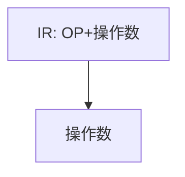
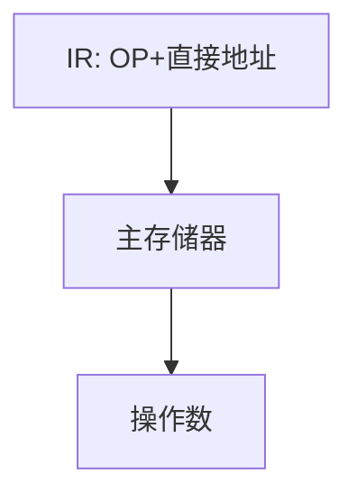
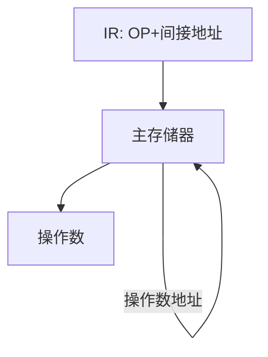
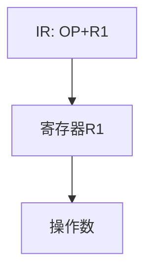
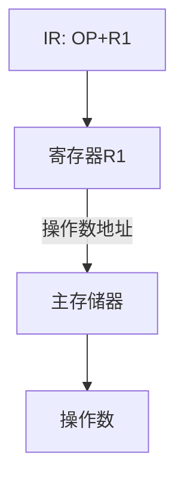

## 指令的定义
- **一条指令**是机器语言的一个语句，表现为**一组有意义的二进制代码**。
- 核心功能：指出计算机要执行的操作性质。

## 指令的构成
采用「操作码-地址码」结构：


$$
\begin{aligned}
\text{指令} = \underbrace{\text{OP}}_{\text{操作码}} + \underbrace{\text{A}}_{\text{地址码}}
\end{aligned}
$$


### 1. 操作码字段（OP）
- 定义操作性质（如加减乘除、数据移动等）

### 2. 地址码字段（A）
- 包含：
  - 操作数的存储地址
  - 操作结果的存放地址
  - 可能包含多个地址字段

## 指令结构类型
| 指令格式示例 | 说明                     |
|--------------|--------------------------|
| `OP A A A A` | 1个操作码 + 4个地址字段 |
| `OP A A A`   | 1个操作码 + 3个地址字段 |
| `OP A A`     | 1个操作码 + 2个地址字段 |
| `OP A`       | 1个操作码 + 1个地址字段 |
| `OP`         | 零地址指令（隐含操作数）|

---

1. **流程图表示指令执行流程**：


2. **二进制代码高亮**（代码块）：
```armasm
; 示例：MOV指令
1101 0100 0000 0111 ; OP=1101(移动), A=010000000111(地址)
```

3. **LaTeX排版扩展**（Latex Suite插件）：
$$
\begin{aligned}
&\text{指令周期} = \text{取指} + \text{译码} + \text{执行} \\
&\small\text{（OP字段控制阶段，A字段参与执行阶段）}
\end{aligned}
$$

---


# 寻址方式详解

## 基本概念
$$
\begin{aligned}
&\text{指令(IR)} = \underbrace{\text{OP}}_{\text{操作码}} + \underbrace{\text{A}}_{\text{地址字段}} \\
&\text{有效地址} = f(\text{地址字段})
\end{aligned}
$$

## 五种寻址方式对比

### 1. 立即寻址

- **特点**：
  - 操作数直接包含在指令中
  - 速度快但灵活性差
- **数学表达**：
  $$
  \text{有效地址} = \text{指令地址字段}
  $$

### 2. 直接寻址

- **特点**：
  - 指令中存放操作数的**主存地址**
- **公式**：
  $$
  \text{EA} = \text{A}
  $$

### 3. 间接寻址

- **特点**：
  - 指令地址字段指向**地址的地址**
  - 需两次访存
- **数学关系**：
  $$
  \begin{aligned}
  \text{EA} &= \text{Mem[A]} \\
  \text{操作数} &= \text{Mem[EA]}
  \end{aligned}
  $$

### 4. 寄存器寻址

- **特点**：
  - 操作数存放在寄存器中
  - 速度最快
- **表达式**：
  $$
  \text{操作数} = \text{Reg[R1]}
  $$

### 5. 寄存器间接寻址

- **特点**：
  - 寄存器存放操作数的**主存地址**
- **公式**：
  $$
  \begin{aligned}
  \text{EA} &= \text{Reg[R1]} \\
  \text{操作数} &= \text{Mem[EA]}
  \end{aligned}
  $$

## 性能对比表
| 寻址方式    | 访存次数 | 速度排名 | 灵活性 |
| ------- | ---- | ---- | --- |
| 立即寻址    | 0    | 1    | 低   |
| 寄存器寻址   | 0    | 1    | 中   |
| 直接寻址    | 1    | 2    | 高   |
| 寄存器间接寻址 | 1    | 3    | 最高  |
| 间接寻址    | 2    | 4    | 高   |

## 寻址过程通用公式
$$
\begin{aligned}
\text{操作数获取时间} &= T_{\text{取指}} + n \times T_{\text{访存}} \\
&\small\text{（n取决于寻址方式，立即寻址n=0，间接寻址n=2）}
\end{aligned}
$$

|寻址方式|汇编示例|访存次数|典型应用场景|
|---|---|---|---|
|立即寻址|`MOV R1, #42`|0|常量赋值|
|直接寻址|`LDR R1, [0x2000]`|1|全局变量访问|
|间接寻址|`LDR R1, [[R2]]`|2|指针操作|
|寄存器寻址|`ADD R1, R2, R3`|0|高速运算|
|寄存器间接寻址|`LDR R1, [R2]`|1|数组/结构体访问|


---
### 解题步骤详解（以图片题目为例）


#### 1. **分解指令格式**
分析 `MOV R1, #45` 的组成部分：
- **操作码**：`MOV`（数据传送）
- **目标操作数**：`R1`（寄存器）
- **源操作数**：`#45`（立即数）

#### 2. **识别寻址方式**
- **目标操作数 `R1`**：
  - 操作数是**寄存器** → **寄存器寻址**
  - 特点：直接操作寄存器内容，无需访存
- **源操作数 `#45`**：
  - `#` 符号表示**立即数** → **立即寻址**
  - 特点：操作数直接编码在指令中

#### 3. **排除错误选项**
| 选项 | 内容                          | 问题点                     |
|------|-------------------------------|----------------------------|
| A    | 直接寻址 + 立即寻址           | 目标操作数不是直接寻址     |
| B    | 寄存器寻址 + 立即寻址         | **完全匹配**               |
| C    | 相对寻址 + 直接寻址           | 两种寻址方式均不适用       |
| D    | 寄存器间接寻址 + 直接寻址     | 目标操作数不是间接寻址     |

#### 4. **验证关键特征**
- **寄存器寻址**：操作数在寄存器中（`R1`）
- **立即寻址**：操作数是常量（`#45`）
- **排除其他可能性**：
  - 无内存访问（排除直接/间接寻址）
  - 无地址偏移计算（排除相对寻址）

#### 5. **快速判断技巧**
- 看到 `#` 立即想到**立即寻址**
- 看到 `R1`/`EAX` 等寄存器名 → **寄存器寻址**
- 看到 `[ ]` 方括号 → 可能涉及**直接/间接寻址**

---

### 通用解题模板（适用于类似题型）

#### 1. **观察指令结构**
```armasm
指令格式：OP 目标操作数, 源操作数
```

#### 2. **对两个操作数分别分析**
| 操作数形式       | 寻址方式         | 示例           |
|------------------|------------------|----------------|
| `#数值`          | 立即寻址         | `#45`          |
| `寄存器名`       | 寄存器寻址       | `R1`/`EAX`     |
| `[数值]`         | 直接寻址         | `[0x2000]`     |
| `[寄存器]`       | 寄存器间接寻址   | `[R2]`         |
| `[寄存器+偏移]`  | 基址变址寻址     | `[R3+4]`       |

#### 3. **排除矛盾选项**
- 若指令中无内存访问（无 `[ ]`），排除直接/间接寻址
- 若操作数非常量，排除立即寻址

#### 4. **典型考题变形**
- **单操作数指令**（如 `INC [R1]`）：
  - 只有 `[R1]` → 寄存器间接寻址
- **混合寻址**（如 `MOV [R1], #5`）：
  - 目标：寄存器间接寻址
  - 源：立即寻址

---

### 图片题目答案解析
**正确答案：B（寄存器寻址和立即寻址）**  
- **寄存器寻址**：目标操作数 `R1` 是寄存器
- **立即寻址**：源操作数 `#45` 是立即数

---

### 高频易错点
1. **混淆直接寻址与立即寻址**：
   - 直接寻址需访问内存（如 `MOV R1, [45]`）
   - 立即寻址不访存（如 `MOV R1, #45`）

2. **忽略操作数方向**：
   - `MOV A, B` 中：
     - A 是目标操作数
     - B 是源操作数
   - 两者寻址方式可能不同

3. **过度联想特殊场景**：
   - 如相对寻址通常用于跳转指令（`JMP +8`）
   - 数据传送指令一般不用相对寻址

---

---
![[Pasted image 20250423204755.png]]