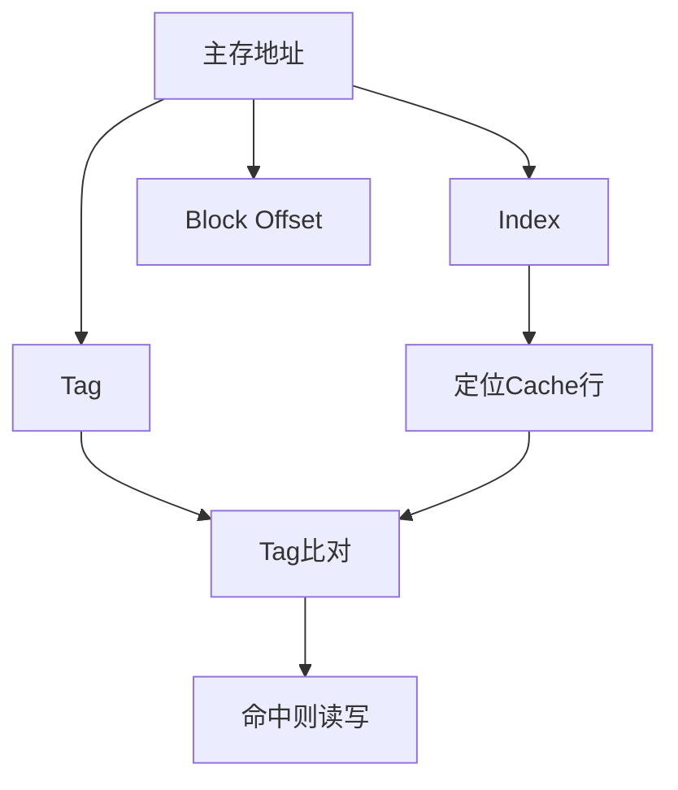
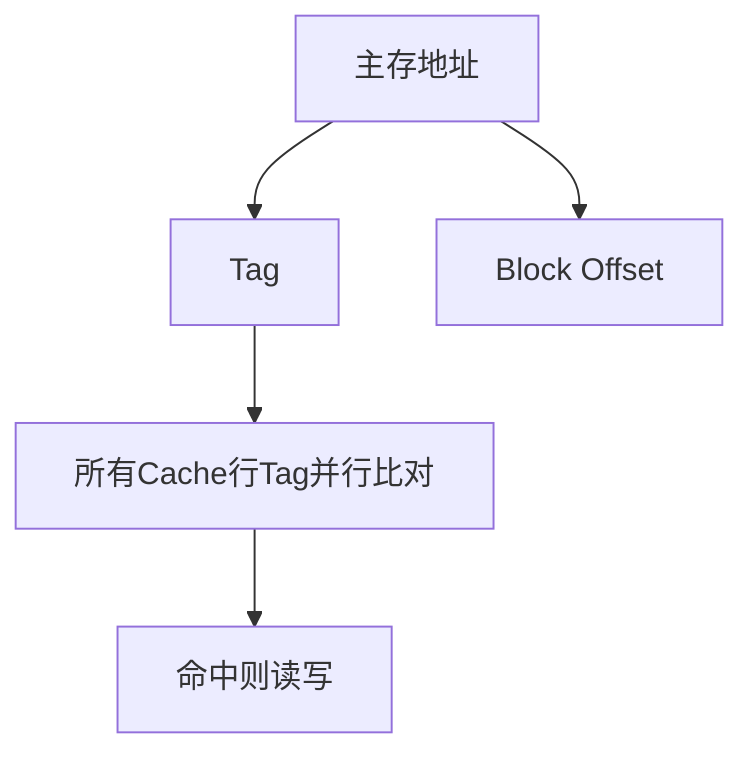
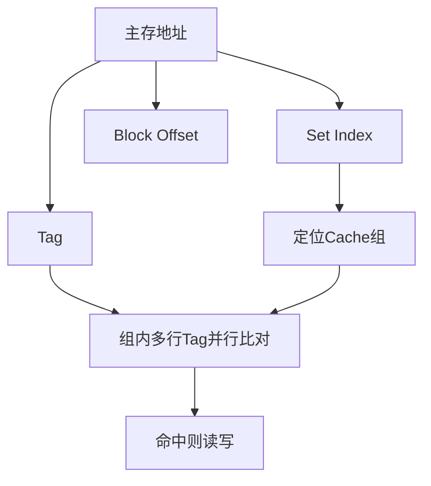
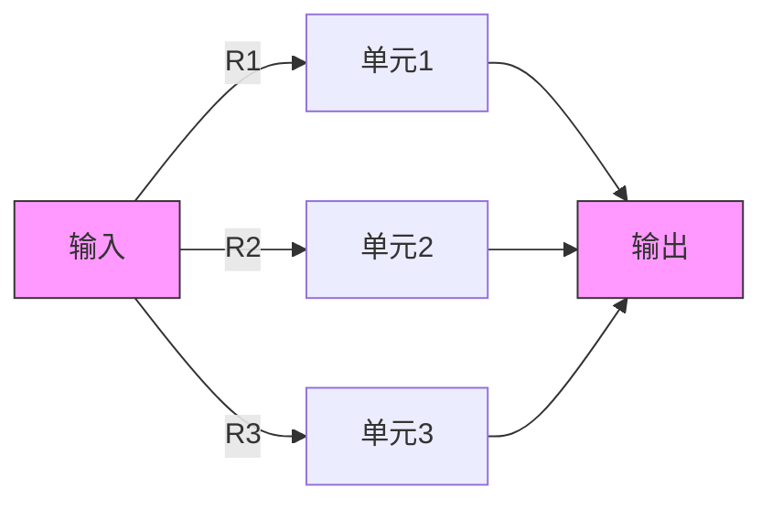
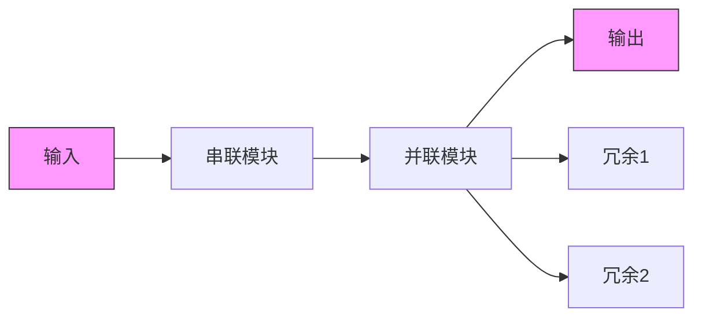

#### **一、金字塔层次结构核心要点**
1. **六大层级划分**  
   ```mermaid
   graph TD
       S0[CPU寄存器] --> S1[芯片内Cache]
       S1 --> S2[芯片外Cache]
       S2 --> S3[主存储器]
       S3 --> S4[外部存储]
       S4 --> S5[远程二级存储]
   ```

2. **四大核心规律**  
   - **速度**：自上而下逐层变慢（S0最快，S5最慢）  
   - **访问频率**：上层数据被CPU频繁访问，下层逐渐降低  
   - **容量**：从S0到S5逐层增大（如S0以KB计，S5可达PB级）  
   - **成本**：每字节造价逐层降低（S0最昂贵，S5最廉价）  

---

#### **二、各层级详解与数据流向**
| 层级 | 名称               | 存储介质                  | 数据流向（红色箭头标注）       | 典型特点                  |
|------|--------------------|---------------------------|--------------------------------|--------------------------|
| S0   | CPU寄存器          | 触发器                    | ← 直接供CPU运算                | 纳秒级访问，容量最小      |
| S1   | 芯片内Cache        | SRAM（如L1/L2 Cache）     | ← 预取S2数据供CPU高频访问       | 低延迟，集成在CPU芯片内   |
| S2   | 芯片外Cache        | SRAM/DRAM（如L3 Cache）   | ← 缓存S3的热数据               | 速度介于主存与芯片内Cache |
| S3   | 主存储器           | DRAM（内存条）            | ← 加载S4数据 → 暂存运算结果     | 易失性存储，GB级容量      |
| S4   | 外部存储           | 硬盘/SSD/光盘             | ← 备份S5数据 → 持久化存储       | 非易失性，TB级容量        |
| S5   | 远程二级存储       | 分布式系统/云存储         | → 提供海量数据                 | 毫秒级延迟，PB级容量      |

---

#### **三、关键问题与解题思路**
**问题示例**：  
*"为什么需要多级存储器结构？如何通过Cache减少'存储墙'问题？"*

**解题思路**：  
1. **必要性分析**  
   - **速度-成本悖论**：单一存储器无法同时满足高速、大容量、低成本需求  
   - **局部性原理**：90%时间CPU仅访问10%的数据（需高频数据放在上层）  

2. **Cache优化方案**  
   - **层级协作**：L1 Cache存储最热数据，L3 Cache缓解主存延迟  
   - **预取机制**：根据空间局部性提前加载相邻数据（如Cache Line）  
   - **替换算法**：LRU淘汰冷数据，保持Cache命中率  

---

#### 存储器层级对比表
   
| 层级  | 类比Obsidian组件 | 应用场景   |
| --- | ------------ | ------ |
| S0  | 快速切换笔记       | 临时记录灵感 |
| S1  | 核心笔记（带#高频标签） | 每日高频查阅 |
| S3  | 主知识库         | 项目文档存储 |
| S5  | 云备份/第三方插件    | 长期归档   |


2. **数据流向模拟**  
   - 用`[[内部链接]]`模拟数据在层级间的移动  
   - 通过`Dataview`插件统计笔记访问频率，自动标记"热数据"  

---


# 🧠 Cache地址映像机制详解

## 📌 一、Cache 的作用
Cache（高速缓存）是 CPU 与主存之间的数据缓冲区，用来提高访问速度，减少 CPU 直接访问主存的频率。

---

## 📌 二、Cache 地址映像的三种方式

### 1. **直接映像（Direct Mapping）**
- **地址结构**：
```

主存地址 = 标记位（Tag） + Cache 行号（Index） + 块内地址（Block Offset）

```
- **特点**：
- 每个主存块只能映射到唯一一个 Cache 行
- 实现简单，速度快
- **缺点**：
- 冲突严重（多个主存块竞争同一 Cache 行）



### 2. **全相联映像（Fully Associative Mapping）**
- **地址结构**：
```

主存地址 = 标记位（Tag） + 块内地址（Block Offset）

```
- **特点**：
- 主存中任意一块可加载到 Cache 中任意一行
- 灵活，冲突少
- **缺点**：
- 查找成本高，需要并行比对（硬件复杂）


---

### 3. **组相联映像（Set-Associative Mapping）**
- 是前两者的折中方案（结合了直接映像和全相联映像的优点）

- **n 路组相联**：Cache 被划分成若干个组，每组有 n 个行
- **地址结构**：
```

主存地址 = 标记位（Tag） + 组号（Set Index） + 块内地址（Block Offset）

```

- **查找方式**：
- 用组号快速定位组
- 在组内并行比对 Tag

- **优缺点**：
- 兼顾速度和命中率
- n 越大，越像全相联；n 越小，越像直接映像



---

## 🧮 三、地址结构 & 计算公式

假设：
- 主存容量：M
- Cache 行数：C
- 块大小：B（以字节为单位）

那么：
- **块内偏移位数（Offset）** = log₂(B)
- **Cache行号/组号位数（Index）** = log₂(C)
- **标记位数（Tag）** = 主存地址总位数 - Index - Offset

---

## ✅ 六、三种映像方式对比表

| 项目         | 直接映像       | 全相联映像       | 组相联映像       |
|--------------|----------------|------------------|------------------|
| 存储灵活性   | 差             | 高               | 中               |
| 实现复杂度   | 低             | 高               | 中               |
| 冲突率       | 高             | 低               | 低（取决于组数） |
| 查找速度     | 快             | 慢               | 中               |

---

## 💥 中断机制笔记

### 🔍 什么是中断？

中断是指 **计算机在执行程序过程中**，由于系统内发生 **非寻常或非预期事件**，使得 CPU **暂时中止当前程序的执行**，转而处理该事件，**处理完毕后返回原程序继续执行** 的机制。

### 🧠 中断处理的基本流程：

1. 当前程序被挂起，保存现场
2. 跳转执行中断处理程序
3. 中断服务完成后，恢复现场
4. 返回被中断程序继续执行

---

### 🧭 中断的分类（按中断源）

#### 📡 外中断（External Interrupt）

**定义**：来自 CPU 和内存以外的中断信号  
**特点**：由**外部硬件设备**发起  
**常见类型**：

- 🖨️ I/O 设备引发的中断（如打印完成）
- ⏰ 时钟中断（系统定时信号）
- 🧲 外部信号（如电源故障）
- 🐞 调试中断（设置断点时触发）

> ✅ 狭义上通常提到的“中断”一般指外中断。

---

#### 🧬 内中断（Internal Interrupt / Exception / Trap）

**定义**：在处理机或内存内部自动产生的中断  
**特点**：由**程序执行错误或特殊条件**引起  
**常见类型**：

- ➗ 除以零异常
- 🔢 算术运算溢出
- 📉 数据格式非法
- 💣 指令非法或越权访问

> 🧠 内中断更常被称为 **陷阱（Trap）** 或 **异常（Exception）**。

---

### 🧭 中断 VS 异常 对比小表

| 类型       | 来源         | 触发时机         | 是否可预期 | 常见别名          |
|------------|--------------|------------------|-------------|-------------------|
| 外中断     | 外设或硬件   | 程序运行过程外部 | 不可预期     | 中断（Interrupt） |
| 内中断     | CPU/内存内部 | 程序运行中       | 可预期/不可预期 | 异常 / 陷阱       |

---

### ✅ 串联系统


**串联系统可靠性公式**：

> **R = R₁ × R₂ × R₃ × … × Rₙ**  
> 所有部件都要正常，整个系统才正常。某一个坏了，系统整体就崩。

---

### ✅ 并联系统



**并联系统可靠性公式**：

> **R = 1 - (1 - R₁)(1 - R₂)(1 - R₃)**  
> 有一个能用就能完成任务，所以是多个单元「取反再乘」，再整体「取反」。

---

### ✅ 混合系统



**混合系统可靠性公式**（示例）：

> **R混合 = R × (1 - (1 - R)³) × (1 - (1 - R₂)³)**  
> 这表示：主模块串联、副模块冗余并联，多个维度保障可靠性。

