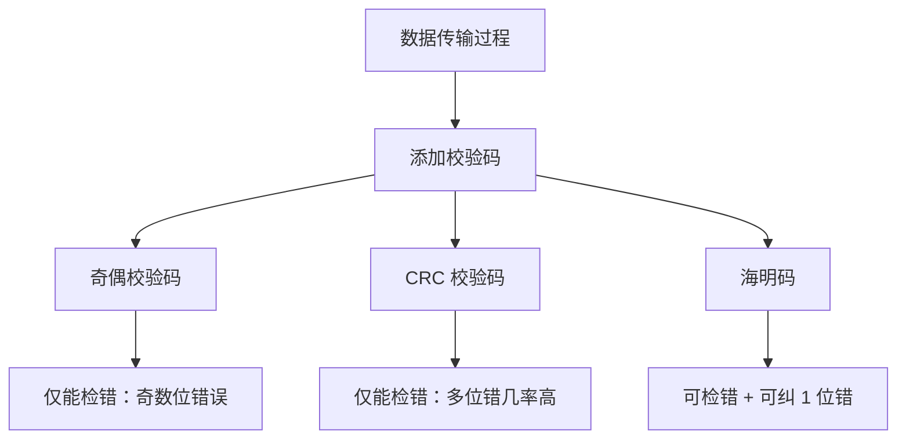

### 🧠 一句话记忆：

> **奇偶码、CRC 检错强，海明码还能纠错更牛叉。**

---

### 🧾 校验方法对比表

|校验码种类|是否可**检错**|是否可**纠错**|可检测错误位数|特点简述|
|---|---|---|---|---|
|奇偶校验码|✅ 是|❌ 否|1 位错（奇数位错误）|最基础、简单，仅能发现奇数位翻转|
|CRC 循环冗余码|✅ 是|❌ 否|多位错（大概率）|检错能力强，工业级使用广泛|
|海明码|✅ 是|✅ 是|可检测并**纠正 1 位错**|既能检错又能单错纠错，性价比高|

---

### 📊 Mermaid 图示：校验方法结构

---

### 📌 重点提醒：

- **奇偶校验**：易实现，硬件中常见，但局限性大；
    
- **CRC**：用多项式除法做校验，工业控制、网络通信广泛应用；
    
- **海明码**：适合内存等对**数据准确性要求高**的领域，能自动定位并修正 1 位错误。
    

