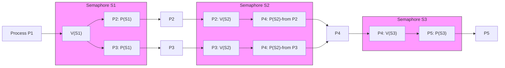

## 📘 PV 操作控制进程执行（图示题）

### 📌 场景说明

有 5 个进程 P1, P2, P3, P4, P5，它们之间存在依赖关系，如图中所示的有向图：

- P1 → P2，P1 → P3，表示：P2、P3 **必须在 P1 执行后才能执行**。
    
- P2 → P4，P3 → P4，表示：P4 必须在 P2 和 P3 执行后才能执行。
    
- P4 → P5，表示：P5 必须在 P4 执行后才能执行。
    

我们使用 **PV 操作**（P 表示 wait（等待），V 表示 signal（释放））来控制执行顺序。

---

### 🔐 信号量设置

- 设置 5 个信号量：S1, S2, S3, S4, S5，初始值均为 0。
    
- 当某进程执行完毕时，对相应的信号量执行 V 操作，唤醒后续进程。
    
- 等待某进程执行完成的进程，会对相应信号量执行 P 操作。
    

---

### 🧠 关键考点

图中：

- a 和 b 处填（1）：说明 P2、P3 需要等待 P1 执行完毕。
    
- c 和 d 处填（2）：说明 P4 需要等待 P2、P3 执行完毕。
    
- e 和 f 处填（3）：说明 P5 需要等待 P4 执行完毕。
    

---

### 死锁的公式

$$
n(w-1)+1
$$