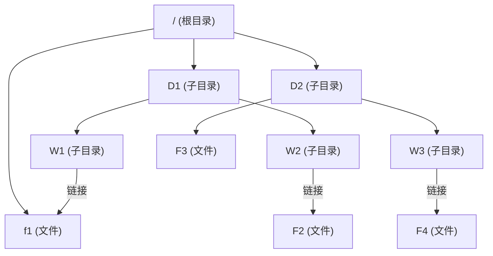

---

### 树

---

### **题目回顾**
题目描述：
> 某文件管理系统为了记录磁盘的使用情况，在磁盘上建立了位示图（bitmap）。若系统中字长为16位，磁盘上的物理块依次编号为：0、1、2、…，那么8192号物理块的使用情况在位示图中的第（ ）个字中描述。  
> 选项：A. 256，B. 257，C. 512，D. 513。

### **快速解题技巧**
- **公式速记**：  
$$
  物理块号 N → 描述位置  ( \left\lfloor \frac{N}{16} \right\rfloor + 1 )=。
$$
- **代入法**：  
  8192是16的整数倍（16×512=8192），直接得513。

### **最终答案**
✅ **D. 513**