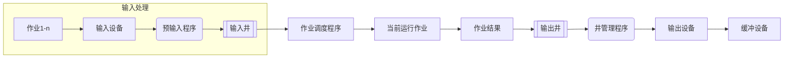
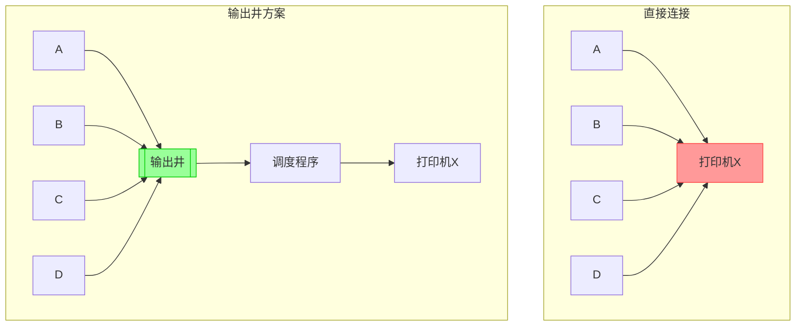

## 1. SPOOLING技术流程图 (Mermaid)

## 2. 打印机共享问题解决方案
### 正确Callout语法示例
> [!ERROR] 冲突现象
> A/B/C/D四个用户同时请求打印机X时，会触发"打印机正在使用！"错误

### 解决方案对比 

## 3. 关键机制说明
> [!TIP] SPOOLING核心思想
> - 通过输入/输出井实现**设备虚拟化**  
> - 预输入程序提前加载作业到输入井  
> - 井管理程序负责缓冲和调度输出  

> [!INFO] 输出井特性
> 1. 先入先出(FIFO)队列结构  
> 2. 支持多用户并发写入  
> 3. 保证打印任务按提交顺序执行  

> [!SUCCESS] 解决机制优势
> - 完全消除设备忙等待  
> - 提高打印机利用率  
> - 用户感知为"独占设备"  
> - 支持离线打印  

## 4. 技术要点总结
> [!NOTE] 相关概念关系
> 输入井 → 作业准备区  
> 输出井 → 结果缓冲区  
> 井管理程序 → I/O调度中心  

> [!WARNING] 注意事项
> - 输出井需要足够存储空间  
> - 需设置合理的打印优先级  
> - 异常处理机制(如打印失败重试)  

## 5. 典型应用场景
> [!EXAMPLE] 生产环境案例
> - 银行票据批量打印  
> - 超市收据系统  
> - 机场登机牌自助终端  
> - 实验室报告集中输出  

