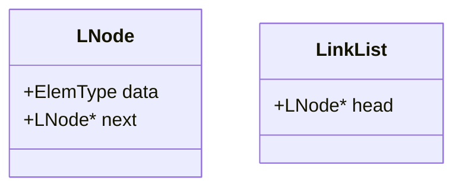
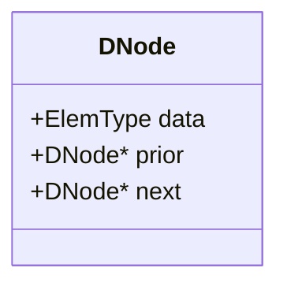
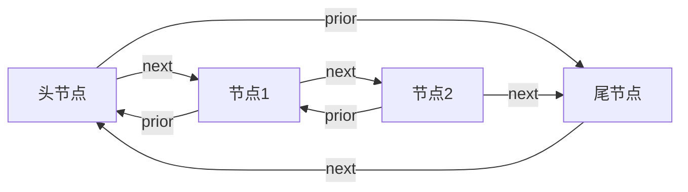

## 1. 单链表结构

### 核心概念
- ​**数据域**​：存储元素值（`data`）
- ​**指针域**​：存储后继节点地址（`next`）
- ​**头节点**​：数据域为空，`next`指向第一个有效节点
- ​**头指针**​：标识整个链表（L1/L2）

>[!tip] 头节点作用
> 统一空表和非空表操作，避免对第一个节点的特殊处理

---
## 2. 单链表实现
### 基本操作
#### 按位查找
```c
LNode* GetElem(LinkList L, int i) {
    if (i < 0) return NULL;
    LNode *p = L->next;
    int j = 1;
    while (p && j < i) {
        p = p->next;
        j++;
    }
    return p;
}
```
​**时间复杂度**​：O(n)

#### 按值查找
```c
LNode* LocateElem(LinkList L, ElemType e) {
    LNode *p = L->next;
    while (p && p->data != e) {
        p = p->next;
    }
    return p;
}
```
​**时间复杂度**​：O(n)

#### 插入操作

```c
s->next = p->next;  // 1. s后继指向p的后继
p->next = s;        // 2. p后继改为s
```

#### 删除操作

```c
q = p->next;          // 1. 记录待删节点
p->next = q->next;    // 2. 绕过q节点
free(q);              // 3. 释放空间
```

---
## 3. 双链表

### 插入操作
```c
s->prior = p;        // 1. s前驱指向p
s->next = p->next;   // 2. s后继指向p的后继
p->next->prior = s;  // 3. p原后继的前驱改为s
p->next = s;         // 4. p后继改为s
```

### 删除操作
```c
p->next = q->next;        // 1. 绕过q节点
q->next->prior = p;       // 2. 修改后继节点的前驱
free(q);                  // 3. 释放空间
```

---
## 4. 循环链表
### 循环单链表


### 循环双链表


>[!important] 空表判断条件
> - 循环单链表：`head->next == head`
> - 循环双链表：`head->next == head && head->prior == head`

---
## 重要题型解析

>[!question] 单链表插入操作的正确顺序
> ​**题目**​：在节点p后插入s的正确代码是？  
> ​**答案**​：  
> 1. `s->next = p->next`  
> 2. `p->next = s`  
> ​**解析**​：必须先修改s的后继指针，再修改p的后继指针，否则会导致链断裂


>[!success] 存储结构对比
> | 存储方式 | 插入/删除效率 | 空间连续性 | 适用场景 |
> |---------|--------------|-----------|---------|
> | 顺序存储 | O(n)         | 连续       | 静态数据 |
> | 链式存储 | O(1)         | 离散       | 动态数据 |

