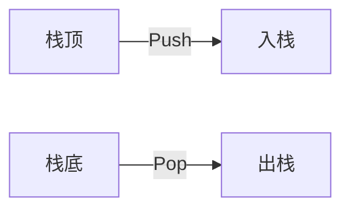
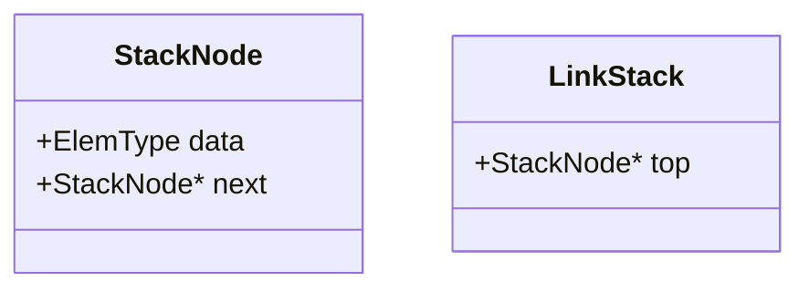
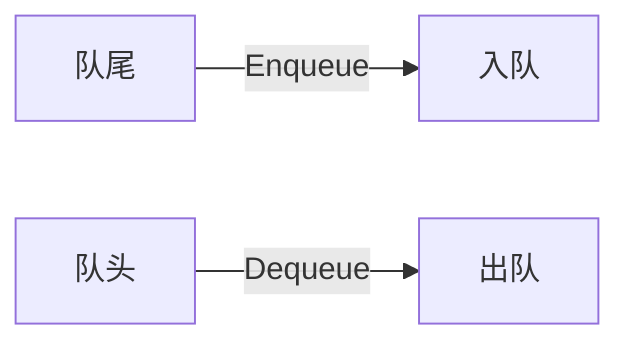
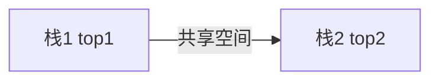

## 一、栈（Stack）
### 1.1 基本概念


- **定义**：后进先出（LIFO）的线性表，仅允许在**栈顶**进行插入（Push）和删除（Pop）
- **特性**：
  - 空栈：`top = -1`（顺序栈）或头结点`next`指向自身（链式栈）
  - 关键操作时间复杂度：**O(1)**


>[!tip] 记忆口诀  
> "栈顶操作，先进后厨（出）"

### 1.2 存储结构
#### 顺序栈（数组实现）
```c
#define MAXSIZE 100
typedef struct {
    ElemType data[MAXSIZE];
    int top; // 栈顶指针
} SqStack;
```

**核心操作**：
```c
// 入栈
void Push(SqStack &S, ElemType x) {
    if (S.top == MAXSIZE-1) return ERROR; // 栈满
    S.data[++S.top] = x; // 先移动指针再存数据
}

// 出栈
ElemType Pop(SqStack &S) {
    if (S.top == -1) return ERROR; // 栈空
    return S.data[S.top--]; // 先取数据再移动指针
}
```

#### 链式栈（单链表实现）


---

## 二、队列（Queue）
### 2.1 基本概念


- **定义**：先进先出（FIFO）的线性表，插入在**队尾**，删除在**队头**
- **特性**：
  - 空队列：`front == rear`（顺序队列）
  - 假溢出问题：通过**循环队列**解决

### 2.2 循环队列实现
```c
#define MAXSIZE 6
typedef struct {
    ElemType data[MAXSIZE];
    int front, rear; // 队头、队尾指针
} SqQueue;
```

**关键判断**：
```c
// 队空
bool isEmpty(SqQueue Q) {
    return Q.front == Q.rear;
}

// 队满（牺牲一个存储单元）
bool isFull(SqQueue Q) {
    return (Q.rear + 1) % MAXSIZE == Q.front;
}
```

**元素个数计算**：
$$
\text{队列长度} = (rear - front + \text{MAXSIZE}) \% \text{MAXSIZE}
$$


## 三、核心算法与应用
### 3.1 卡特兰数（合法出栈序列）
**正确公式**：
$$
C_n = \frac{1}{n+1} \binom{2n}{n}
$$

**计算实例**（n=3）：
1. $\binom{6}{3} = 20$  
2. $C_3 = \frac{20}{4} = 5$ 种合法序列


### 3.2 题型解析
#### 题型1：判断非法出栈序列
**问题**：入栈序列1,2,3,4,5，不可能的输出序列是？  
**解析方法**：
1. 模拟栈操作，逐个匹配目标序列
2. 发现矛盾即排除（如序列4,3,5,1,2中5过早出栈）

#### 题型2：递归转非递归
**解决方案**：  
显式使用**栈结构**保存函数调用状态（参数、返回地址）

---

## 四、扩展结构
### 4.1 共享栈


**判满条件**：  
`top1 + 1 == top2`

### 4.2 双端队列（Deque）
- **特性**：两端均可进行入队/出队操作
- **应用场景**：滑动窗口算法、回文检查

---

## 五、综合对比
| 结构        | 插入位置 | 删除位置 | 典型应用           |
|-------------|----------|----------|--------------------|
| 栈          | 栈顶     | 栈顶     | 函数调用、括号匹配 |
| 普通队列    | 队尾     | 队头     | 缓冲区、BFS       |
| 循环队列    | 队尾     | 队头     | 高性能消息队列     |
| 双端队列    | 两端     | 两端     | 复杂调度算法       |
