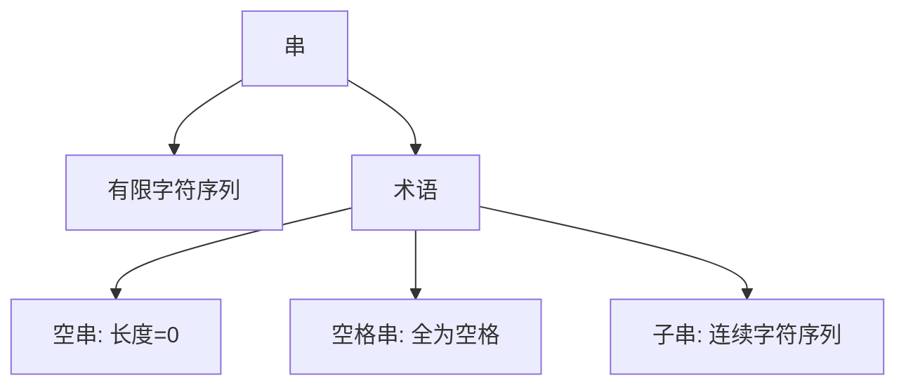
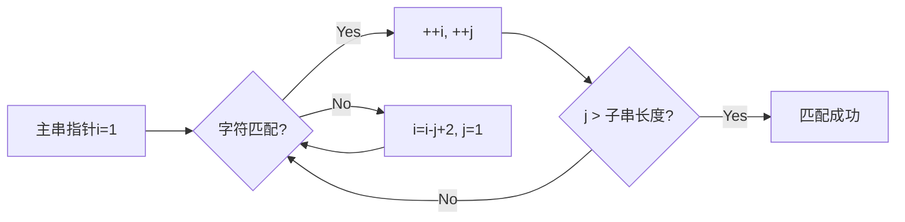
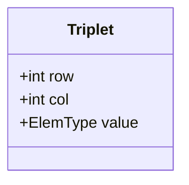
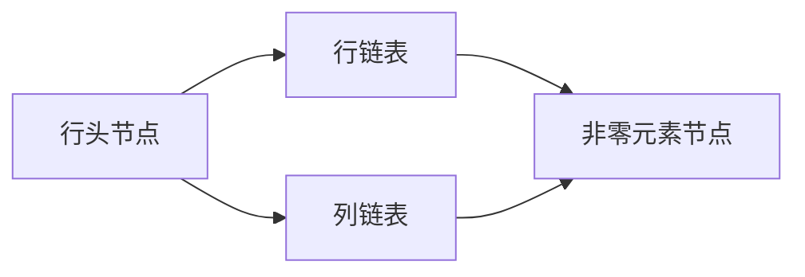

## 一、串（String）
### 1.1 基本概念


- **定义**：由零个或多个字符组成的有限序列
- **关键特性**：
  - 空串与空格串的区别：`""` vs `"   "`
  - 子串必须连续字符（如`"China"`的子串`"Chi"`）
  - 字符位置从1开始计数

### 1.2 基本操作
| 操作                | 功能描述                     | 时间复杂度 |
|---------------------|----------------------------|-----------|
| `StrCopy(&T, S)`    | 串复制                      | O(n)      |
| `StrEmpty(S)`       | 判空                       | O(1)      |
| `StrCompare(S, T)`  | 串比较（字典序）             | O(n)      |
| `StrLength(S)`      | 求串长                     | O(1)      |
| `SubString(&Sub, S, pos, len)` | 取子串           | O(len)    |
| `Concat(&T, S1, S2)`| 串连接                     | O(n+m)    |
| `Index(S, T)`       | 模式匹配（定位子串）         | O(n*m)    |

```c
// 模式匹配示例：在S="ababcabcacbab"中查找T="abcac"
int Index(String S, String T) {
    int i=1, j=1;
    while(i<=S[0] && j<=T[0]) {
        if(S[i] == T[j]) { ++i; ++j; }
        else { i = i-j+2; j=1; } // 指针回溯
    }
    return j>T[0] ? i-T[0] : 0;
}
```

---
## 二、模式匹配算法
### 2.1 简单模式匹配（BF算法）
**执行流程**：


**时间复杂度分析**：
- 最好情况：O(n)（首字符匹配失败）
- 最坏情况：O(n*m)（每次匹配到最后一个字符失败）

### 2.2 应用实例
```markdown
主串S: a b c a b c a c b a b  
子串T: a b c a c  
匹配过程：  
1. abcab... → 第5字符c≠b  
2. 回溯后从b开始 → 不匹配  
3. 最终在第6位置匹配成功
```

---
## 三、矩阵压缩存储
### 3.1 对称矩阵压缩
**存储策略**：仅存储下三角+主对角线元素  
**下标映射公式**（行列从1开始）：
$$
k = \begin{cases}
\frac{i(i-1)}{2} + j-1 & \text{当 } i \geq j \\
\frac{j(j-1)}{2} + i-1 & \text{当 } i < j
\end{cases}
$$

**示例**：  
6×6对称矩阵元素`a[4][3]`在一维数组中的位置：
$$
k = \frac{4×3}{2} + 2 = 8
$$

### 3.2 三角矩阵压缩
#### 下三角矩阵存储
**存储策略**：下三角+常数项  
**元素总数**：
$$
\frac{n(n+1)}{2} + 1
$$

**地址计算**：
$$
\text{地址}(a_{ij}) = \begin{cases}
base + \frac{(i-1)i}{2} + (j-1) & i \geq j \\
base + \frac{n(n+1)}{2} & i < j
\end{cases}
$$

### 3.3 稀疏矩阵存储
#### 三元组表示法


**示例矩阵**：
```
0 0 4 0  
0 6 0 0  
9 0 0 0  
23 0 0 0

三元组表示：
(0,2,4)  
(1,1,6)  
(2,0,9)  
(3,0,23)
```

#### 十字链表法


---
## 四、典型题型解析
### 4.1 矩阵地址计算
**题目**：n阶下三角矩阵（行列从1开始），求`a_{ii}`在一维数组中的下标  
**解析**：
$$
k = \frac{i(i-1)}{2} + (i-1) = \frac{i^2 - i + 2i - 2}{2} = \frac{i^2 + i - 2}{2}
$$

### 4.2 模式匹配过程
**题目**：主串`S="abcabca"`，模式`T="bca"`的匹配次数  
**解答**：
```step
1. 比较位置1-3：abc vs bca → 失败  
2. 回溯到位置2：bc vs bc → 继续比较第3字符  
3. 最终在位置2匹配成功，共比较4次
```

---
## 附录
### 重要公式速查
| 矩阵类型       | 元素总数公式              | 地址计算式                  |
|---------------|-------------------------|---------------------------|
| 对称矩阵       | `n(n+1)/2`             | `k = i(i-1)/2 + j-1`      |
| 下三角矩阵     | `n(n+1)/2 + 1`         | `k = i(i-1)/2 + j-1`      |
| 稀疏矩阵       | 非零元素个数+1          | 三元组(row, col, value)    |

### 复杂度对比
| 算法/结构      | 时间复杂度          | 空间复杂度       |
|---------------|--------------------|----------------|
| BF模式匹配     | O(n*m)            | O(1)           |
| 对称矩阵压缩   | O(1)访问          | O(n²/2)        |
| 十字链表存储   | O(1)插入/删除     | O(t)（t为非零元数）|

> 掌握矩阵压缩的核心公式和模式匹配的回溯机制，是应对算法题的关键！🚀
