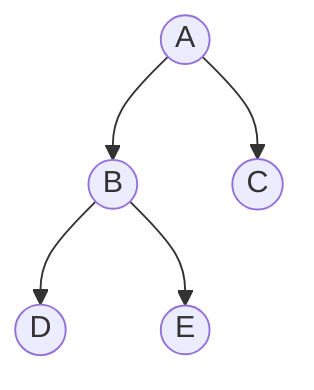
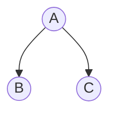
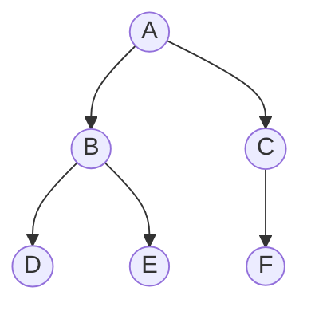
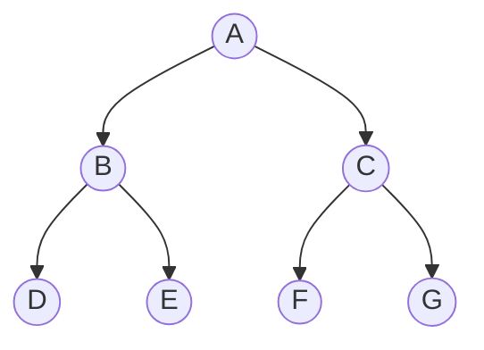
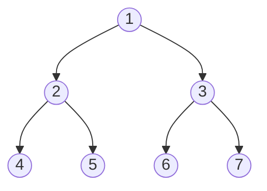

## 树的基本术语
以下是树结构相关术语的详细解释及图示说明：

---

### 1. **祖先 (Ancestor)**  
**定义**：某个结点到根结点的路径上的所有结点（包括父结点、祖父结点等）。  
**图示**：  

- 结点D的祖先：B、A。

---

### 2. **双亲 (Parent)**  
**定义**：直接连接到某个结点的上层结点（直接前驱）。  
**图示**：  

- B和C的双亲是A。

---

### 3. **孩子 (Child)**  
**定义**：某个结点的直接下层结点（直接后继）。  
**图示**：  

- B和C是A的孩子。

---

### 4. **结点的度 (Degree of a Node)**  
**定义**：结点拥有的子结点个数。  
**图示**：  

- 结点B的度是2（子结点D和E）。

---

### 5. **树的度 (Degree of a Tree)**  
**定义**：树中所有结点的度的最大值。  
**图示**：  

- 树的度是2（结点B的度最大）。

---

### 6. **分支结点 (Branch Node)**  
**定义**：度大于0的结点（即有子结点的结点）。  
**图示**：  

- 分支结点：A、B。

---

### 7. **叶子结点 (Leaf Node)**  
**定义**：度为0的结点（没有子结点的结点）。  
**图示**：  

- 叶子结点：B和C（假设B和C没有子结点）。

---

### 8. **兄弟 (Sibling)**  
**定义**：有相同双亲的结点。  
**图示**：  

- B和C是兄弟。

---

### 9. **深度 (Depth)**  
**定义**：从根结点到该结点的路径长度（根结点的深度为1）。  
**图示**：  

- 结点D的深度是3。

---

### 10. **高度 (Height)**  
**定义**：从该结点到最远叶子结点的路径长度（叶子结点的高度为1）。  
**图示**：  

- 结点A的高度是3，结点B的高度是2，结点D的高度是1。

---

### 11. **有序树 (Ordered Tree)**  
**定义**：树中结点的子结点顺序是有意义的，不可随意交换。  
**图示**：  

- B和C的顺序有意义（例如B是左子树，C是右子树）。

---

### 12. **无序树 (Unordered Tree)**  
**定义**：树中结点的子结点顺序无关紧要。  
**图示**：  

- B和C的顺序可以交换。

---

### 13. **路径 (Path)**  
**定义**：从根结点到某个结点的一系列连接的边和结点。  
**图示**：  

- 路径A → B → D。

---

### 14. **路径长度 (Path Length)**  
**定义**：路径中边的数量（即路径长度=结点数-1）。  
**图示**：  

- 路径A → B → D的长度是2。

---

### 综合图示与关系  

- **树的度**：2（结点B的度最大）。  
- **叶子结点**：D、E、F。  
- **深度**：A=1, B=2, D=3。（从上往下） 
- **高度**：A=3, B=2, D=1。  （从下往上）
- **路径**：A→B→D（长度2）。  

通过图示可以直观理解树结构的层级关系和术语含义。

## 树的基本性质

---

### 1. **树中的结点数等于所有结点的度数之和加一**  
  
**公式**：  
$$ n = \sum (\text{所有结点的度数}) + 1 $$  
**解释**：  
- 树的边数 = 所有结点的度数之和（每个边被父结点计数一次）。  
- 根据树的性质，结点数 = 边数 + 1，因此成立。  

---

### 2. **m叉树中第i层至多有 $$m^{i-1}$$ 个结点**   
**公式**：  
$$ \text{第} i \text{层最大结点数} = m^{i-1} $$  
**图示**：  

- 对二叉树（m=2），第3层最多有 $$2^{3-1} = 4$$ 个结点（图示中第3层有4个结点）。  

---

### 3. **高度为h的m叉树至多有 $$\frac{m^h - 1}{m - 1}$$ 个结点**   
**解释**：  
- 满m叉树的总结点数是等比数列求和（根结点为第1层）：  
  $$ 1 + m + m^2 + \dots + m^{h-1} = \frac{m^h - 1}{m - 1} $$  
**图示**：  

- 高度为3的满二叉树（m=2），总结点数 = $$\frac{2^3 - 1}{2 - 1} = 7$$，与图示一致。

---

### 4. **具有n个结点的m叉树的最小高度为 $$\lceil \log_m (n(m-1) + 1) \rceil$$**    
**公式**：  
$$ \text{最小高度} = \left\lceil \log_m \big( n(m-1) + 1 \big) \right\rceil $$  
**推导**：  
- 最小高度对应完全填满前h-1层，且第h层至少有一个结点。  
- 满足不等式：  
  $$ \frac{m^{h-1} - 1}{m - 1} < n \le \frac{m^h - 1}{m - 1} $$  
- 解得 $$ h = \lceil \log_m (n(m-1) + 1) \rceil $$。  

---

## 满二叉树
### 1. **满二叉树的结点总数**  
**定义**：高度为 $$h$$ 的满二叉树，结点总数为 $$2^h - 1$$。  
**示例**：  
- 高度3的满二叉树，结点总数 = $$2^3 - 1 = 7$$。  
**图示**：  


---

### 2. **求父结点的索引**  
**修正**：  
- 父结点索引为 $$\left\lfloor \frac{i}{2} \right\rfloor$$（向下取整）。  
- 更直观的写法：若结点索引从1开始，父结点索引为 $$i // 2$$（整数除法）。  
**示例**：  
- 结点5的父结点是 $$5 // 2 = 2$$。  
**图示**：  


---

### 3. **求基于父结点的兄弟结点的索引**  
- **左兄弟**： $$2i$$。  
- **右兄弟**： $$2i + 1$$
 
**图示**：  

- 结点4的右兄弟是5，结点5的左兄弟是4。  

---
## 完全二叉树
1. 一个度为1的结点只会有左孩子，不会有右孩子。
2. 同时度为1的结点只可能有一个。

## 二叉排序树
1. 左字数的结点关键字均小于右字数的关键字。

## 平衡二叉树
1. 树上任一结点的左子树和右子树的深度之差绝对值不超过1。（了解即可）

## 二叉树的性质
1. 非空二叉树上的叶子结点数等于度为2的结点数加1，即n0=n2+1。<span style="background:#fff88f">叶子数 = 分叉点数 + 1</span>。<font color="#ffffff"><span style="background:rgba(3, 135, 102, 0.2)"><font color="#ffffff">根结点开始是叶子，之后每次分叉“替换”一个叶子为分叉点，并新增两个叶子，净增加1叶子。</font></span></font>
2. 非空二叉树上第k层上至多有2<sup>k-1</sup>个结点。
3. 高度为h的二叉树至多有 2<sup>k</sup>-1个结点。
4. 具有 n(n>0)个结点的完全二叉树的高度为​⌈log2​(n+1)⌉​或⌊log2​n⌋+1。
5. 在含有n个结点的二叉链表中，含有n+1个空链域，含有n-1个非空链域。

## 二叉树的遍历
**一、前序遍历（Preorder Traversal）**

访问顺序：  
👉 先访问**根节点** → 再访问**左子树** → 最后访问**右子树**

**口诀**：根 → 左 → 右

**例子**（假设是下面这个简单的二叉树）：

```
    A
   / \
  B   C
 / \
D   E
```

前序遍历结果是：`A → B → D → E → C`

---

**二、中序遍历（Inorder Traversal）**

访问顺序：  
👉 先访问**左子树** → 然后访问**根节点** → 最后访问**右子树**

**口诀**：左 → 根 → 右

**例子**：

```
    A
   / \
  B   C
 / \
D   E
```

中序遍历结果是：`D → B → E → A → C`

---

**三、后序遍历（Postorder Traversal）**

访问顺序：  
👉 先访问**左子树** → 再访问**右子树** → 最后访问**根节点**

**口诀**：左 → 右 → 根

**例子**：

```
    A
   / \
  B   C
 / \
D   E
```

后序遍历结果是：`D → E → B → C → A`

---
