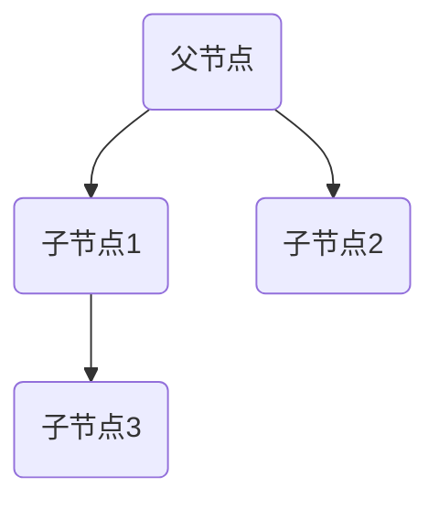
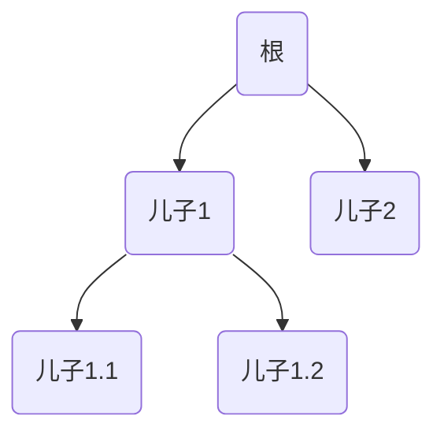
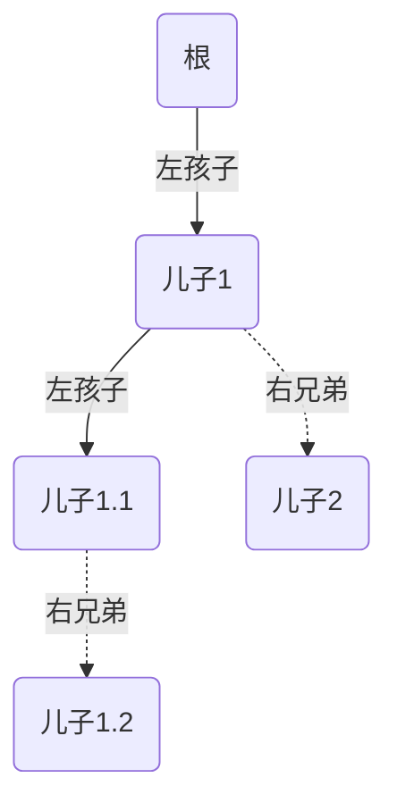
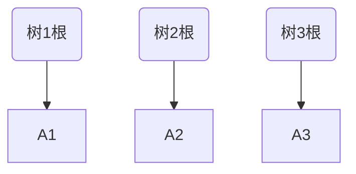
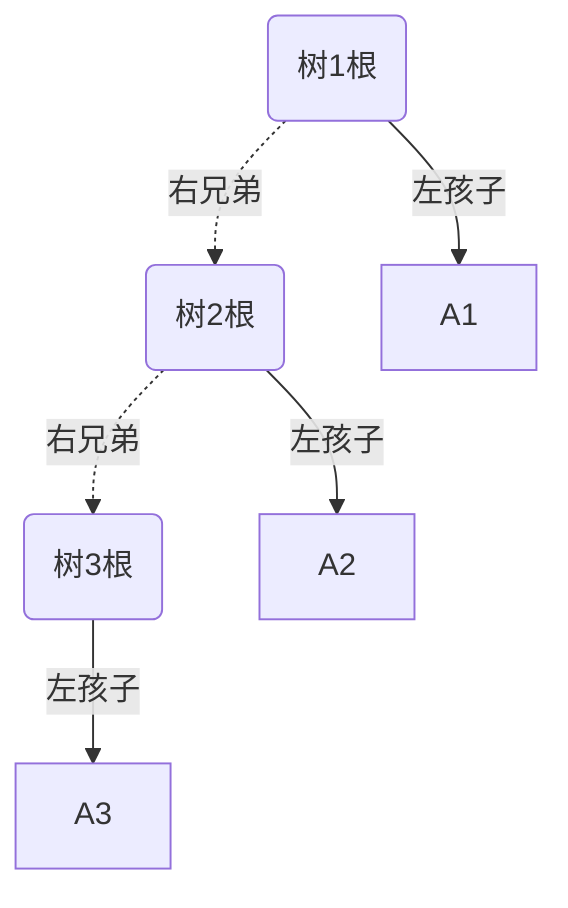
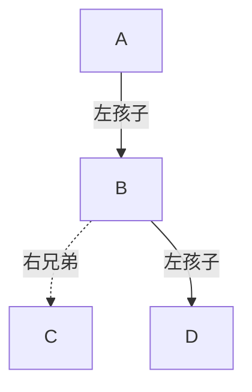
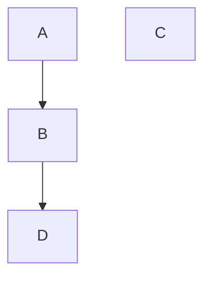

1. 树的存储结构
2. 把树转换成二叉树
3. 由数转换成二叉树，其根结点的右子树总是空的
4. 把森林转换成二叉树
5. 设森林F中有三棵树，第一、第二、第三棵树上的结点个数分别为M1,M2,M3则与森林 F 对应的二叉树根结点的右子树上的结点个数为M2+M3。
6. 画出二叉树对应的森林
7. 树的遍历（先根遍历，后根遍历）
8.  森林的遍历
9. 二叉排序树
10. 二叉排序树的插入
11. 向二叉排序树插入一个新结点时，新结点一定会成为二叉排序树的一个子结点
12. 二叉排序树的构造
13. 二叉排序树的删除
14. 若结点只有一棵左子树或者右子树，则让该结点的子树成为其父结点的子树(直接前驱)代替该结点
15. 若结点有左、右两棵子树，则令该结点的直接后继然后从二叉排序树中删去这个直接后继(直接前驱)，这样就转换成了前两种情况
----

# 树与二叉树笔记

## 1. 树的存储结构

- **双亲表示法**（每个节点记录父节点指针）
    
- **孩子表示法**（每个节点记录子节点链表）
    
- **孩子兄弟表示法**（孩子指针+兄弟指针）
    
- **总结**：  
    通常采用**孩子-兄弟表示法**，便于转成二叉树。
    

### 图示

---

## 2. 把树转换成二叉树

**转换规则：**

- 保留**长子**，其他兄弟通过**右指针**连接。
    
- 左指针指向第一个孩子，右指针指向下一个兄弟。
    

### 图示
原始的树：

转换成二叉树（左孩子右兄弟表示）：

---

## 3. 特例：树转换成二叉树，右子树总是空

- 只有**一个孩子**的情况下出现。
    
- 每个节点只有**左子树**，右子树为空。
    

---

## 4. 把森林转换成二叉树

- 把森林里的每棵树**按顺序连接**，后一棵树作为前一棵树**根节点的右孩子**。
    
- 每棵树内部还是按照“长子+兄弟”的二叉化规则处理。
    

原始森林（多棵树）

转换成二叉树（根的右兄弟是下一个树的根）：

---

## 5. 结点个数关系

设森林F中有三棵树，结点个数分别为：

- M₁：第一棵树结点数
    
- M₂：第二棵树结点数
    
- M₃：第三棵树结点数
    

则：

- 与森林F对应的二叉树中，**根节点的右子树上的结点数为：M₂ + M₃**
    

---

## 6. 画出二叉树对应的森林

**规则**：

- 左子树是孩子。
    
- 右子树是兄弟。
    

给定二叉树（左孩子右兄弟）

**转换成森林（分成多棵树）：**

- A是森林的第一棵树根。
    
- B是A的孩子。
    
- C是B的兄弟，所以是第二棵树的根。
    
- D是B的孩子。

---

## 7. 树的遍历

- **先根遍历**：先访问节点，再访问孩子。
    
- **后根遍历**：先访问所有孩子，再访问节点本身。
    

> **口诀**：“先自己，后儿子” vs “先儿子，后自己”

---

## 8. 森林的遍历

- **先根遍历森林** = **先根遍历每棵树**，按顺序依次遍历。
    
- **后根遍历森林** = **后根遍历每棵树**，也是按顺序。
    

---

# 二叉排序树（BST）

## 9. 定义

- 左子树上所有结点值小于根节点。
    
- 右子树上所有结点值大于根节点。
    
- 左右子树也是BST。
    

---

## 10. 二叉排序树的插入

**原则：**

- 比当前节点小，往左；
    
- 比当前节点大，往右；
    
- 直到找到空位置插入。
    

---

## 11. 插入新节点，一定是子节点

插入操作总是找到一个**空子树**，所以新节点一定成为已有节点的**左/右子节点**。

---

## 12. 二叉排序树的构造

**步骤：**

- 依次把元素插入空树，遵循BST插入规则。
    
- 插入顺序影响树的形状。
    

---

## 13. 二叉排序树的删除

删除节点分三种情况：

|情况|处理方式|
|:--|:--|
|只有左子树或右子树|直接用子树代替|
|有左右子树|找直接前驱或直接后继，替换后再删除|
|叶子节点|直接删除|

---

## 14. 子树代替删除节点（直接前驱/后继）

- 若只有左子树/右子树：
    
    - 子树顶上，接到原父节点上。
        
- 直接取代位置，连上原本的父节点。
    

---

## 15. 删除有两棵子树的结点

- 找**直接后继**（右子树最左节点）或**直接前驱**（左子树最右节点）。
    
- 用直接后继（或前驱）替换要删的节点，然后再删除后继节点（此时变成前面那种情况了）。
    

