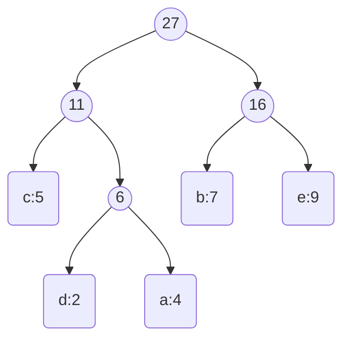

## 题目内容

给定字符及其出现频率：

- a：4
    
- b：7
    
- c：5
    
- d：2
    
- e：9
    

要求：

1. 画哈夫曼树（左子树权值 ≤ 右子树权值）
    
2. 求哈夫曼编码
    
3. 翻译编码串 `1100011100010111`
    
4. 计算带权路径长度
    

---

## 哈夫曼树构造步骤

```text
1. 将所有结点作为单独的树（权值分别为4,7,5,2,9）。
2. 每次选择权值最小的两棵树，构建一个新节点作为它们的父亲节点。
3. 新节点的权值 = 两棵子树权值之和。
4. 将新节点插回集合中，继续循环。
5. 重复 2-4，直到集合中只剩一棵树为止。
```

---

## 哈夫曼树构建过程

**初始节点权值：**

```
{a:4}, {b:7}, {c:5}, {d:2}, {e:9}
```

**步骤一：**  
选最小的两个节点：d(2), a(4)  
→ 合并成新节点（d,a）：权值6

新的节点集合：

```
{(d,a):6}, {b:7}, {c:5}, {e:9}
```

**步骤二：**  
选最小的两个节点：c(5), (d,a)(6)  
→ 合并成新节点（c,(d,a))：权值11

新的节点集合：

```
{(c,(d,a)):11}, {b:7}, {e:9}
```

**步骤三：**  
选最小的两个节点：b(7), e(9)  
→ 合并成新节点（b,e)：权值16

新的节点集合：

```
{(c,(d,a)):11}, {(b,e):16}
```

**步骤四：**  
最后两个节点合并：  
(c,(d,a))(11) + (b,e)(16) → 新节点，权值27

✅ **哈夫曼树构建完成！**

---

## 哈夫曼树结构（图示）



**说明：**

- 左孩子权小于右孩子权。
    
- 每一个合并新节点，左、右子树分别是合并的两个原节点/子树。
    

---

## 哈夫曼编码（0左1右）

- c：左 → 0
    
- d：左 → 左 → 0 → 0
    
- a：左 → 右 → 0 → 1
    
- b：右 → 左 → 1 → 0
    
- e：右 → 右 → 1 → 1
    

总结成表格：

|字符|编码|
|:-:|:-:|
|c|00|
|d|010|
|a|011|
|b|10|
|e|11|

---

## 编码串翻译

编码串：`1100011100010111`

根据编码表解码：

- 11 → e
    
- 00 → c
    
- 011 → a
    
- 100 → b
    
- 010 → d
    
- 111 → e
    

翻译结果是：**e c a b d e**

---

## 带权路径长度（WPL）

公式：  
WPL=∑(权值×路径长度)WPL = \sum (\text{权值} × \text{路径长度})

具体计算：

- c（5）路径长度2 → 5×2=10
    
- d（2）路径长度3 → 2×3=6
    
- a（4）路径长度3 → 4×3=12
    
- b（7）路径长度2 → 7×2=14
    
- e（9）路径长度2 → 9×2=18
    

总和：

WPL=10+6+12+14+18=60WPL = 10 + 6 + 12 + 14 + 18 = 60

✅ 带权路径长度是：**60**

---

# 小结

- 哈夫曼树：每次选最小两棵子树合并。
    
- 哈夫曼编码：左0右1，遍历得到。
    
- 带权路径长度WPL：权值×深度累加。
    
- 记住！**哈夫曼树一定是最优无损编码方案。**
    
