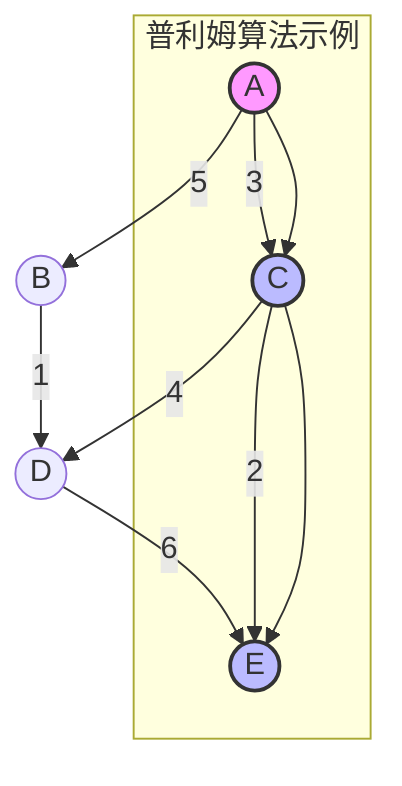
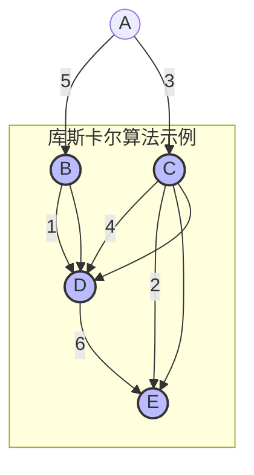
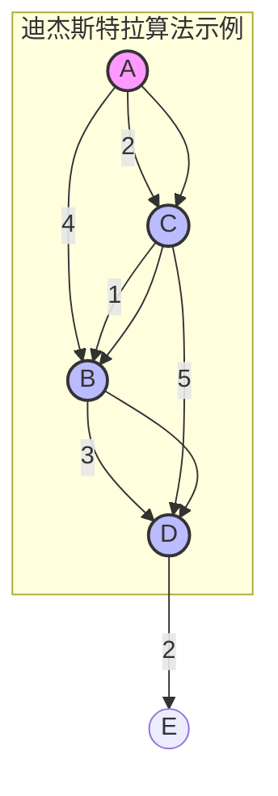
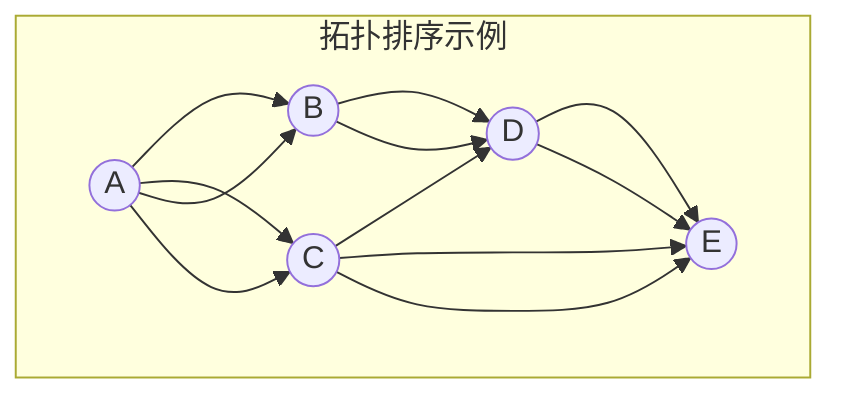
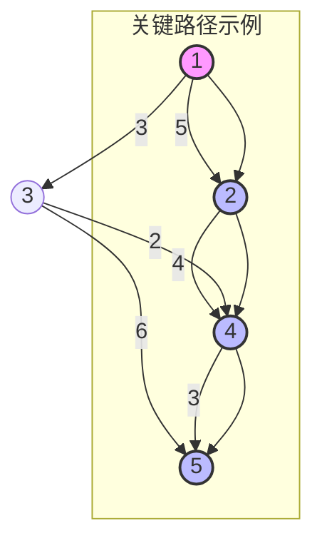

1. 最小生成树
	1. 普利姆算法
	2. 库斯卡尔算法
2. 最短路径
	1. 迪杰斯科拉算法
3. 拓扑排序
	1. AOV网
	2. 拓扑排序
4. 关键路径
	1. AOE网
	2. 关键路径
	3. 关键活动

---
# 图算法笔记

## 1. 最小生成树

### 1.1 普利姆算法 (Prim's Algorithm)

普利姆算法用于寻找加权无向连通图的最小生成树，从单个顶点开始，逐步选择与当前生成树连接的最小权值边。

**步骤**：

1. 选择任意顶点作为起点，加入生成树。
2. 从与生成树相邻的边中，选择权值最小的边，将其连接的顶点加入生成树。
3. 重复步骤2，直到所有顶点都加入生成树。

**时间复杂度**：

- 使用邻接矩阵：O(V²)
- 使用优先队列：O(E log V)

> [!TIP]  
> 普利姆算法适合稠密图，优先队列优化能显著提升效率。

### 1.2 库斯卡尔算法 (Kruskal's Algorithm)

库斯卡尔算法通过按权值排序所有边，逐步加入不形成环的最小权值边，构建最小生成树。

**步骤**：

1. 将所有边按权值从小到大排序。
2. 依次选择权值最小的边，若加入不形成环，则加入生成树。
3. 重复步骤2，直到生成树包含 V-1 条边。

**时间复杂度**：

- 使用并查集：O(E log E)

> [!NOTE]  
> 库斯卡尔算法适合稀疏图，依赖并查集高效判断环的存在。

## 2. 最短路径

### 2.1 迪杰斯特拉算法 (Dijkstra's Algorithm)

迪杰斯特拉算法用于计算单源最短路径，适用于非负权值的有向或无向图。

**步骤**：

1. 初始化起点距离为0，其他顶点距离为无穷大。
2. 选择未访问且距离最小的顶点，标记为已访问。
3. 更新与该顶点相邻顶点的距离（若新路径更短）。
4. 重复步骤2-3，直到所有顶点被访问。

**时间复杂度**：

- 使用优先队列：O((V + E) log V)

> [!WARNING]  
> 迪杰斯特拉算法不适用于负权值边，负权值需使用 Bellman-Ford 算法。

## 3. 拓扑排序

### 3.1 AOV网

AOV网（Activity on Vertex Network）是有向无环图（DAG），顶点表示活动，边表示先后顺序。

### 3.2 拓扑排序

拓扑排序对 AOV 网中的顶点进行线性排序，确保若存在边 (u, v)，则 u 在 v 之前。

**步骤**：

1. 计算每个顶点的入度。
2. 将入度为0的顶点加入队列。
3. 从队列中取出一个顶点，加入排序结果，并将其邻接顶点的入度减1。
4. 若邻接顶点入度变为0，加入队列。
5. 重复步骤3-4，直到队列为空。

**时间复杂度**：O(V + E)

> [!CAUTION]  
> 若图中存在环，拓扑排序无法进行，需先检测环。

## 4. 关键路径

### 4.1 AOE网

AOE网（Activity on Edge Network）是有向无环图，边表示活动，顶点表示事件，边权值表示活动耗时。

### 4.2 关键路径

关键路径是从起点到终点的最长路径，决定整个工程的最短完成时间。

**步骤**：

1. 计算每个事件的最早发生时间（ve）和最晚发生时间（vl）。
2. 计算每个活动的开始时间（e）和最晚开始时间（l）。
3. 关键活动满足 e = l，关键路径由关键活动组成。

**时间复杂度**：O(V + E)

### 4.3 关键活动

关键活动是关键路径上的活动，其延迟会导致整个工程延期。

> [!TIP]  
> 通过缩短关键活动的耗时，可优化工程总时长。

