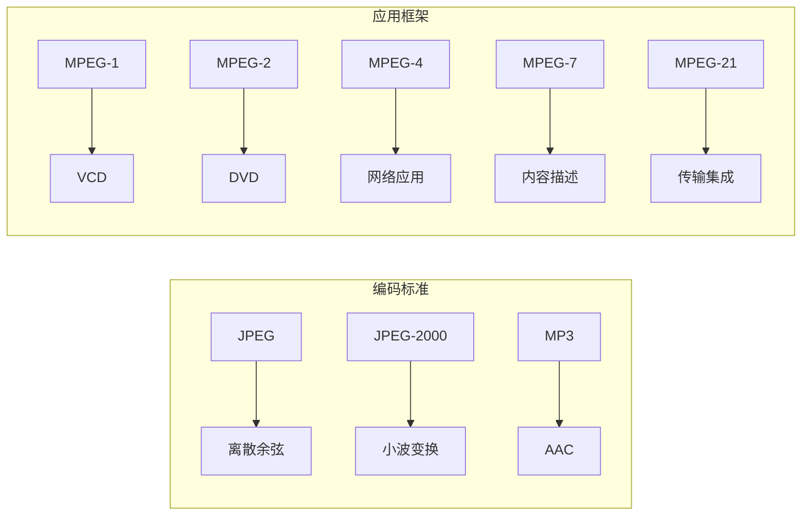
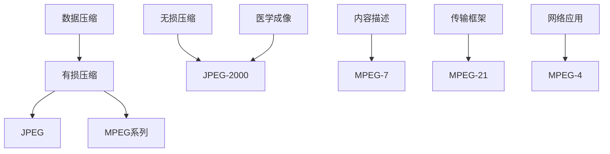
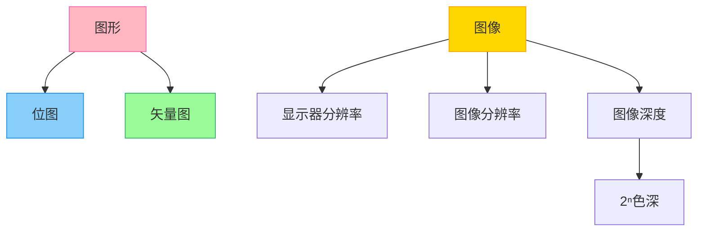
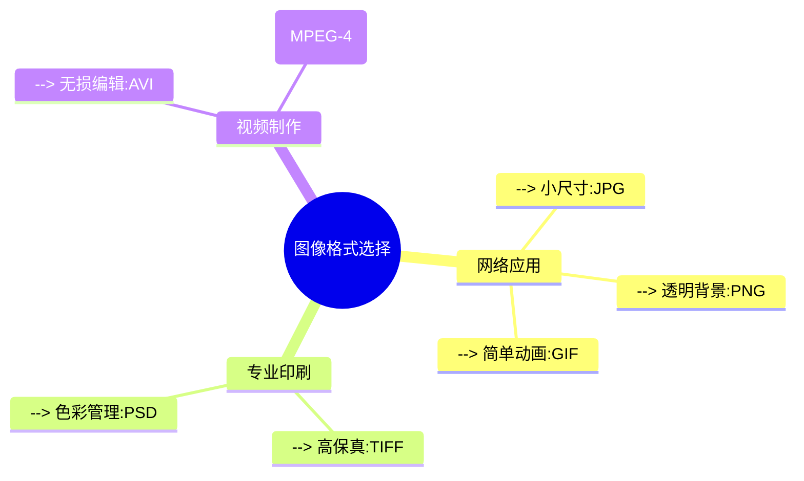

# 多媒体技术标准体系

## 1. 技术标准概览


## 2. 核心编码技术
> [!NOTE] 压缩算法演进
> - **第一代编码**  
>   📌 离散余弦变换（JPEG）  
>   📌 Huffman编码（有损压缩）  
>   ▶ 应用：VCD、早期数码相机
>
> - **新一代编码**  
>   📌 小波变换（JPEG-2000）  
>   📌 AAC音频编码（MPEG-2/4）  
>   ▶ 优势：+30%压缩率，支持医学图像

## 3. 应用领域矩阵
| 标准         | 主要应用场景                | 关键技术特性                  |
|--------------|---------------------------|-----------------------------|
| **MPEG-1**   | VCD、MP3音频               | 首套音视频集成标准            |
| **MPEG-2**   | DVD、数字电视              | 支持隔行扫描，DRM基础         |
| **MPEG-4**   | 网络流媒体、可视电话        | 对象编码，增强交互性          |
| **MPEG-7**   | 多媒体内容检索             | XML元数据描述规范             |
| **MPEG-21**  | 数字版权管理(DRM)          | 跨平台传输框架                |

## 4. 关键技术特性
> [!TIP] JPEG核心机制
> ```mermaid
> graph TB
>     RGB输入 --> YUV转换 --> 分块处理 --> 离散余弦变换 --> 量化 --> 熵编码
>     style YUV转换 fill:#FFD700
>     style 离散余弦变换 fill:#87CEEB
> ```

> [!WARNING] 标准兼容注意
> - MPEG-4与H.264的协议融合
> - JPEG-2000不兼容传统JPEG
> - AAC作为MP3演进格式需要特殊解码器

## 5. 技术关系图


## 6. 关键特性总结
> [!EXAMPLE] 标准演进里程碑
> - 1988: JPEG（静态图像）  
> - 1992: MPEG-1（VCD时代）  
> - 1994: MPEG-2（DVD革命）  
> - 1999: MPEG-4（网络时代）  
> - 2001: JPEG-2000（医学成像）  
> - 2002: MPEG-7（内容检索）  
> - 2005: MPEG-21（DRM体系）

---
# 图像处理核心概念与格式体系

## 1. 核心概念关系图 (Mermaid)


## 2. 核心概念详解
> [!NOTE] 关键定义
> **显示器分辨率**  
> `物理像素矩阵`（如1920×1080）  
> **图像分辨率**  
> `像素密度`（ppi/pixels per inch）  
> **图像深度**  
> `2ⁿ色深` → n=8bit → 256色

> [!TIP] 格式选择原则
> ```mermaid
> flowchart LR
>     web应用 --> 矢量图(SVG) & 有损压缩(JPG)
>    印刷出版 --> 无损格式(TIFF) & 高色深格式(PCD)
>    动画制作 --> GIF & 矢量动画
> ```

## 3. 图像格式特性对比表
| 格式类型 | 代表格式 | 压缩类型 | 典型应用 | 特殊功能 |
|---------|---------|---------|---------|---------|
| **静态** | GIF | LZW无损 | 网页图标 | 支持256色动画 |
|          | JPG | 有损DCT | 数字摄影 | 可调压缩比 |
|          | BMP | 无压缩 | Windows系统 | 原生位图存储 |
| **动态** | AVI | 无损封装 | 视频采集 | 多编码器支持 |
|          | MPG | MPEG压缩 | 数字电视 | 时间戳同步 |

## 4. 技术要点详解
> [!EXAMPLE] 位图 vs 矢量图
> ```mermaid
> graph LR
>     subgraph 位图
>         A[像素矩阵] --> B[照片级真实感]
>         C[分辨率固定] --> D[放大失真]
>     end
>     subgraph 矢量图
>         E[数学公式] --> F[几何图形]
>         G[无限缩放] --> H[CAD设计]
>     end
> ```

> [!WARNING] 格式兼容注意
> - PCX格式已逐步被PNG替代
> - PCD(Kodak Photo CD)需专用软件
> - MPG容器需注意MPEG-1/2/4版本差异

## 5. 应用场景指南



---

---

### **声音核心知识解析**

---

#### **一、声音带宽范围**
| **声源类型** | **频率范围**       | **应用场景**                     |
|--------------|--------------------|----------------------------------|
| 人耳听觉     | 20Hz - 20kHz       | 全频段音频设备（Hi-Fi音响）       |
| 人声说话     | 300Hz - 3400Hz     | 电话通信（窄带压缩节省带宽）       |
| 乐器         | 20Hz - 20kHz       | 音乐录制/高保真播放               |

**技术要点**：  
- 电话系统采用**300-3400Hz**带宽，滤除高低频冗余数据以降低传输成本。  
- CD音质采样率44.1kHz（满足**奈奎斯特采样定理**，覆盖20kHz上限）。  

---

#### **二、人对声音的三维感知**
1. **音量（Loudness）**  
   - **物理特性**：与声波振幅成正比（单位：分贝dB）。  
   - **感知示例**：  
     - 0dB：听觉阈值  
     - 60dB：正常对话  
     - 120dB：疼痛阈值  

2. **音调（Pitch）**  
   - **物理特性**：由声波频率决定（单位：赫兹Hz）。  
   - **感知示例**：  
     - 男声：85Hz - 180Hz  
     - 女声：165Hz - 255Hz  
     - 钢琴中央C：261.63Hz  

3. **音色（Timbre）**  
   - **物理特性**：由声波波形形状（谐波成分）决定。  
   - **感知示例**：  
     - 同一音调下，小提琴 vs 钢琴的独特音色。  
     - 语音识别中区分不同说话人的关键特征。  

---

#### **三、技术应用实例**
1. **音频压缩（如MP3）**  
   - 利用**人耳掩蔽效应**，保留300Hz-3400Hz主要语音频段，剔除听阈外的冗余数据。  
2. **语音识别**  
   - 通过MFCC（梅尔频率倒谱系数）提取音调、音色特征，实现说话人验证。  
3. **乐器数字接口（MIDI）**  
   - 记录音调（音符）和音量（力度），通过音色库还原不同乐器声。  

---
