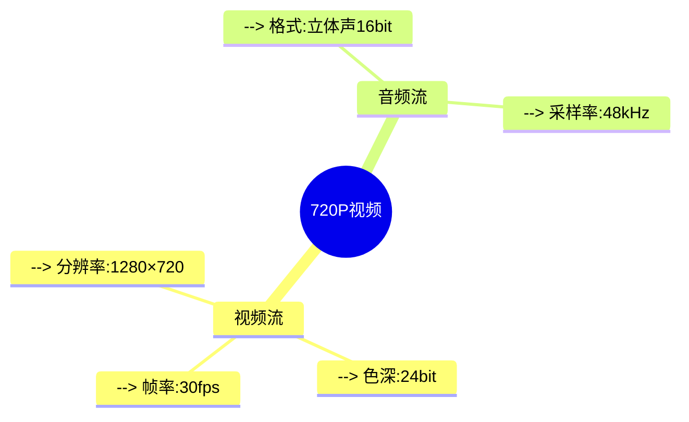

## 1. 图像容量计算
### 1.1 核心公式 (Mermaid)
```mermaid
flowchart LR
    A[图像容量] --> B[像素×位深÷8]
    A --> C[像素×log2(色数)÷8]
    
    style B fill:#FFD700,stroke:#FFA500
    style C fill:#87CEFA,stroke:#1E90FF
```

### 1.2 计算示例
| **条件类型**       | **计算公式**                    | **典型示例**                                 | **计算步骤**                     |
|--------------------|---------------------------------|---------------------------------------------|----------------------------------|
| 已知像素与位数     | 分辨率×位数÷8                  | 640×480@16bit                              | `640×480×16÷8=614,400B`          |
| 已知像素与色数     | 分辨率×log₂(色数)÷8            | 640×480@256色                              | `640×480×8÷8=307,200B`           |

> [!TIP] 色数转换技巧
> - 256色 = 2⁸ → 位深=8bit  
> - 16位色 = 65536色  
> - RGB24位 = 2²⁴色 ≈1677万色

---

## 2. 音频容量计算
### 2.1 公式分解

$$
\text{每秒容量} = \frac{\text{采样频率} \times \text{量化位数} \times \text{声道数}}{8} \times \text{时长(s)}

$$
### 2.2 参数说明表
| 参数         | 典型值          | 单位   | 注意要点                 |
|-------------|----------------|--------|--------------------------|
| 采样频率     | 44.1kHz (CD音质)| Hz     | 需满足奈奎斯特采样定理     |
| 量化位数     | 16bit          | bit    | 决定动态范围              |
| 声道数       | 2 (立体声)      | 个     | 单声道=1，5.1环绕=6       |

> [!EXAMPLE] CD音质计算
> `44,100×16×2÷8×60 = 10,584,000B/分钟 ≈ 10.1MB/分钟`

---

## 3. 视频容量计算
### 3.1 复合公式
$$
\text{总容量} = \left( \frac{\text{宽}×\text{高}×\text{位深}}{8} × \text{fps} \times t \right) + \left( \text{音频容量} \times t \right)
$$

### 3.2 720P参数示例


> [!NOTE] 计算演练
> ```markdown
> 1分钟720P视频（无压缩）：
> - 视频部分 = (1280×720×24÷8) ×30×60 = 4,976,640,000B ≈ 4.96GB
> - 音频部分 = (48000×16×2÷8)×60 = 11,520,000B ≈ 11.5MB
> - 合计 ≈ 4.97GB
> ```

---

## 4. 快速查询表
| 媒体类型 | 典型规格         | 未压缩容量/min | 压缩后（H.265） |
|---------|------------------|----------------|-----------------|
| 图像    | 4K (3840×2160)  | 248MB          | 3-8MB           |
| 音频    | 192kHz/24bit     | 82.8MB         | 5-10MB          |
| 视频    | 1080P@60fps      | 11.2GB         | 60-150MB        |

