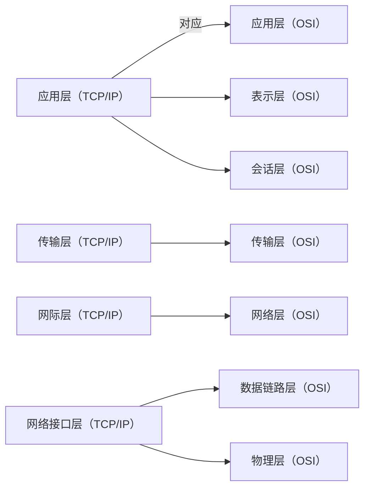
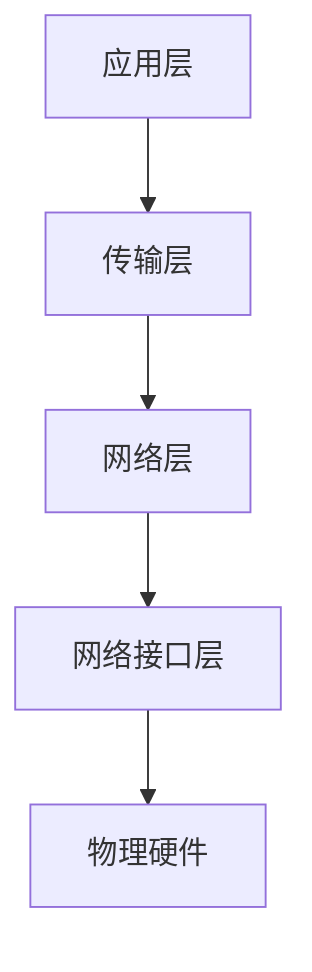
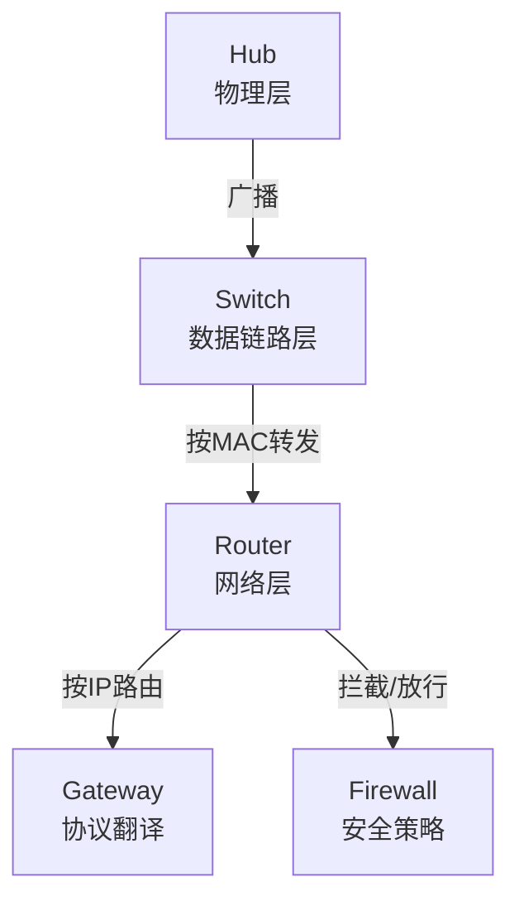
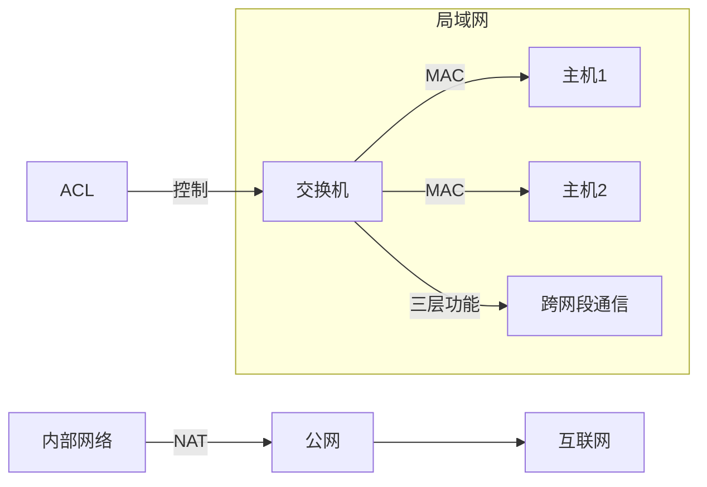

## 一、TCP/IP 模型 vs OSI 七层模型 对应关系

---

## 二、协议分类总结（按层划分）

### 📌 应用层（TCP/IP）

|协议/服务|端口号|说明|
|:--|:--|:--|
|POP3|110|接收邮件|
|FTP|20/21|文件传输|
|HTTP|80|超文本传输|
|Telnet|23|远程登录|
|SMTP|25|发邮件|
|NFS|-|网络文件系统|
|DHCP|67|动态主机配置|
|SNMP|161|简单网络管理协议|
|DNS|53|域名解析|
|TFTP|69|简单文件传输|

> [!note]  
> 📌 **常见端口号要记！**  
> 20/21（FTP），80（HTTP），25（SMTP），53（DNS）。

---

### 📌 传输层（TCP/IP）

|协议|说明|
|:--|:--|
|TCP|面向连接的可靠传输|
|UDP|面向无连接的快速传输|

---

### 📌 网络层（TCP/IP）

|协议|说明|
|:--|:--|
|IP|负责寻址和路由|
|ICMP|控制报文，比如ping|
|IGMP|管理组播|
|ARP|地址解析协议|
|RARP|反向地址解析协议|

---

### 📌 网络接口层（TCP/IP）

|技术|说明|
|:--|:--|
|CSMA/CD|以太网冲突检测|
|Token Ring|令牌环网|

---

## 三、整体记忆建议

---

# 📚 计算机网络常见协议一览（分层总结）

## 1. 应用层（Application Layer）

|协议/服务|简单介绍|备注|
|:--|:--|:--|
|**HTTP**|超文本传输协议，用来浏览网页。|基于TCP|
|**FTP**|文件传输协议，上传/下载文件。|基于TCP|
|**SMTP**|发送电子邮件的协议。|基于TCP|
|**POP3**|接收电子邮件，下载到本地。|基于TCP|
|**DNS**|域名解析系统，把网址变成IP地址。|基于UDP为主，有时TCP|
|**DHCP**|动态分配IP地址。|基于UDP|
|**TFTP**|简单文件传输协议，轻量版FTP。|基于UDP|
|**SNMP**|管理网络设备（路由器、交换机等）。|基于UDP|
|**Telnet**|远程登录到服务器（明文，不安全）。|基于TCP|
|**NFS**|网络文件系统，在网络上共享文件。|基于TCP/UDP皆可|

> [!tip]  
> 📌应用层的协议一般是**基于传输层（TCP或UDP）**完成的。  
> 其中：
> 
> - TCP（安全可靠，适合需要完整传输的）
>     
> - UDP（速度快，适合简单、实时要求高的）
>     

---

## 2. 传输层（Transport Layer）

|协议|简单介绍|备注|
|:--|:--|:--|
|**TCP**|可靠传输，三次握手/四次挥手。|面向连接，适合重要数据传输|
|**UDP**|不可靠传输，快速简单。|面向无连接，适合实时音视频、DNS|

> [!question]  
> 记住：**TCP像快递员，确认收货；UDP像甩报纸，扔了就跑。**

---

## 3. 网络层（Network Layer）

|协议|简单介绍|备注|
|:--|:--|:--|
|**IP**|地址寻址和路由转发。|分为IPv4、IPv6|
|**ICMP**|传输控制消息，比如ping测试。|辅助IP协议|
|**IGMP**|组播管理，比如视频会议。|管理一对多通信|
|**ARP**|把IP地址解析成MAC地址。|局域网内必备|
|**RARP**|反向解析，MAC地址找IP地址。|现在较少使用|

> [!info]  
> 网络层就是**搞定位、搞中转**的，像导航系统一样。

---

## 4. 网络接口层（Link Layer）

|技术|简单介绍|备注|
|:--|:--|:--|
|**CSMA/CD**|以太网协议，检测冲突后重发。|经典局域网技术|
|**Token Ring**|令牌环网，顺序传输避免冲突。|已基本淘汰|

> [!abstract]  
> 网络接口层就像**路面铺设工程**，解决「怎么发」的问题。

---

# 📚 浅谈常见网络设备

> [!info]  
> 本节快速了解路由器、集线器、交换机、网关、防火墙各自干什么、工作在哪一层，有什么区别。

---

## 1. **集线器 Hub（已淘汰）**

|项目|内容|
|:--|:--|
|定义|一个简单的**物理连接器**，收到数据包后，**广播**给所有端口。|
|工作层次|**物理层**（OSI第1层）|
|特点|傻瓜式中继，不区分数据去向，没有智能。|
|缺点|极易产生冲突，效率低，已基本被淘汰。|

> [!danger]  
> 集线器：听不懂指令，只会**一股脑儿乱喊**。

---

## 2. **交换机 Switch（主流）**

|项目|内容|
|:--|:--|
|定义|带有**MAC地址表**，根据目的MAC地址**精准转发**数据。|
|工作层次|**数据链路层**（OSI第2层）|
|特点|比集线器聪明，减少冲突，提高网络效率。|
|进阶|三层交换机=交换机+部分路由功能。|

> [!tip]  
> 交换机：像个聪明邮局，**按收件人地址送快递**。

---

## 3. **路由器 Router（掌控方向）**

|项目|内容|
|:--|:--|
|定义|连接不同网络，基于IP地址选择最佳路径转发数据。|
|工作层次|**网络层**（OSI第3层）|
|特点|可以连接局域网与外网（比如家庭网络到Internet）。|
|附加功能|DHCP分配地址、防火墙过滤、NAT地址转换。|

> [!question]  
> 路由器：像个交通指挥官，**看IP决定去哪条路**。

---

## 4. **网关 Gateway（多才多艺）**

|项目|内容|
|:--|:--|
|定义|把两种不同协议/结构的网络连接在一起的设备。|
|工作层次|**传输层及以上**（可到应用层）|
|特点|协议转换，格式翻译器，像翻译官。|
|举例|VoIP网关、工业控制网关。|

> [!abstract]  
> 网关：不同国家的翻译官，**说人话**和**说机器话**都行。

---

## 5. **防火墙 Firewall（安全守卫）**

|项目|内容|
|:--|:--|
|定义|按规则监控、允许或阻止网络通信的设备。|
|工作层次|灵活，可基于**网络层、传输层、应用层**。|
|特点|防止非法入侵、数据泄露，设定访问策略。|

> [!warning]  
> 防火墙：像保安，**查通行证、挡坏人**。

---

# 🧠 设备大对比（速记表）

|设备|功能|智能程度|工作层|
|:--|:--|:--|:--|
|Hub（集线器）|统一广播|无|物理层|
|Switch（交换机）|定向转发（MAC）|有|数据链路层|
|Router（路由器）|IP路由转发|有|网络层|
|Gateway（网关）|协议翻译|很高|多层（高层）|
|Firewall（防火墙）|网络安全防护|很高|多层|

---

---

# 📚 网络设备进阶扩展

---

## 1. **NAT（网络地址转换）**

|项目|内容|
|:--|:--|
|定义|将**内部私有IP**与**外部公网IP**之间进行地址转换。|
|类型|静态NAT、动态NAT、端口地址转换（PAT）|
|作用|解决IPv4地址不足、隐藏内部结构、提升安全性。|
|应用|家庭路由器上网，办公局域网访问外网。|

> [!info]  
> NAT = **“内外翻译官”**：家里一堆私有地址，用一个公网IP对外交流。

---

## 2. **三层交换机**

|项目|内容|
|:--|:--|
|定义|结合了**交换机的数据转发**和**路由器的三层功能**。|
|特点|在局域网内部高速转发数据包，同时能进行跨网段通信。|
|应用|大型企业局域网、校园网、数据中心。|

> [!tip]  
> 三层交换机 = **"懂转发又会选路的超级邮差"**，效率超高！

---

## 3. **ACL（访问控制列表）**

|项目|内容|
|:--|:--|
|定义|定义一系列过滤规则，允许或拒绝特定流量。|
|作用|提高安全性，精细控制谁能访问谁。|
|分类|标准ACL（基于源IP）、扩展ACL（基于源IP+目标IP+端口）。|

> [!question]  
> ACL = **“门卫大叔”**，你能不能进、从哪儿来、去哪儿，统统要核查。

---

# 🧠 再来一波结构速记表

|名称|关键点|类似角色|
|:--|:--|:--|
|NAT|内网地址翻译成公网|翻译官|
|三层交换机|转发+选路，局域网利器|超级邮差|
|ACL|精准流量过滤|门卫大叔|

---

# 📊 Mermaid 小图

---

# 🔥 小总结

> **NAT**隐藏了你的私有IP，**三层交换机**让局域网通信又快又灵活，**ACL**保证了只有合法流量能通行。

