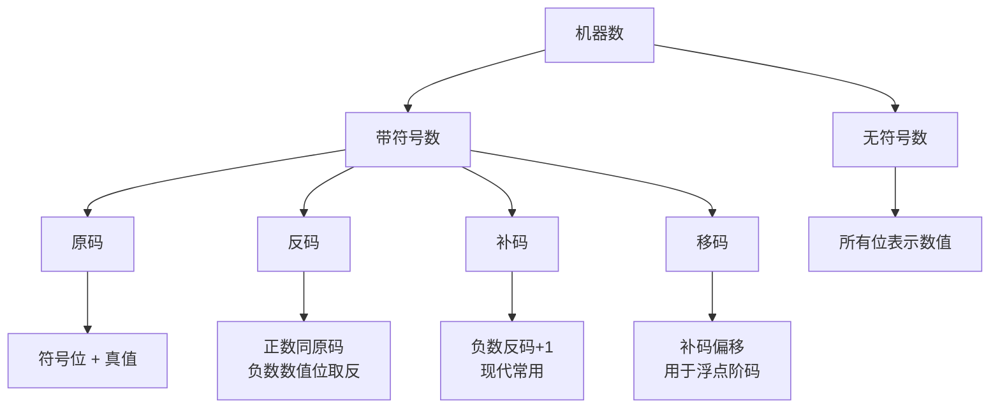

### 操作系统知识

>考点

> [!NOTE]
> - <font color="#0070c0">操作系统</font>的作用、类型、特征、功能和结构。
> - <font color="#0070c0">处理机管理</font>:并行与并发、单道与多道、进程与线程、同步与互斥、进程状态和状态转换、处理机调度。
> - <font color="#0070c0">存储管理</font>:内存管理、虚存管理。
> - <font color="#0070c0">设备管理</font>:设备的分类、虚拟设备、块设备管理。
> - <font color="#0070c0">文件管理</font>:文件存储空间管理、目录管理、文件的读写管理和存取控制。 
> - <font color="#0070c0">作业管理</font>:作业调度、人机交互和用户界面管理。
> - <font color="#0070c0">常见操作系统</font>:主要是 Linux 操作系统命令。

#### 操作系统基础知识

**操作系统（OS）** 是计算机的核心软件，负责管理硬件资源（如CPU、内存、硬盘等），并为应用程序提供运行环境。它像“大管家”一样协调软硬件的工作，同时简化用户操作——比如通过图形界面或命令行控制计算机，让多个程序高效、安全地同时运行。常见的操作系统包括Windows、macOS、Linux和Android等。


**冯·诺依曼计算机结构模型**
冯·诺依曼体系将现代计算机的构成分为:
运算器、控制器、存储器、输入设备、输出设备 5个部分。

```mermaid
graph TD
  输入设备 -->|输入数据| 内存
  内存 -->|取指令| 控制单元
  控制单元 -->|解码指令| 运算器
  运算器 -->|执行指令| 内存
  控制单元 -->|指令控制| 运算器
  运算器 -->|结果| 内存
  内存 -->|输出数据| 输出设备

  subgraph CPU[中央处理器]
    控制单元
    运算器
  end

  subgraph 存储器[存储器]
    内存
  end

  输入设备 -.->|数据传输| 存储器
  存储器 -.->|数据输出| 输出设备
  ```


冯·诺依曼提出了现代计算机的两大特征: 
1. 数制采用`二进制`从而简化硬件系统设计。
2. 计算机按照程序`顺序执行`并进行存储,从而使计算机具有了多应用能力。

#### CPU核心组件与工作原理

**CPU四大核心功能**
**程序控制**  
> 通过执行指令控制程序执行顺序  
> PC寄存器自动更新下条指令地址（顺序执行时+1，跳转时获取新地址）

**操作控制**  
> 生成指令对应操作信号  
> 通过控制总线(CB)**Control Bus**分发到不同部件

**时间控制**  
> 采用时序产生器协调操作节奏  
> 确保各部件操作的时间同步性

**数据处理**  
> 执行算术运算(ALU)与逻辑运算  
> 通过数据总线进行传输加工  
> CPU最核心的功能模块

## 2. 运算器架构
**核心功能**：执行数据加工处理  
**组件构成**：
1. 算术/逻辑运算单元（ALU）**Arithmetic Logic Unit**
   - 执行加减乘除等算术运算
   - 处理AND/OR/NOT等逻辑操作
1. 累加器（ACC）**Accumulator**
   - 存储ALU运算的中间结果
1. 寄存器组**Register Set**
   - 通用寄存器：暂存高频使用数据
   - 专用寄存器：特定功能存储
1. 数据总线（**Data Bus**）
   - 传输位宽决定单次处理能力（32/64位）

## 3. 控制器机制
### 3.1 指令执行四阶段
1. 取指令 → 2. 指令译码 → 3. 执行操作 → 4. 生成下址

### 3.2 核心组件
| 组件                              | 功能说明                |
| ------------------------------- | ------------------- |
| 程序计数器(PC)Program Counter        | 存储下条指令地址，具有自动+1特性   |
| 指令寄存器(IR)Instruction Register   | 暂存当前执行指令（包含操作码+地址码） |
| 指令译码器(ID)Instruction Decoder    | 解析操作码，生成控制信号矩阵      |
| 数据寄存器(DR)Data Register          | 缓存待处理数据             |
| 地址寄存器(AR)Address Register       | 存储操作数内存地址           |
| 状态条件寄存器(PSW)Program Status Word | 保存运算状态（溢出/进位/零标志等）  |

## 4. 控制器工作流程
### 4.1 PC运行机制
- **初始化**：载入程序首地址 → PC
- **执行阶段**：
```mermaid
graph TD
  PC当前地址 -->|取指| 取指单元
  取指单元 -->|取指完成| PC自动更新
  PC自动更新 -->|顺序执行| PC+1
  PC自动更新 -->|跳转执行| PC_新地址
```

### 4.2 指令处理流水线
## ✅ **1. 取指阶段（Fetch）**

- **MAR**（Memory Address Register，内存地址寄存器）：存储当前要读取或写入的内存地址。
    
- **IR**（Instruction Register，指令寄存器）：用于存储当前从内存中取出的指令。
    
- **过程**：
    
    - **PC（程序计数器）** 提供当前指令的内存地址，存入 **MAR**。
        
    - 从内存中取出指令，将指令存入 **IR**，等待下一步解码。
        
    - **PC 自动更新**，指向下一条指令的地址。
        

📖 **简单理解**：取出程序中的下一条指令，做好执行准备。

---

## ✅ **2. 译码阶段（Decode）**

- **ID**（Instruction Decode，指令译码）：负责解析指令的内容。
    
- **操作码**：指示需要执行的操作类型，例如加法、减法、存储等。
    
- **地址码**：指向内存或寄存器中涉及的数据地址。
    
- **微操作控制信号**：根据操作码生成的控制信号，用于指导后续硬件执行具体操作。
    

📖 **简单理解**：翻译指令，让计算机明白它需要做什么。

---

## ✅ **3. 执行阶段（Execute）**

- **ALU**（Arithmetic Logic Unit，算术逻辑单元）：执行数学计算和逻辑操作。
    
- **PSW**（Program Status Word，程序状态字）：记录当前运算的状态，包括结果是否为零、是否溢出等信息。
    
- **过程**：
    
    - 根据译码结果，ALU 执行加法、减法、逻辑运算等任务。
        
    - **PSW** 实时更新，记录运算结果的状态信息。
        

📖 **简单理解**：像计算器一样执行指令中的运算或逻辑判断。

---

## ✅ **4. 写回阶段（Write Back）**

- **写回**：将执行结果写入目标位置，例如寄存器或内存。
    
- **PC 更新**：执行完成后，程序计数器（PC）会指向下一条指令的地址，准备进入下一轮取指。
    

📖 **简单理解**：把计算结果存起来，并准备执行下一条指令。

### 4.3 PSW关键标志位
**PSW（Program Status Word，程序状态字）**是一个用于记录 CPU 运算状态的寄存器。它的关键标志位用于反映指令执行后的状态，方便后续的程序判断和执行。下面详细解释一下这些标志位的功能：

---

## ✅ **1. ZF（Zero Flag）- 零标志**

- **功能**：当运算结果为 **0** 时，ZF 置为 **1**；否则置为 **0**。
- **作用**：判断运算结果是否为零，通常用于条件判断，例如 `if (a == b)`。
- **例子**：
    
    ```
    5 - 5 = 0   → ZF = 1
    3 + 2 = 5   → ZF = 0
    ```
    
    **程序可能执行的操作**：如果 `ZF = 1`，可能跳转到执行“相等”的分支。

---

## ✅ **2. CF（Carry Flag）- 进位标志**

- **功能**：当无符号运算中产生**进位**或**借位**时，CF 置为 **1**；否则置为 **0**。
- **作用**：用于检测无符号数的溢出或借位情况。
- **例子（无符号数）**：
    
    ```
    255 (8位最大) + 1 = 256  → CF = 1 （进位）
    100 - 150   → CF = 1 （借位）
    ```
    
    **程序可能执行的操作**：根据 CF 判断是否发生了无符号溢出。

---

## ✅ **3. OF（Overflow Flag）- 溢出标志**

- **功能**：当有符号数运算结果超过表示范围时，OF 置为 **1**；否则置为 **0**。
- **作用**：检测有符号数溢出，例如 `int` 运算中溢出的情况。
- **例子（有符号数）**：
    
    ```
    127 + 1 = -128  → OF = 1 （溢出）
    -128 - 1 = 127  → OF = 1 （溢出）
    ```
    
    **程序可能执行的操作**：根据 OF 判断是否需要处理异常。

---

## ✅ **4. SF（Sign Flag）- 符号标志**

- **功能**：当运算结果为**负数**时，SF 置为 **1**；结果为**正数**时，SF 置为 **0**。
- **作用**：用于判断有符号数运算的正负性。
- **例子（有符号数）**：
    
    ```
    5 - 10 = -5  → SF = 1 （负数）
    3 + 2 = 5    → SF = 0 （正数）
    ```
    
    **程序可能执行的操作**：根据 SF 判断结果是否为负数，比如用于控制程序执行负数相关的分支。

---


|标志位|作用场景|举例说明|
|---|---|---|
|**ZF**|判断运算结果是否为零|判断 `a == b` 时用到|
|**CF**|判断无符号数运算是否溢出|255 + 1 进位溢出|
|**OF**|判断有符号数运算是否溢出|127 + 1 溢出|
|**SF**|判断结果是否为负|-5 结果为负|

## 计算机信息表示





#### 机器数

1. **定义**：机器数是指连同符号位一起被数字化的数，也就是说，它不仅包括数值本身，还包括表示正负的符号位（通常用0表示正数，1表示负数）。

2. **特点**：
   - **符号数字化**：符号位被明确地用一个二进制位表示，而不是单独处理。这使得正负数的表示统一在同一个二进制格式中。
   - **受机器字长限制**：机器数的表示范围和精度受到计算机硬件的字长（word length，通常是8位、16位、32位、64位等）的限制。字长决定了可以存储的二进制位数，超过这个位数的部分会被截断或舍弃。

3. **与硬件的关系**：每个机器数占用的二进制位数取决于机器的硬件设计，特别是字长。例如，在一个32位系统中，一个机器数最多占用32位（包括1位符号位和31位数值位）。如果计算结果超出了这个范围，多余的位会被丢弃，导致精度丢失或溢出。

#### 真值

### 定义
- **机器数**：计算机中用二进制表示的完整数字，包括符号位和数值位。例如，在一个8位机器数中，`01001011` 是一个机器数，其中首位`0`是符号位，后面的`1001011`是数值位。
- **真值**：从机器数中去掉符号位后，剩余的数值位所对应的实际数值（通常以十进制表示）。真值不考虑正负，只反映数值本身的大小。

### 举例说明
1. **机器数：`01001011`**
   - 符号位：`0`（表示正数）
   - 数值位：`1001011`
   - 真值：`1001011`（二进制）转换为十进制是 `75`。
   - 完整含义：这表示 `+75`。

2. **机器数：`11001011`**
   - 符号位：`1`（表示负数）
   - 数值位：`1001011`
   - 真值：`1001011`（二进制）转换为十进制仍是 `75`。
   - 完整含义：这表示 `-75`（具体解释可能涉及补码表示，取决于机器数的编码方式）。

### 注意事项
- **真值与机器数的区别**：真值只关心数值位表示的大小，不包括符号。而机器数是计算机中实际存储的形式，符号位会影响最终的正负。
- **编码方式的影响**：在实际计算机系统中，负数的机器数通常采用补码形式存储，因此直接看数值位不一定是真值，需要根据上下文（例如原码、反码、补码）来判断。

根据你的描述，机器数可以分为两大类：**无符号数**和**带符号数**。下面我详细解释这两种分类：

### 1. 无符号数 (Unsigned Number)
- **定义**：机器字长的所有二进制位都用来表示数值，没有专门的符号位。
- **特点**：
  - 不区分正负，所有的位都用于表示数值大小。
  - 表示范围从 0 到 2ⁿ-1（其中 n 是机器字长）。
- **例子**（假设字长为 8 位）：
  - 机器数：`00001010`
    - 所有位表示数值：`00001010`（二进制）= `10`（十进制）。
  - 机器数：`11111111`
    - 所有位表示数值：`11111111`（二进制）= `255`（十进制）。
  - 表示范围：`0` 到 `255`。

### 2. 带符号数 (Signed Number)
- **定义**：机器数中一部分位表示数值，另一部分（通常是最高位）表示符号。符号位和数值位都用二进制代码表示。
- **特点**：
  - 通常最高位（左起第一位）作为符号位：`0` 表示正数，`1` 表示负数。
  - 数值部分由剩余的位表示。
  - 表示范围受符号位和数值位数的限制，通常为 -2ⁿ⁻¹ 到 2ⁿ⁻¹-1（n 是字长）。
- **常见的表示方法**：
  - **原码**：符号位直接表示正负，数值位是真值的二进制形式。
  - **反码**：正数与原码相同，负数的数值位取反。
  - **补码**：负数在反码基础上加 1，常用于现代计算机中。
- **例子**（假设字长为 8 位，采用原码表示）：
  - 机器数：`00101010`
    - 符号位：`0`（正数）
    - 数值位：`0101010`
    - 真值：`0101010`（二进制）= `42`（十进制）
    - 表示：`+42`。
  - 机器数：`10101010`
    - 符号位：`1`（负数）
    - 数值位：`0101010`
    - 真值：`0101010`（二进制）= `42`（十进制）
    - 表示：`-42`（原码情况下）。

### 总结
| 类型       | 符号位 | 表示范围（8位为例）       | 特点                   |
|------------|--------|---------------------------|------------------------|
| 无符号数   | 无     | 0 到 255                 | 所有位表示数值         |
| 带符号数   | 有     | -128 到 +127（补码为例） | 最高位为符号位，区分正负 |
下面我将为你提供一个简明易懂的教程，详细讲解**原码**、**反码**、**补码**和**移码**的定义、计算方法和用途。假设我们以 **4 位字长** 为例（1 位符号位 + 3 位数值位），方便理解。

---

### 1. 原码 (Sign-Magnitude)
#### 定义
- 原码是最直观的表示方法：符号位表示正负（0 为正，1 为负），数值位直接表示真值的二进制形式。
- 表示范围（4 位）：-7 到 +7。

#### 计算方法
- 正数：符号位为 0，数值位是真值的二进制。
- 负数：符号位为 1，数值位仍是真值的二进制。

#### 示例
- `+5`：
  - 真值：5，二进制 `101`
  - 原码：`0101`（0 表示正，101 是 5）
- `-5`：
  - 真值：5，二进制 `101`
  - 原码：`1101`（1 表示负，101 是 5）

#### 特点
- 优点：简单直观，真值直接可见。
- 缺点：加减法复杂（需要单独处理符号），有 +0 (`0000`) 和 -0 (`1000`) 两种表示。

---

### 2. 反码 (One's Complement)
#### 定义
- 反码是对原码的改进：
  - 正数：与原码相同。
  - 负数：符号位为 1，数值位是原码数值位的按位取反（0 变 1，1 变 0）。
- 表示范围（4 位）：-7 到 +7。

#### 计算方法
- 正数：直接用原码。
- 负数：原码的数值位取反，符号位保持 1。

#### 示例
- `+5`：
  - 原码：`0101`
  - 反码：`0101`（正数不变）
- `-5`：
  - 原码：`1101`
  - 反码：符号位不变，数值位 `101` 取反为 `010`，结果是 `1010`

#### 特点
- 优点：加法比原码稍简单。
- 缺点：仍有 +0 (`0000`) 和 -0 (`1111`)，运算中需处理“端进位”。

---

### 3. 补码 (Two's Complement)
#### 定义
- 补码是现代计算机最常用的表示法：
  - 正数：与原码相同。
  - 负数：在反码基础上加 1。
- 表示范围（4 位）：-8 到 +7（补码利用了 -0 的位置表示一个额外负数）。

#### 计算方法
- 正数：直接用原码。
- 负数：
  1. 先取原码。
  2. 数值位按位取反（得到反码）。
  3. 再加 1（得到补码）。
- 快捷方法：从右向左找到第一个 1，保持不变，其左侧所有位取反。

#### 示例
- `+5`：
  - 原码：`0101`
  - 补码：`0101`（正数不变）
- `-5`：
  - 原码：`1101`
  - 反码：`1010`（数值位取反）
  - 补码：`1010 + 1 = 1011`

#### 验证
- `-5 + 5`：
  - `1011`（-5 的补码）+ `0101`（+5 的补码）= `10000`
  - 4 位字长溢出，丢弃高位，得 `0000`（即 0），正确。

#### 特点
- 优点：加减法统一（减法转为加法），没有 +0 和 -0 的冗余。
- 用途：计算机整数运算标准。

---

### 4. 移码 (Excess-K 或 Biased Representation)
#### 定义
- 移码是在补码基础上整体偏移一个固定值（偏置值），常用于浮点数的阶码表示。
- 偏置值通常是 2ⁿ⁻¹（n 是位数），4 位时偏置值为 8。
- 表示范围（4 位）：真值从 -8 到 +7，移码从 0 到 15。

#### 计算方法
- 移码 = 真值的补码 + 偏置值（2ⁿ⁻¹）。
- 或：真值 + 偏置值（结果用无符号数表示）。

#### 示例
- 偏置值：`2³ = 8`
- `+5`：
  - 真值：5
  - 移码：`5 + 8 = 13`，二进制 `1101`
- `-5`：
  - 真值：-5
  - 补码：`1011`
  - 移码：`-5 + 8 = 3`，二进制 `0011`

#### 特点
- 优点：负数也能用无符号数表示，便于比较大小。
- 用途：浮点数中的指数（阶码）存储。

### 用途与区别
- **原码**：直观，早期使用，运算复杂。
- **反码**：过渡形式，改进原码。
- **补码**：现代标准，简化加减法。
- **移码**：优化比较，浮点数专用。


- [ ] 暂时省略不同码制之间的转换

## 1. 校验码概述
校验码是一种用于检测和纠正数据传输或存储中错误的编码方式。数据的错误可能由噪声、干扰等引起。为提高可靠性：
- **硬件措施**：优化电路、电源、抗干扰设计。
- **软件措施**：通过数据编码加入冗余位，实现检错和纠错。

### 数据校验码的实现原理
- 在正常数据（信息位）后加入冗余位（校验位）。
- 冗余位使错误数据变成“非法编码”，通过检测非法编码发现并定位错误。


### 🚀 **1. 汉明码的实际用途是什么？**

汉明码的核心作用就是 **检测和纠正数据传输或存储过程中的错误**。它的用处主要是在 **数据传输** 和 **存储系统** 中，确保数据能够 **正确无误** 地传输和存储，避免因为信号干扰或其他问题导致的数据错误。

### ✅ **举个例子：**

#### **场景 1：发送电子邮件或文件**

假设你正在通过网络发送一个文件或一封电子邮件。网络传输过程中，信号可能会受到干扰（比如无线网络波动），这时文件中的一些数据就可能出错。

- **如果没有错误检测和纠正机制：** 假设文件的某部分出错了（比如一个字符变成了其他字符），收件人收到文件后根本不知道哪里出错了。这样收件人看不到错误，可能会导致严重后果（比如数据丢失或错误的文件）。
- **如果有汉明码：** 文件发送前，发送方会通过汉明码在文件中加上 **检查信息**。当接收方收到文件后，他会用同样的规则来检查文件中的数据是否完整。比如，接收方发现某个字符出错了，使用汉明码可以 **准确找到出错的位置**，甚至可以 **自动纠正错误**，让文件恢复正确内容。

这个过程可以用来确保在网络上传输的 **文件数据** 不会因为外界干扰而发生错误。

#### **场景 2：内存错误检测**

计算机在运行时，有时内存会出现 **硬件故障**，导致某个存储的数字出错。为了确保程序运行的准确性，需要一种方法来发现和修复这些错误。

- **如果没有汉明码：** 内存中的错误可能会导致计算机程序崩溃或输出错误的结果。比如，如果存储的数字 `10` 被错误地存储成了 `11`，程序可能会根据错误的数字做出不正确的计算。
- **如果有汉明码：** 内存中的数据会加上 **冗余位**（检查位）。这样当计算机读取数据时，**如果发生错误**，通过汉明码的 **校验机制**，计算机会发现数据出错，并进行 **纠正**，确保程序继续正常运行。

---

### ✅ **2. 为什么我们要用汉明码？**

- **错误检测与纠正**：它可以 **自动纠正 1 位错误**，并且可以 **检测出 2 位错误**。在许多对数据要求准确无误的场合中，这一点非常重要。
    
- **提高可靠性**：在 **无线通信、计算机内存、硬盘存储等领域**，汉明码能够确保 **即使在有干扰或错误的情况下**，数据依然可以被正确传输或恢复，避免丢失重要信息。
    

---

### 🚀 **3. 简单的实际例子来理解**

假设你有一个非常重要的文件，需要通过网络发送给别人。如果这个文件丢失或者损坏，可能会影响到你和收件人之间的合作，甚至会带来严重后果。

1. **发送前，文件加入汉明码：**
    
    - 你将文件内容用汉明码编码，这样编码后的文件不仅包含你发送的数据，还带有一些额外的检查信息（**冗余位**）。这些检查信息能帮助接收方检测到是否发生了数据错误。
2. **传输过程中：**
    
    - 假设由于网络问题，文件的某些部分出现了错误（例如 `A` 被传输了成了 `B`）。
3. **接收方接收到文件：**
    
    - 接收方收到文件后，他会用汉明码的 **校验机制** 对文件进行检查。如果文件中某个字母出错了，接收方 **会发现错误**，并可以 **纠正错误**（恢复原来的 `A`）。这样，你和接收方就能确保文件内容是 **正确的**，避免了因为传输错误带来的麻烦。

---

### 码距（海明距离）
- **定义**：两个编码之间不同位的数量。例如，`0011` 和 `0001` 只有第 2 位不同，码距为 1。
- **作用**：码距决定了校验码的检错和纠错能力。

#### 示例
- **例 1-17**：
	- 4 位编码表示 16 种状态（`0000` 到 `1111`），码距为 1。任何一位出错（如 `0000` → `0001`），结果仍是合法编码，无法检错。
- **例 1-18**：
	- 4 位编码表示 8 种状态（如 `0000`, `0011`, `0101` 等），码距为 2。一位出错（如 `0000` → `0001`），变成非法编码，可检错。


### 码距与检错/纠错能力
- **d ≥ e + 1**：可检测 e 个错误。
- **d ≥ 2t + 1**：可纠正 t 个错误。
- **d ≥ e + t + 1**：可检测 e 个错误并纠正 t 个错误。
- 校验位越多，码距越大，检错/纠错能力越强。

#### 示例（例 1-19）
- 编码组：`00000000`, `00000111`, `11111000`, `11111111`，码距为 5。
- 可纠正 2 位错误（d = 5 ≥ 2×2 + 1）。
- 接收到 `00000011`，与合法编码比较，最近的是 `00000111`（差 2 位），可纠正。

---

## 2. 奇偶校验码
### 定义
- 在数据后加 1 位校验位，使“1”的总数符合奇数（奇校验）或偶数（偶校验）。
- **奇校验**：1 的个数为奇数。
- **偶校验**：1 的个数为偶数。

### 计算方法
- 统计信息位中“1”的个数。
- 根据奇/偶要求，设置校验位（P）为 0 或 1。

#### 示例（例 1-20）
- 信息码：`1100111`（7 位，1 的个数为 5，奇数）。
- **奇校验**：
  - 1 的个数已是奇数，P = 0。
  - 结果：`11001110`。
- **偶校验**：
  - 1 的个数为奇数，需加 1 个 1，P = 1。
  - 结果：`11001111`。

### 特点
- **优点**：简单易实现。
- **缺点**：只能检测奇数个错误（如 1 位错），无法检测偶数个错误，也无法纠错。

---

## 3. 海明校验码
### 定义
- 在奇偶校验基础上，增加多个校验位，形成多组奇偶校验，可检错并纠错。

### 校验位数计算
- 信息位数为 n，校验位数为 k，满足：`2^k ≥ n + k + 1`。
- **例 1-21**：信息位 n = 8：
  - `2^k ≥ 8 + k + 1 = 9 + k`。
  - k = 3 时，`2^3 = 8 < 12`，不满足。
  - k = 4 时，`2^4 = 16 ≥ 13`，满足。
  - 校验位数为 4。

### 编码方法
- 校验位位置为 2^i（i = 0, 1, 2, ...），如 P1 = 2^0 = 1, P2 = 2^1 = 2, P3 = 2^2 = 4。
- 信息位（D）和校验位（P）混合排列。
- 每个信息位的位号由校验位号之和表示：
  - 如 D3（第 7 位）：7 = 1 + 2 + 4，被 P1, P2, P3 校验。

#### 示例（例 1-22）
- 信息位：`D7 D6 D5 D4 D3 D2 D1 D0 = 01101001`。
- 校验位：P1, P2, P3, P4（偶校验）。
- 计算校验位：
  - P1（校验 1, 3, 5, 7, 9, 11）：`D0 ⊕ D1 ⊕ D3 ⊕ D4 ⊕ D6 = 1 ⊕ 0 ⊕ 0 ⊕ 1 ⊕ 1 = 1`。
  - P2（校验 2, 3, 6, 7, 10, 11）：`D0 ⊕ D2 ⊕ D3 ⊕ D5 ⊕ D6 = 1 ⊕ 0 ⊕ 0 ⊕ 1 ⊕ 1 = 0`。
  - P3（校验 4, 5, 6, 7, 12）：`D1 ⊕ D2 ⊕ D3 ⊕ D7 = 0 ⊕ 0 ⊕ 0 ⊕ 0 = 1`。
  - P4（校验 8, 9, 10, 11, 12）：`D4 ⊕ D5 ⊕ D6 ⊕ D7 = 1 ⊕ 1 ⊕ 1 ⊕ 0 = 0`。
- 海明码：`011001001011`。

### 校验与纠错
- 计算校验组 G：
  - G1 = P1 ⊕ D0 ⊕ D1 ⊕ D3 ⊕ D4 ⊕ D6。
  - G2 = P2 ⊕ D0 ⊕ D2 ⊕ D3 ⊕ D5 ⊕ D6。
  - G3 = P3 ⊕ D1 ⊕ D2 ⊕ D3 ⊕ D7。
  - G4 = P4 ⊕ D4 ⊕ D5 ⊕ D6 ⊕ D7。
- 偶校验：G4G3G2G1 = 0000 表示无错。
- 若非 0000，其十进制值指出错位置。

---

## 4. 循环冗余校验码 (CRC)
### 定义
- 使用生成多项式 G(x) 计算校验和，附加在数据后，用于高效检错。

### 计算方法
- **模 2 除法**：异或运算（0+0=0, 1+0=1, 1+1=0）。
- 步骤：
  1. 数据 M(x) 左移 k 位（k = G(x) 阶数）。
  2. 用 G(x) 对 M(x)·x^k 模 2 除，余数 R(x) 即校验位。
  3. CRC 码 = M(x)·x^k + R(x)。

#### 示例（例 1-23）
- 数据：`1101`，G(x) = `x^3 + x + 1 = 1011`（k = 3）。
- M(x)·x^3 = `1101000`。
- 模 2 除：
  ```
  1101000 ÷ 1011 = 1011
  1011
  ----
   0110
   1011
  ----
    101
  ```
- 余数 R(x) = `001`。
- CRC 码：`1101000 + 001 = 1101001`。

### 校验
- 接收到的码用 G(x) 模 2 除：
  - 余数 = 0，无错。
  - 余数 ≠ 0，有错，余数值可定位错误位。

---

### 总结
- **奇偶校验**：简单，只能检奇数错。
- **海明校验**：可检错并纠错 1 位。
- **CRC**：高效检错，广泛用于通信。

以下是对 **字符与汉字编码** 的详细教程，基于你提供的内容进行整理和讲解。我会清晰地说明 ASCII 码和汉字编码的各种类型及其转换过程。

---

## 1.1.2.5 字符与汉字编码

---

## 1. 美国信息交换标准码 (ASCII)
### 定义
- **ASCII**（American Standard Code for Information Interchange）是用 **7 位二进制码** 表示 128 个符号。
- 在计算机中，用 **1 个字节（8 位）** 存储，最高位补 0。

### 组成
- **总数**：128 个符号。
	  - **34 个非图形字符**：控制字符（如回车、换行）。
	  - **94 个图形字符**：可打印字符（如字母、数字、标点）。
- 示例：
	  - “A”：7 位 ASCII 码为 `1000001`，存储为 `01000001`。

### 常用字符 ASCII 值关系
- **顺序**：空格 < 数字 < 大写字母 < 小写字母。
- **十进制值**：
  - 空格：32
  - “0”：48
  - “A”：65
  - “a”：97

---

## 2. 汉字的处理过程
- **ASCII** 适用于英文字符，但无法表示汉字。
- 汉字处理需要专门的编码体系，计算机对汉字的处理是各种编码之间的转换过程：
  - 输入码 → 内码 → 字形码 → 输出。

---

## 3. 汉字编码

### (1) 输入码（外码）
- **定义**：用于将汉字输入计算机的编码。
- **特点**：因输入法不同而异。
- **示例**（“中”字）：
  - 全拼：`zhong`
  - 双拼：`vs`
  - 五笔：`kh`

### (2) 国标码 (GB 2312-1980)
- **定义**：《信息交换用汉字编码字符集 基本集》，用 **2 个字节** 表示一个汉字。
- **内容**：
  - 总计 6763 个汉字。
  - 一级汉字：3755 个常用字（按拼音排序）。
  - 二级汉字：3008 个非常用字（按部首排序）。
- **特点**：每个字节最高位为 0。

### (3) 区位码
- **定义**：将国标码汉字分为 94 区（行）和 94 位（列），用 **4 位十进制数** 表示（前 2 位区号，后 2 位位号）。
- **容量**：94 × 94 = 8836 个汉字。
- **示例**：“中”字区位码为 `5448`（第 54 区，第 48 位）。

#### 区位码与国标码转换
1. 区位码（十进制）转十六进制。
2. 区号和位号各加 `20H`（32）。
- **示例**（“中”字）：
  - 区位码：`5448`
    - 区号 54 = `36H`
    - 位号 48 = `30H`
  - 国标码：`36H + 20H = 56H`，`30H + 20H = 50H`
    - 结果：`5650H`

### (4) 内码
- **定义**：计算机内部存储和处理的汉字编码，用 **2 个字节**，每个字节最高位为 1。
- **转换**：国标码每个字节加 `80H`。
- **示例**（“中”字）：
  - 国标码：`5650H`
  - 内码：`56H + 80H = D6H`，`50H + 80H = D0H`
    - 结果：`D6D0H`

### (5) 字形码（汉字字模）
- **定义**：用于显示或打印汉字的编码。
- **类型**：
  1. **点阵式**：
     - 用二进制位表示点阵网格（1 有点，0 无点）。
     - 放大后显示效果差。
  2. **矢量式**：
     - 描述轮廓，显示效果不受大小影响。
- **示例**（例 1-24）：
  - 24×24 点阵：
    - 每行 24 位 = 3 字节（3B）。
    - 总共：3B × 24 = **72 字节**。

### (6) 地址码
- **定义**：字库中存储字形码的逻辑地址。
- **作用**：通过地址码找到字形码并输出。

### (7) 其他汉字内码
- **GBK**：扩展国标码，收录 2 万多简繁体字，2 字节表示。
- **UCS**：支持中日韩文字，4 字节表示。
- **Unicode**：统一编码，65536 个字符，2 字节表示。
- **BIG5**：台湾、香港常用繁体字编码。


