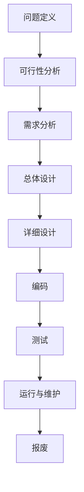
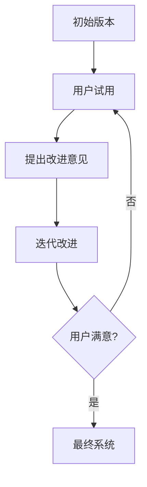
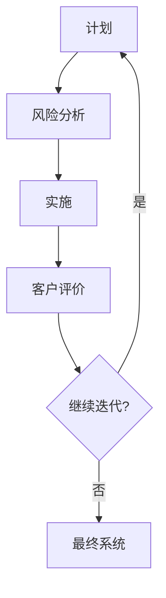

## 概述

**软件工程**是将系统化、严格约束、可量化的工程方法应用于软件开发，以应对**软件危机**，提高开发效率和软件质量。

> [!info] 核心概念
> 
> - **软件危机**（1968年提出）：早期家庭式作坊开发导致软件规模扩大后质量低、问题频发。
> - **软件工程**：引入工程化思想，系统化开发软件。

### 软件工程方法学要素

1. **方法**：完成开发任务的技术方法（如不同编程技术）。
2. **工具**：支持方法的开发环境（如.NET、Java）。
3. **过程**：获取高质量软件的任务框架（如需求分析、设计、测试）。

> [!tip] 记忆要点  
> 方法、工具、过程是软件工程的三大支柱，考试常考。

## 软件生命周期

软件生命周期指从产生到报废的过程，分为以下阶段：

1. 问题定义
2. 可行性分析
3. 需求分析
4. 总体设计
5. 详细设计
6. 编码
7. 测试
8. 运行与维护

> [!summary] 生命周期特点
> 
> - 每个阶段有明确目标和产出（如需求分析产出说明书）。
> - 运行维护阶段需持续更新，直至软件淘汰。

## 软件开发模型

### 1. 瀑布模型

**瀑布模型**是最经典的开发模型，分为六个阶段：

- **定义阶段**：计划、需求分析
- **开发阶段**：设计、编码、测试
- **维护阶段**：运行与维护

**优点**：

1. 提供阶段性检查点（里程碑，如需求说明书）。
2. 前阶段完成后只关注后续阶段。
3. 提供模板指导开发全过程。

**缺点**：

1. 文档工作量大，开发人员负担重。
2. 线性流程，用户需到最后才见产品，风险高。
3. 不适应需求变化，前期错误传导至后期。

> [!warning] 适用场景  
> 需求明确或很少变更的项目（如建筑沙盘模型）。

### 2. 快速原型模型

快速原型模型通过快速构建简易模型，与用户沟通需求，分为三种类型：

1. **探索型原型**：需求分析阶段，澄清用户需求（如医疗行业软件）。
2. **实验型原型**：设计阶段，验证方案可行性（如飞机实验机）。
3. **演化型原型**：持续改进原型，直至成为最终系统。

> [!tip] 原型分类
> 
> - 探索型、实验型为抛弃型，演化型为渐进型。
> - 演化型适合需求不明确的项目。

### 3. 演化模型

演化模型基于演化型原型，快速构建初始版本，迭代改进至用户满意。

**优点**：

1. 早期验证需求，降低风险。
2. 提供进度数据，便于成本估算。
3. 经验教训反馈至下一迭代。
4. 开发人员早期见雏形，增强信心。

**缺点**：

1. 初期需求不清，总体设计困难。
2. 缺乏严格过程管理，易退化为“试错修改”。
3. 不稳定功能可能影响用户信心。

### 4. 增量模型

增量模型将软件拆分为多个增量构建，逐步添加功能，每个增量均为可操作版本。

**优点**：

1. 人员分配灵活，初期投入低。
2. 用户可早期使用，提出改进意见。
3. 模块化开发，利于风险控制。
4. 适合需求频繁变更的项目。

**缺点**：

1. 增量集成需严格管理，避免混乱。
2. 初期规划不足可能影响整体架构。

> [!summary] 增量模型特点  
> 每次发布均为可操作版本，类似“积木式”开发。

### 5. 螺旋模型

螺旋模型结合瀑布模型和演化模型，增加风险分析，每轮迭代包括：

1. 制定计划
2. 风险分析
3. 实施
4. 客户评价

**优点**：

1. 设计灵活，阶段内可变更。
2. 用户深度参与，确保方向正确。
3. 客户随时掌握项目进展。

**缺点**：

1. 需经验丰富的风险评估人员。
2. 过多迭代增加成本。

