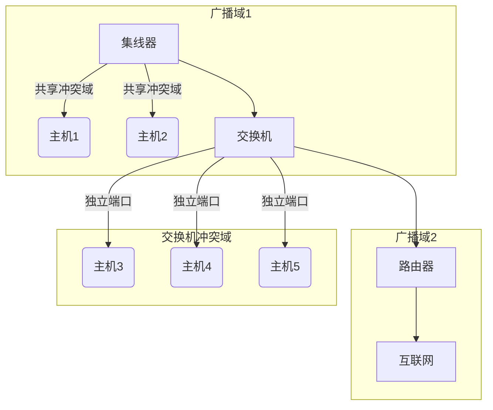

​​
**题目：​**​ SQL-99标准规定的事务的四个隔离级别中，能解决幻影读现象的级别是（56)。

​**选项：​**​  
A. REPEATABLE READ【repeatable read]
B. READ COMMITTED 【read committed】
C. READ UNCOMMITTED  【read uncommitted】
D. SERIALIZABLE 【serializable】

---

### ​**正确答案：D. SERIALIZABLE**​


#### ​**2. 各隔离级别的能力对比**​

|隔离级别|脏读（Dirty Read）|不可重复读（Non-repeatable Read）|幻读（Phantom Read）|
|---|---|---|---|
|READ UNCOMMITTED|❌|❌|❌|
|READ COMMITTED|✅|❌|❌|
|REPEATABLE READ|✅|✅|❌|
|​**SERIALIZABLE**​|✅|✅|✅|

---
### ​**问题复述**​

​**题目：​**​ 主域名服务器在接收到域名请求后，首先查询的是（ ）。

​**选项：​**​  
A. 本地缓存  
B. 本地hosts文件  
C. 授权域名服务器  
D. 转发域名服务器

### ​**正确答案：A. 本地缓存**​

### ​**详细解析**​

#### ​**1. DNS查询的核心流程**​

当主域名服务器收到域名解析请求时，会按照以下**优先级顺序**进行查询：

1. ​**本地缓存**​（A选项） → 2. ​**本地hosts文件**​（B选项） → 3. ​**本地数据库**​ → 4. ​**转发域名服务器**​（D选项） → 5. ​**授权域名服务器**​（C选项）


---

### ​**问题复述**​

​**题目：​**​ 以下关于包过滤防火墙和代理服务防火墙的叙述中，<font color="#ff0000">正确</font>的是（ ）。

​**选项：​**​  
A. 代理服务技术安全性较高，可以提高网络整体性能  
<font color="#ff0000">B. 包过滤技术对应用和用户是透明的 </font> 
C. 包过滤成本技术实现成本较高，所以安全性能高  
D. 代理服务技术只能配置成用户认证后才建立连接
 ​

### 🎯解析如下：

|项|选项|正确性|解析|
|---|---|---|---|
|A|❌|**错误**|代理服务确实**安全性较高**，但它**引入额外开销，降低性能**，尤其在高并发下不如包过滤性能好。不能说“提高网络整体性能”。|
|**B**|✅|**正确**|包过滤是在网络层（IP 层）上工作，它**不关心上层应用协议**，所以对用户和应用程序是**完全透明**的。|
|C|❌|**错误**|包过滤技术实现简单，成本低。但它安全性也较低，容易被绕过；不能说“技术实现成本高所以安全性能高”。逻辑错误。|
|D|❌|**错误**|虽然代理**可以配置用户认证机制**，但不是“只能认证后建立连接”，也可以配置成**无认证匿名代理**。这属于误导性描述。|

---

### 📚小贴士：两种防火墙核心对比表

|对比项|包过滤防火墙|代理服务防火墙（应用层）|
|---|---|---|
|层级|网络层 / 传输层|应用层|
|安全性|相对较低|相对较高|
|性能|高（处理快）|较低（需解析协议和数据）|
|是否透明|✅透明（对用户无感）|❌不透明（需要配置代理或改设置）|
|适用范围|网络级控制|细粒度应用级控制|

---

### ​**问题复述**​

​**题目：​**​ 以下关于事务调度的叙述中，错误的是（50)。

​**选项：​**​  
A. 2PL能够保证不产生死锁  
B. 可串行化调度是正确的调度  
C. 2PL能够保证可串行化调度  
D. 串行调度是指一个事务执行完再执行下一个事务

---

### ​**正确答案：A. 2PL能够保证不产生死锁**​

### ​**解析：事务调度的核心概念与常见误区**​

#### ​**1. 关键概念定义**​

|术语|定义|关联选项|
|---|---|---|
|​**2PL（两阶段锁）​**​|事务分为**加锁阶段**和**解锁阶段**，确保可串行化，但**可能死锁**。|A, C|
|​**可串行化调度**​|调度结果等价于某个串行调度，是正确性的黄金标准。|B, C|
|​**串行调度**​|事务严格按顺序执行（一个结束后再开始下一个）。|D|

#### ​**2. 逐选项分析**​

- ​**A选项**​：
    - ❌ ​**错误**​：2PL**不能避免死锁**​（例如事务T1锁A后请求B，事务T2锁B后请求A）。
    - ✅ 修正：2PL只能保证可串行化，需额外机制（如超时、死锁检测）解决死锁。
- ​**B选项**​：
    - ✅ 正确：可串行化调度是唯一能保证数据一致性的并发调度方式。
- ​**C选项**​：
    - ✅ 正确：2PL通过锁机制强制事务串行化执行（但需满足严格两阶段锁）。
- ​**D选项**​：
    - ✅ 正确：串行调度即无并发，完全顺序执行。

#### ​**3. 死锁与2PL的关系**​

- ​**2PL的死锁风险**​：
   
    ```plaintext
    事务T1        事务T2
    ──────────────────
    锁A           锁B
    请求B（阻塞）  请求A（阻塞）
    → 互相等待，形成死锁
    ```
    
- ​**解决方案**​：
    - 超时回滚
    - 等待图（Wait-for Graph）检测

#### ​**4. 可串行化的实现方式**​

|方法|优点|缺点|
|---|---|---|
|​**2PL**​|实现简单|可能死锁、并发度低|
|​**乐观并发**​|高并发|冲突回滚代价大|
|​**时间戳**​|无锁、避免死锁|长事务可能饥饿|

#### ​**5. 实际应用建议**​

- ​**银行系统**​：通常使用2PL+死锁检测（如MySQL InnoDB）。
- ​**高并发场景**​：可选用乐观并发（如Cassandra）。
​

​**总结**​：  
2PL虽能保证可串行化（C正确），但**无法避免死锁**​（A错误）。可串行化是正确调度的标准（B正确），而串行调度是单线程执行（D正确）。

---

### ​**问题复述**​

​**题目：​**​ 以下关于磁盘碎片整理程序的描述中，正确的是（ ）。

​**选项：​**​  
A. 用磁盘碎片整理程序对磁盘进行碎片整理，以提高<span style="background:#fff88f">访问文件</span>的速度  
B. 用磁盘碎片整理程序可以修复磁盘中的坏扇区，使其可以重新使用  
C. 用磁盘碎片整理程序可以对内存进行碎片整理，以提高<span style="background:#fff88f">访问内存</span>速度  
D. 磁盘碎片整理程序的作用是延长磁盘的使用寿命

---

### ​**正确答案：A. 用磁盘碎片整理程序对磁盘进行碎片整理，以提高访问文件的速度**​

### ​**解析：磁盘碎片整理程序的核心功能**​

#### ​**1. 磁盘碎片整理程序的作用**​

- ​**主要功能**​：通过重新排列分散存储的文件数据，​**减少文件碎片**，从而**提高磁盘读写速度**。
- ​**原理**​：
    - 文件被分散存储在磁盘的不同位置（碎片化）会导致磁头频繁移动，降低性能。
    - 整理后，文件数据连续存储，减少磁头寻道时间。

#### ​**2. 各选项分析**​

|选项|描述|正确性|原因|
|---|---|---|---|
|​**A**​|整理碎片以提高文件访问速度|✅ ​**正确**​|这是碎片整理的核心目的|
|​**B**​|修复坏扇区|❌ 错误|坏扇区需用`chkdsk`或专业工具修复，碎片整理不涉及|
|​**C**​|整理内存碎片|❌ 错误|内存碎片由操作系统自动管理（如分页机制），与磁盘工具无关|
|​**D**​|延长磁盘寿命|❌ 错误|频繁整理可能加剧机械硬盘磨损（对SSD甚至有害）|

#### ​**3. 关键区别**​

- ​**碎片整理 vs. 坏扇区修复**​：
    - 碎片整理：优化文件存储位置，​**提升性能**。
    - 坏扇区修复：标记或修复物理损坏的扇区，​**保证数据可靠性**​（需专用工具）。
- ​**磁盘 vs. 内存**​：
    - 磁盘碎片：文件在存储介质上的物理分布问题。
    - 内存碎片：进程运行时动态分配/释放内存导致，由OS管理。

#### ​**4. 现代存储设备的注意事项**​

- ​**机械硬盘（HDD）​**​：碎片整理有效（因磁头移动耗时）。
- ​**固态硬盘（SSD）​**​：
    - ​**无需整理**​（无磁头，随机读写速度快）。
    - ​**可能有害**​：频繁整理会触发冗余写入，缩短寿命。

#### ​**5. 实际应用建议**​

- ​**何时整理**​：
    - HDD在文件访问明显变慢时（如每月一次）。
    - SSD禁用自动整理（通过`优化驱动器`工具执行TRIM即可）。

---

### ​**应试技巧**​

1. ​**核心功能优先**​：碎片整理的核心是**提升文件访问速度**​（A选项）。
2. ​**排除绝对化描述**​：
    - “修复坏扇区”（B）、“延长寿命”（D）等表述过于绝对，通常错误。
3. ​**区分存储层级**​：
    - 磁盘工具不涉及内存管理（C选项明显错误）。

​**答案：A ✅**​

​**总结**​：  
磁盘碎片整理程序通过**减少文件碎片**优化读写性能（A正确），但**不修复坏扇区**、**不操作内存**，且对SSD无益甚至有害。

---
### ​**问题复述**​

​**题目：​**​ 以下关于系统原型的叙述中，<span style="background:#fff88f">不</span>正确的是（ ）。

​**选项：​**​  
A. 可以用来指导代码优化  
B. 可以帮助导出系统需求并验证需求的有效性  
C. 可以用来探索特殊的软件解决方案  
D. 可以用来支持用户界面设计

---

### ​**正确答案：A. 可以用来指导代码优化**​

### ​**解析：系统原型（Prototype）的核心用途**​

#### ​**1. 系统原型的定义与目的**​

- ​**原型**​：是软件的**早期简化版本**，用于快速验证设计理念、需求或技术可行性。
- ​**核心目标**​：
    - 需求验证（B选项）
    - 方案探索（C选项）
    - 用户界面设计（D选项）
    - ​**不包含代码优化**​（A选项错误）

#### ​**2. 各选项分析**​

|选项|描述|正确性|原因|
|---|---|---|---|
|​**A**​|指导代码优化|❌ ​**错误**​|原型关注功能/界面验证，而非代码性能优化|
|​**B**​|导出和验证需求|✅ 正确|原型通过用户反馈明确真实需求（如敏捷开发）|
|​**C**​|探索特殊解决方案|✅ 正确|验证技术可行性（如新算法或架构）|
|​**D**​|支持UI设计|✅ 正确|原型是UI交互设计的核心工具（如Figma/Mockups）|

#### ​**3. 原型的典型应用场景**​

- ​**需求模糊时**​：通过原型让用户直观确认需求（B选项）。
- ​**技术风险高时**​：快速验证技术路线（C选项）。
- ​**UI/UX设计**​：迭代界面交互逻辑（D选项）。
- ​**代码优化**​：需通过性能分析工具（如Profiler），原型不涉及（A选项不符）。

#### ​**4. 原型与代码优化的区别**​

|​**活动**​|原型开发|代码优化|
|---|---|---|
|​**阶段**​|需求/设计阶段|开发/测试阶段|
|​**目标**​|验证功能或设计|提升性能或可维护性|
|​**工具**​|Figma/Axure/纸质原型|Profiler/静态分析工具|

#### ​**5. 常见误解**​

- ​**误认为原型是代码草稿**​：原型可能是非代码的（如线框图），且不关注实现细节。
- ​**混淆原型与MVP**​：MVP是功能完整的最小版本，原型仅用于验证假设。

---

### ​**应试技巧**​

1. ​**排除法**​：B/C/D均为原型经典用途，直接排除。
2. ​**关键词陷阱**​：
    - “代码优化”属于开发后期活动，与原型的早期验证目标无关。
3. ​**速记口诀**​：  
    ​**​“原型三件事：需求、方案、UI；代码优化靠边站”​**​

​**答案：A ✅**​

​**总结**​：  
系统原型的核心是**快速验证**​（需求、技术、UI），而非优化代码性能（A错误）。其他选项均为其标准应用场景。

---
### ​**问题复述**​

​**题目：​**​ 以下关于编译和解释的叙述中，正确的为（ ）。

​**选项：​**​  
① 编译是将高级语言源代码转换成目标代码的过程  
② 解释是将高级语言源代码转换为目标代码的过程  
③ 在编译方式下，用户程序运行的速度更快  
④ 在解释方式下，用户程序运行的速度更快

​**组合选项：​**​  
A. ②③  
B. ②④  
C. ①③  
D. ①④

---

### ​**正确答案：C. ①③**​

### ​**解析：编译与解释的核心区别**​

#### ​**1. 编译 vs. 解释的定义**​

| ​**特性**​   | ​**编译（Compilation）​**​       | ​**解释（Interpretation）​**​ |
| ---------- | ---------------------------- | ------------------------- |
| ​**过程**​   | ​**① 将源代码一次性转换为目标代码**​（如机器码） | 逐行翻译并执行，​**不生成独立目标代码**​   |
| ​**输出**​   | 生成可执行文件（如.exe、.bin）          | 无独立输出文件，直接运行源代码           |
| ​**速度**​   | ​**③ 执行速度快**​（直接运行机器码）       | 执行速度慢（需实时翻译）              |
| ​**代表语言**​ | C、C++、Go                     | Python、JavaScript、Ruby    |
|            |                              |                           |

​
### ​**问题复述**​

​**题目：​**​ 以下关于面向对象数据库系统的叙述中，错误的是（65)。

​**选项：​**​  
A. 具有表达复杂对象结构的能力  
B. 具有表达和管理对象的能力  
C. 不具有表达对象嵌套的能力  
D. 具有表达和管理数据库变化的能力

---

### ​**正确答案：C. 不具有表达对象嵌套的能力**​

### ​**解析：面向对象数据库（OODB）的核心特性**​

#### ​**1. 面向对象数据库的核心能力**​

OODB 是结合面向对象编程（OOP）和数据库技术的系统，其核心特性包括：

- ​**复杂对象结构**​（A选项）：支持类、继承、聚合等OOP特性。
- ​**对象管理**​（B选项）：直接存储和操作对象（如Java对象）。
- ​**对象嵌套**​（C选项错误）：允许对象包含其他对象（如订单包含多个商品）。
- ​**数据库变化管理**​（D选项）：支持事务、版本控制等。

#### ​**2. 为什么C选项错误？​**​

- ​**对象嵌套是OODB的基本功能**​：
    
    ```java
    // 示例：订单（Order）嵌套多个商品（Product）
    class Product { String name; double price; }
    class Order { 
        List<Product> products; // 嵌套对象集合
    }
    ```
    
    - 关系数据库需拆表（订单表+商品表），而OODB直接存储嵌套结构。
- ​**反例**​：若OODB不支持嵌套，则无法体现OOP优势（如组合模式）。

#### ​**3. 其他选项的正确性**​

|选项|描述|正确性|
|---|---|---|
|A|复杂对象结构|✅ 正确（如继承、多态）|
|B|对象管理|✅ 正确（直接操作对象）|
|D|数据库变化|✅ 正确（如事务回滚）|

#### ​**4. OODB vs. 关系数据库（RDBMS）​**​

|​**特性**​|OODB|RDBMS|
|---|---|---|
|​**数据模型**​|对象（类、继承）|表（行、列）|
|​**嵌套支持**​|✅ 直接嵌套对象|❌ 需外键关联|
|​**查询语言**​|OQL（面向对象查询）|SQL|
|​**典型应用**​|CAD、多媒体系统|企业信息系统|

#### ​**5. 常见误解**​

- ​**误认为OODB不支持嵌套**​：实则是其核心优势（如MongoDB的文档嵌套）。
- ​**混淆“数据库变化”​**​：OODB通过版本控制管理对象历史，而非仅事务。

---

### ​**应试技巧**​

1. ​**关键词匹配**​：
    - “面向对象” → 必然支持**嵌套**​（C选项错误）。
2. ​**排除法**​：
    - A/B/D均为OODB的基础能力，直接排除。

​**答案：C ✅**​

​**总结**​：  
面向对象数据库的核心是**直接表达和管理对象**，包括嵌套结构（C错误），而其他选项均为其标准能力。


---
### ​**问题复述**​

​**题目：​**​ 下述协议中与<span style="background:#fff88f">安全</span>电子邮箱服务无关的是（ ）。

​**选项：​**​  
A. PGP  
B. MIME  
C. SSL  
D. HTTPS

---

### ​**解析与答案**​

#### ​**1. 分析各选项与安全电子邮箱的关系**​

|选项|协议|用途|是否与安全邮箱相关？|
|---|---|---|---|
|​**A**​|​**PGP**​|端到端加密邮件（如数字签名、内容加密）|​**直接相关**​（如ProtonMail）|
|​**B**​|​**MIME**​|扩展邮件格式（支持附件、多媒体）|​**无关安全**​（仅编码格式）|
|​**C**​|​**SSL**​|加密传输层（如SMTP over SSL）|​**相关**​（保护传输安全）|
|​**D**​|​**HTTPS**​|加密Web访问（如邮箱网页版）|​**相关**​（保护登录/通信）|

#### ​**2. 关键区分点**​

- ​**MIME（B选项）​**​：
    - 仅定义邮件**内容格式**​（如文本、附件、HTML），​**不涉及加密或认证**。
    - 安全邮箱需依赖**PGP**或**S/MIME**​（MIME的安全扩展），但MIME本身无安全功能。
- ​**其他选项**​：
    - PGP、SSL、HTTPS均直接参与邮件**加密/传输安全**。

#### ​**3. 排除法验证**​

- ​**PGP（A）​**​：必选安全协议，排除。
- ​**SSL（C）​**和**HTTPS（D）​**​：保障通信安全，排除。
- ​**MIME（B）​**​：纯格式协议，​**与安全无关**。

---

### ​**最终答案：B. MIME**​

​**总结：​**​  
MIME是邮件**格式标准**，而题目问的是**安全无关**的协议，因此选B。其他选项（PGP、SSL、HTTPS）均涉及安全功能。

---
### 问题复述：

​**题目**​：以下媒体文件格式中，（ ）是视频文件格式。  
​**选项**​：  
A. MOV  
B. MP3  
C. WAV  
D. BMP

### 解析：

- ​**正确答案：A. MOV**​
    - ​**MOV**​ 是苹果公司开发的视频容器格式（QuickTime 文件），属于**视频文件格式**。
- ​**其他选项错误原因**​：
    - ​**B. MP3**​ → 音频压缩格式（非视频）。
    - ​**C. WAV**​ → 未压缩的音频格式（非视频）。
    - ​**D. BMP**​ → 静态位图图像格式（非视频）。

### 补充说明：

常见视频格式还包括：MP4、AVI、MKV、FLV 等，而音频格式如WMA、图像格式如JPEG/PNG需注意区分。

---
### 问题复述

​**题目**​：以下对数据转储的叙述中，不正确的是（ ）  
​**选项**​：  
A. 静态转储在转储期间不允许对数据库进行更新  
B. 海量转储是指每次转储全部数据  
C. 动态转储在转储期间允许对数据库进行读取，但不允许更新  
D. 增量转储是指每次只转储上次转储后更新过的数据

### 解析

- ​**不正确的叙述：C. 动态转储在转储期间允许对数据库进行读取，但不允许更新**​
    
    - ​**理由**​：动态转储允许在转储期间对数据库进行**读取和更新**，但可能导致转储数据与数据库实际状态不一致（需结合日志文件恢复一致性）。
- ​**其他选项分析**​：
    
    - ​**A. 静态转储在转储期间不允许对数据库进行更新**​ → 正确。静态转储要求转储期间数据库处于冻结状态（无更新操作）。
    - ​**B. 海量转储是指每次转储全部数据**​ → 正确。海量转储会备份整个数据库，区别于增量转储。
    - ​**D. 增量转储是指每次只转储上次转储后更新过的数据**​ → 正确。增量转储仅备份变化部分，节省存储空间和时间。

### 扩展知识

- ​**动态转储 vs 静态转储**​：
    - 动态转储：允许读写，需依赖日志文件保证数据一致性（如MySQL的在线备份）。
    - 静态转储：简单可靠，但影响业务连续性（如Oracle的冷备份）。
- ​**海量转储 vs 增量转储**​：
    - 海量转储恢复速度快，但占用资源多；增量转储反之。

---


### 问题复述

​**题目**​：位于CPU与主存之间的高速缓冲存储器(Cache)用于存放部分主存数据的拷贝，主存地址与Cache地址之间的转换工作由（ ）完成。  
​**选项**​：  
A. 程序员  
B. 用户  
C. 软件  
D. 硬件

### 解析

- ​**正确答案：D. 硬件**​
    
    - ​**理由**​：主存地址与Cache地址的转换（即**地址映射**）由**硬件电路**​（如MMU内存管理单元）自动完成，以确保高速、实时响应。这是计算机体系结构的核心设计，无需程序员或软件干预。
- ​**其他选项分析**​：
    
    - ​**A. 程序员**​ → 程序员无法直接参与地址转换（涉及底层硬件操作）。
    - ​**B. 用户**​ → 用户对地址转换无感知，更不参与。
    - ​**C. 软件**​ → 软件（如操作系统）可能管理Cache策略，但具体地址转换仍依赖硬件。

### 扩展知识

- ​**Cache地址映射方式**​：
    - 直接映射、组相联映射、全相联映射均由硬件实现。
- ​**性能影响**​：  
    硬件转换速度直接影响CPU访问Cache的延迟（通常1-3个时钟周期）。

---

### 问题复述

​**题目**​：关于ROLLBACK的描述，正确的是（55)。  
​**选项**​：  
A. ROLLBACK语句会将事务对数据库的更新撤消  
B. ROLLBACK语句会退出事务所在程序  
C. ROLLBACK语句能够将事务中使用的所有变量置空值  
D. ROLLBACK语句会将事务对数据库的更新写入数据库

### 解析

- ​**正确答案：A. ROLLBACK语句会将事务对数据库的更新撤消**​
    
    - ​**理由**​：ROLLBACK是事务控制的关键命令，其核心功能是**撤销当前事务内所有未提交的数据库操作**，使数据恢复到事务开始前的状态。这是事务原子性（Atomicity）的体现。
- ​**其他选项分析**​：
    
    - ​**B. ROLLBACK语句会退出事务所在程序**​ → 错误。ROLLBACK仅回滚事务，不影响程序继续执行（程序退出由其他逻辑控制）。
    - ​**C. ROLLBACK语句能够将事务中使用的所有变量置空值**​ → 错误。ROLLBACK仅针对数据库操作，​**不处理程序变量**​（变量状态由程序自身管理）。
    - ​**D. ROLLBACK语句会将事务对数据库的更新写入数据库**​ → 错误。这是COMMIT的功能，ROLLBACK的作用恰恰相反。


---

### 问题复述

​**题目**​：关于模式分解，（ ）不是分解前后模式等价性的准则。  
​**选项**​：  
A. 分解既要保持函数依赖，又要具有无损连接性  
B. 分解后关系模式要达到最高范式  
C. 分解要保持函数依赖  
D. 分解具有无损连接性

### 解析

- ​**正确答案：B. 分解后关系模式要达到最高范式**​
    
    - ​**理由**​：模式分解的等价性准则主要包括**无损连接性**和**保持函数依赖**，而“达到最高范式”是数据库设计的优化目标，并非分解等价性的强制要求。分解可以满足无损连接或保持函数依赖，但不一定达到最高范式（如BCNF或3NF）。
- ​**其他选项分析**​：
    
    - ​**A. 分解既要保持函数依赖，又要具有无损连接性**​ → 正确。这是模式分解的理想目标，确保数据完整性和查询正确性。
    - ​**C. 分解要保持函数依赖**​ → 正确。保持函数依赖是等价性准则之一，避免语义丢失。
    - ​**D. 分解具有无损连接性**​ → 正确。无损连接性是等价性准则的核心，确保数据可通过自然连接还原。

### 扩展知识

- ​**无损连接性**​：通过分解后的关系自然连接能完全恢复原始数据。
- ​**保持函数依赖**​：分解后的关系模式能反映原模式的所有函数依赖。
- ​**范式与分解的关系**​：
    - 达到高范式（如3NF、BCNF）通常需牺牲部分函数依赖或引入冗余，因此并非等价性的必要条件。

---

### 问题复述

​**题目**​：内存按字节编址，从A1000H到B13FFH的区域的存储容量为（ ）KB。  
​**选项**​：  
A. 32  
B. 67  
C. 65  
D. 34

### 解析

#### 1. ​**理解题目要求**​

题目要求计算从地址 `A1000H` 到 `B13FFH` 的内存区域的存储容量，并以 ​**KB**​ 为单位给出结果。内存按字节编址，意味着每个地址对应1字节的存储空间。

#### 2. ​**计算地址范围的大小**​

要计算存储容量，需要先确定地址范围包含多少个字节。计算方法是：  
​**结束地址 - 起始地址 + 1**​

- ​**起始地址**​：`A1000H`
- ​**结束地址**​：`B13FFH`

由于是十六进制计算，可以先将地址转换为十进制或直接进行十六进制减法。

#### 3. ​**十六进制减法计算**​

计算 `B13FFH - A1000H + 1`：

- 先将 `B13FFH` 和 `A1000H` 对齐位数：
    
    - `B13FFH` = `B 1 3 F F`
    - `A1000H` = `A 1 0 0 0`
- 逐位相减（注意借位）：
    
    - `B13FFH - A1000H = 103FFH`
    - 然后 `+1`，得到 `10400H`

#### 4. ​**将结果转换为十进制**​

`10400H` 转换为十进制：

- $1 * 16^4 + 0 * 16^3 + 4 * 16^2 + 0 * 16^1 + 0 * 16^0$
- `= 66560` 字节

#### 5. ​**转换为KB**​

1 KB = 1024 字节，因此：  
`66560 / 1024 = 65 KB`

#### 6. ​**验证选项**​

计算结果是 `65 KB`，对应选项 ​**C**。

#### 7. ​**检查可能的误区**​

- ​**误区1**​：忘记 `+1`  
    如果直接计算 `B13FFH - A1000H = 103FFH`，然后转换为十进制是 `66559`，再 `+1` 才是正确的 `66560`。
- ​**误区2**​：单位混淆  
    题目要求的是 ​**KB**，不是字节或MB，需注意单位转换。

### 最终答案

​**正确答案：C. 65**​

### 扩展知识

- ​**内存地址计算**​：  
    内存按字节编址时，地址范围大小 = 结束地址 - 起始地址 + 1。
- ​**十六进制转换**​：  
    十六进制转十进制时，从右到左每位乘以 `16^n`（n从0开始）。
- ​**单位换算**​：  
    1 KB = 1024 字节，1 MB = 1024 KB。
  


需要进一步扩展某个命令的说明或案例吗？

`B13FFH - A1000H = 103FFH` - 然后 `+1`，得到 `10400H` +1为什么是10400？

你提到的计算过程涉及**十六进制（Hexadecimal）​**的减法与加法运算。我们来逐步解析为什么 `B13FFH - A1000H = 103FFH`，以及为什么 `103FFH + 1 = 10400H`。

---

### ​**第一步：十六进制减法 `B13FFH - A1000H`**​

1. ​**对齐位数**​（假设用16位或更高位计算，不足补零）：
    
    markdown
    
    复制
    
    ```markdown
      B13FF
    - A1000
    ```
    
2. ​**逐位相减**​（从右到左）：
    - ​**个位（16⁰位）​**: `F (15) - 0 = F (15)` → 结果个位是 `F`
    - ​**十六位（16¹位）​**: `F (15) - 0 = F (15)` → 结果十六位是 `F`
    - ​**256位（16²位）​**: `3 - 0 = 3` → 结果256位是 `3`
    - ​**4096位（16³位）​**: `1 - 1 = 0` → 结果4096位是 `0`
    - ​**65536位（16⁴位）​**: `B (11) - A (10) = 1` → 结果65536位是 `1`
3. ​**合并结果**​：`1 0 3 F F` → ​**`103FFH`**​

---

### ​**第二步：十六进制加法 `103FFH + 1`**​

十六进制的加法遵循“逢16进1”的规则，类似于十进制的“逢10进1”。  
我们逐位分析 `103FFH + 1`：

1. ​**从最低位（最右侧）开始加1**​：
    - 当前值：`103F`**`F`**​（最右侧是 `F=15`）
    - `F (15) + 1 = 16` → ​**十六进制的 `10`**​（即 `0` 并向前进 `1`）
        - 结果最右侧位变为 `0`，并向高位进 `1`。
2. ​**处理进位**​：
    - 次低位是 `F`，加上进位 `1`：`F (15) + 1 = 16` → 同样变为 `0` 并继续向前进 `1`。
3. ​**更高位的 `3`**​：
    - `3 + 1（进位） = 4`，没有新的进位。
4. ​**最终结果**​：
    - 原数：`1 0 3 F F`
    - 加1后：`1 0 4 0 0` → ​**`10400H`**​

---

### ​**关键点：为什么 `FF + 1 = 100`？​**​

- 十六进制的 `FF` 表示 `15×16 + 15 = 255`（十进制的255）。
- `255 + 1 = 256`，而十六进制的 `256` 表示为 `100`（因为 `1×16² + 0×16 + 0 = 256`）。
- 同理，`103FFH` 的末两位是 `FF`，加 `1` 后触发连续进位，最终得到 `10400H`。

---

### ​**总结**​

- ​**减法**​：`B13FFH - A1000H = 103FFH`（逐位相减，高位借位规则与十进制类似）。
- ​**加法**​：`103FFH + 1` 的进位过程类似于十进制中的 `999 + 1 = 1000`，十六进制的 `FF + 1 = 100`，因此结果是 `10400H`。

这种计算在计算机科学（如内存地址计算）和硬件编程中非常常见，理解十六进制的进位规则是关键！

16进制的字母分别是什么对应什么

在**十六进制（Hexadecimal）​**系统中，除了数字 `0-9` 外，还使用字母 `A-F`（或 `a-f`）表示十进制中的 `10-15`。以下是完整的对应关系：

---

### ​**十六进制字符与十进制的对应表**​

|​**十六进制**​|​**十进制**​|​**二进制（4位）​**​|
|---|---|---|
|`0`|0|`0000`|
|`1`|1|`0001`|
|`2`|2|`0010`|
|`3`|3|`0011`|
|`4`|4|`0100`|
|`5`|5|`0101`|
|`6`|6|`0110`|
|`7`|7|`0111`|
|`8`|8|`1000`|
|`9`|9|`1001`|
|`A` 或 `a`|10|`1010`|
|`B` 或 `b`|11|`1011`|
|`C` 或 `c`|12|`1100`|
|`D` 或 `d`|13|`1101`|
|`E` 或 `e`|14|`1110`|
|`F` 或 `f`|15|`1111`|

---

### ​**关键规则**​

1. ​**字母大小写无关**​：
    
    - `A-F` 和 `a-f` 是等价的（通常编程中习惯用大写）。
    - 例如：`B3Eh` 和 `B3EH` 表示相同的值。
2. ​**进位规则**​：
    
    - 十六进制是“逢16进1”。
    - 例如：`F (15) + 1 = 10H`（即十进制的 `16`），类似十进制的 `9 + 1 = 10`。
3. ​**与二进制的直接转换**​：
    
    - 每个十六进制字符对应 ​**4位二进制**​（见上表），因此常用于简化二进制表示。
    - 例如：`5Fh = 0101 1111`（二进制）。

---

### ​**为什么需要字母？​**​

- 十进制只有 `0-9`，无法直接表示 `10-15`，因此用字母扩展符号集。
- 十六进制的紧凑性使其在计算机科学中广泛使用（如内存地址、颜色编码等）。

---

### ​**示例**​

- `A3H` = `10×16 + 3 = 163`（十进制）
- `FFH` = `15×16 + 15 = 255`（十进制）
- `1D2H` = `1×256 + 13×16 + 2 = 466`（十进制）

掌握这些对应关系是理解计算机底层数据表示的基础！

- $1 * 16^4 + 0 * 16^3 + 4 * 16^2 + 0 * 16^1 + 0 * 16^0$ - `= 66560` 字节 #### 5. **转换为KB** 1 KB = 1024 字节，因此： `66560 / 1024 = 65 KB` 在考场上有限的时间如何快速计算

在考场上时间有限时，可以**简化计算步骤**，利用**十六进制与二进制的转换关系**或**近似估算**来快速得到结果。以下是针对你的例子（`10400H` 转换为 KB）的快速计算方法：

---

### ​**问题回顾**​

将 `10400H`（十六进制地址范围）转换为 KB：

1. 先计算 `10400H` 的十进制值（字节数）：  
    `1 * 16⁴ + 0 * 16³ + 4 * 16² + 0 * 16¹ + 0 * 16⁰ = 66560` 字节
2. 再转换为 KB：`66560 / 1024 = 65 KB`

​**如何在考场上快速完成？​**​

---

### ​**快速计算技巧**​

#### ​**方法1：直接利用十六进制与二进制的转换**​

1. ​**十六进制 → 二进制**​：
    
    - `10400H` 的二进制形式：`0001 0000 0100 0000 0000`（每4位十六进制对应1位二进制）。
    - 去掉前导零，有效位数是 `10000010000000000`（共17位）。
2. ​**二进制 → 十进制**​：
    
    - 直接计算 `2^16 + 2^10`（因为第16位和第10位是1，其余为0）：
        - `2^16 = 65536`
        - `2^10 = 1024`
        - 总和：`65536 + 1024 = 66560` 字节
3. ​**字节 → KB**​：
    
    - `66560 / 1024 = 65 KB`（因为 `1024 * 65 = 66560`）。

​**优点**​：无需手动计算幂次，直接利用二进制位权求和。

---

#### ​**方法2：分段近似法（适合心算）​**​

1. ​**拆分 `10400H`**​：
    
    - `10000H` = `1 * 16⁴ = 65536` 字节（必须记住 `16⁴=65536`）。
    - `400H` = `4 * 16² = 1024` 字节（记住 `16²=256`，`4 * 256=1024`）。
    - 总和：`65536 + 1024 = 66560` 字节。
2. ​**转换为 KB**​：
    
    - `66560 / 1024`：
        - 先计算 `66560 - 65536 = 1024`（因为 `65536 / 1024 = 64 KB`）。
        - 剩余 `1024 / 1024 = 1 KB`。
        - 总和：`64 + 1 = 65 KB`。

​**优点**​：利用已知的 `16⁴=65536` 和 `16²=256` 快速分段求和。

---

#### ​**方法3：快速除法技巧**​

如果忘记 `16⁴` 的值，可以这样计算 `10400H`：

1. ​**计算 `16⁴`**​：
    
    - `16² = 256` → `16⁴ = 256 * 256`。
    - 快速计算 `256 * 256`：
        - `250 * 256 = 64000`
        - `6 * 256 = 1536`
        - 总和：`64000 + 1536 = 65536`。
2. ​**计算 `400H`**​：
    
    - `4 * 256 = 1024`。
3. ​**总和与转换**​：
    
    - `65536 + 1024 = 66560` → `66560 / 1024 = 65 KB`。

​**适用场景**​：当需要重新推导 `16⁴` 时。

---

### ​**关键记忆点**​

1. ​**必须记住的数值**​：
    
    - `16² = 256`
    - `16⁴ = 65536`（即 `64 KB`，因为 `65536 / 1024 = 64`）。
    - `1024 = 1 KB`。
2. ​**快速转换逻辑**​：
    
    - 如果十六进制地址形如 `1XXXXH`，直接计算：
        - `10000H = 64 KB`
        - `XXXXH` 部分单独转换为字节后除以 `1024`，再与 `64` 相加。

---

### ​**考场实战步骤（最快）​**​

以 `10400H` 为例：

1. ​**拆分**​：`10400H = 10000H + 400H`。
2. ​**直接转换**​：
    - `10000H = 64 KB`（必须记住）。
    - `400H = 1024 字节 = 1 KB`（因为 `4 * 256 = 1024`）。
3. ​**总和**​：`64 + 1 = 65 KB`。

以 `10400H` 为例：

1. ​**拆分**​：`10400H = 10000H + 400H`。
2. ​**直接转换**​：
    - `10000H = 64 KB`（必须记住）。
    - `400H = 1024 字节 = 1 KB`（因为 `4 * 256 = 1024`）。
3. ​**总和**​：`64 + 1 = 65 KB`。

​**耗时**​：约10秒（无需复杂计算）。


---
### 问题复述

​**题目**​：利用报文摘要算法生成报文摘要的目的是（ ）。  
​**选项**​：  
A. 防止发送方否认发送过的数据  
B. 对传输数据进行加密，防止数据被窃听  
C. 验证通信对方的身份，防止假冒  
D. 防止发送的报文被篡改

### 解析

#### 1. ​**理解报文摘要算法的作用**​

报文摘要算法（如MD5、SHA-1、SHA-256等）用于生成数据的**固定长度哈希值**​（摘要）。其主要目的是：

- ​**数据完整性验证**​：通过比对摘要值，检测数据是否被篡改。
- ​**不可逆性**​：无法从摘要还原原始数据。
- ​**唯一性**​：不同数据几乎不可能生成相同摘要（抗碰撞）。

#### 2. ​**分析各选项**​

- ​**A. 防止发送方否认发送过的数据**​
    
    - 这是**数字签名**的功能（结合摘要算法和私钥加密），而非摘要算法本身的目的。
    - ​**错误**。
- ​**B. 对传输数据进行加密，防止数据被窃听**​
    
    - 摘要算法**不加密数据**，加密需使用对称/非对称加密算法（如AES、RSA）。
    - ​**错误**。
- ​**C. 验证通信对方的身份，防止假冒**​
    
    - 身份验证通常依赖数字证书或密钥交换协议（如SSL/TLS），摘要算法单独无法实现。
    - ​**错误**。
- ​**D. 防止发送的报文被篡改**​
    
    - ​**正确**。发送方生成摘要并随报文发送，接收方重新计算摘要并比对。若不一致，说明报文被篡改。

#### 3. ​**关键区别**​

- ​**摘要算法 vs 加密算法**​：
    - 摘要：保证完整性（防篡改）。
    - 加密：保证机密性（防窃听）。
- ​**摘要算法 vs 数字签名**​：
    - 摘要：仅生成哈希值。
    - 数字签名：用私钥加密摘要，实现防否认（A选项）。

### 最终答案

​**正确答案：D. 防止发送的报文被篡改**​

---

​### 问题复述

​**题目**​：在UML图中，（ ）展现了一组对象以及它们之间的关系，描述了类实例的静态快照。  
​**选项**​：  
A. 状态图  
B. 对象图  
C. 序列图  
D. 类图

### 解析

#### 1. ​**理解题目要求**​

题目问的是哪种UML图能够展示**一组对象及其关系**，并且是**类实例的静态快照**。关键词是：

- ​**对象**​：类的实例。
- ​**静态快照**​：某一时刻的状态，非动态行为。

#### 2. ​**分析各选项**​

- ​**A. 状态图（State Diagram）​**​
    
    - 描述**单个对象的状态变化**​（如订单从“创建”到“完成”的流程）。
    - ​**不符合**​：不展示多个对象及其关系，且是动态行为图。
- ​**B. 对象图（Object Diagram）​**​
    
    - ​**直接匹配题目描述**​：
        - 展示**特定时刻**的一组对象实例及其链接关系（即静态快照）。
        - 是类图的实例化表现（如类图中的`Customer`类，在对象图中为具体实例`customer1: Customer`）。
- ​**C. 序列图（Sequence Diagram）​**​
    
    - 描述**对象间动态交互**​（消息传递的时间顺序）。
    - ​**不符合**​：强调行为而非静态关系。
- ​**D. 类图（Class Diagram）​**​
    
    - 描述**类的结构**​（属性、方法）及类间关系（继承、关联等）。
    - ​**不符合**​：类图是抽象设计，不涉及具体对象实例。

#### 3. ​**关键区别**​

- ​**对象图 vs 类图**​：
    - 类图：展示抽象的类及其关系（如`Student`类与`Course`类的关联）。
    - 对象图：展示具体实例（如`student1: Student`与`course1: Course`的实际链接）。
- ​**对象图 vs 序列图**​：
    - 对象图：静态结构。
    - 序列图：动态交互。

### 最终答案

​**正确答案：B. 对象图**​

### 扩展知识

- ​**对象图的作用**​：
    - 用于调试或验证类图的正确性，展示系统在某一时刻的实际状态。
- ​**示例**​：
    - 类图中定义`Car`与`Engine`的关系，对象图中展示具体车辆`myCar: Car`与引擎`v8: Engine`的实例链接。

---

---

### 问题复述

​**题目**​：在定义课程实体时，具有属性：课程号、课程名、学分、任课教师，同时，教师又以实体形式出现在另一E-R图中，这种情况属于（ ），合并E-R图时，解决这一冲突的方法是（56)。

​**问题1选项**​：  
A. 实体冲突  
B. 结构冲突  
C. 属性冲突  
D. 命名冲突

### 解析

#### 1. ​**理解题目描述**​

- ​**课程实体**的属性中有一个是“任课教师”，但“教师”在另一个E-R图中是独立的实体。
- 这意味着“任课教师”在课程实体中可能是**属性**，而在另一E-R图中是**实体**，导致两者表达方式不一致。

#### 2. ​**冲突类型分析**​

- ​**A. 实体冲突**​：指同一对象在不同E-R图中被建模为实体或联系（如“教师”是实体还是联系）。
- ​**B. 结构冲突**​：指同一对象在不同E-R图中被建模为**实体**或**属性**​（如本题中“教师”既是属性又是实体）。
- ​**C. 属性冲突**​：指同一属性在不同E-R图中的数据类型、取值范围等不一致（如“学号”在一个图中是字符串，另一个图中是整数）。
- ​**D. 命名冲突**​：指同名对象表示不同含义，或不同名对象表示相同含义（如“教师”和“老师”指同一实体但名称不同）。

​**本题情况**​：  
“教师”在课程实体中是属性，在另一E-R图中是实体，属于**建模方式不一致**，即**结构冲突**。

#### 3. ​**解决冲突的方法（问题56的预判）​**​

虽然问题56的选项未给出，但通常解决结构冲突的方法是：

- ​**统一建模方式**​：将“任课教师”从课程的属性提升为实体，并与教师实体建立联系（如“授课”关系）。
- 例如：
    - 原课程实体：`课程(课程号, 课程名, 学分, 任课教师)` → 修改为 `课程(课程号, 课程名, 学分)` + `授课(教师号, 课程号)`。

### 最终答案

​**问题1正确答案：B. 结构冲突**​

### 扩展知识

- ​**E-R图合并中的常见冲突**​：
    1. ​**属性冲突**​：数据类型、单位等不一致。
    2. ​**命名冲突**​：同名异义或异名同义。
    3. ​**结构冲突**​：同一对象在不同图中作为实体、属性或联系。
- ​**解决原则**​：
    - 通过协商统一建模方式，确保逻辑一致性。

---

### 问题复述

​**题目**​：在日志中加入检查点，可（ ）。  
​**选项**​：  
A. 避免级联回滚  
B. 提高一并故障恢复的效率  
C. 避免死锁  
D. 减少并发冲突

### 解析

#### 1. ​**理解检查点（Checkpoint）的作用**​

检查点是数据库管理系统（DBMS）在日志中定期记录的一种机制，用于标记某个时间点数据库的一致性状态。其主要功能包括：

- ​**故障恢复加速**​：恢复时只需从最近的检查点开始重做（REDO）或撤销（UNDO）日志，无需从头扫描日志。
- ​**减少恢复工作量**​：检查点之前已提交的事务无需恢复，未提交的事务可快速定位。

#### 2. ​**分析各选项**​

- ​**A. 避免级联回滚**​
    
    - ​**错误**​：级联回滚是由事务依赖（如脏读）引起的，检查点无法避免，需通过隔离级别（如可串行化）解决。
- ​**B. 提高一并故障恢复的效率**​
    
    - ​**正确**​：检查点通过记录一致性状态，显著减少故障恢复时需要处理的日志量，从而**提高恢复效率**。
- ​**C. 避免死锁**​
    
    - ​**错误**​：死锁需通过超时机制或死锁检测（如等待图）解决，与检查点无关。
- ​**D. 减少并发冲突**​
    
    - ​**错误**​：并发冲突（如丢失更新、脏读）由并发控制机制（如锁、MVCC）管理，检查点不直接影响并发。

#### 3. ​**关键区别**​

- ​**检查点 vs 并发控制**​：
    - 检查点：优化故障恢复过程（选项B）。
    - 并发控制：解决事务隔离问题（选项A、C、D）。

### 最终答案

​**正确答案：B. 提高一并故障恢复的效率**​

### 扩展知识

- ​**检查点的实现方式**​：
    1. ​**一致性检查点**​：暂停所有事务，确保检查点时刻数据一致。
    2. ​**模糊检查点**​：允许事务并发执行，通过日志记录动态状态。
- ​**恢复流程**​：
    - 从最近检查点开始，重做（REDO）已提交事务，撤销（UNDO）未提交事务。

---

​### 问题复述

​**题目**​：安全需求可划分为物理线路安全、网络安全、系统安全和应用安全。下面的安全需求中属于系统安全的是（ ），属于应用安全的是（ ）。  
​**选项**​：  
A. 漏洞补丁管理  
B. 机房安全  
C. 入侵检测  
D. 数据库安全

### 解析

#### 1. ​**理解安全需求的分类**​

- ​**物理线路安全**​：保护硬件设施（如机房、电缆）。
- ​**网络安全**​：保护网络通信（如防火墙、入侵检测）。
- ​**系统安全**​：保护操作系统和基础软件（如补丁管理、权限控制）。
- ​**应用安全**​：保护具体应用程序和数据（如数据库安全、代码审计）。

#### 2. ​**分析各选项**​

- ​**A. 漏洞补丁管理**​
    
    - ​**系统安全**​：修补操作系统或基础软件（如Windows、Apache）的漏洞。
- ​**B. 机房安全**​
    
    - ​**物理线路安全**​：属于硬件设施保护（如门禁、监控）。
- ​**C. 入侵检测**​
    
    - ​**网络安全**​：监控网络流量中的攻击行为（如IDS/IPS）。
- ​**D. 数据库安全**​
    
    - ​**应用安全**​：保护数据库系统（如SQL注入防御、权限管理）。

#### 3. ​**分类结果**​

- ​**系统安全**​：漏洞补丁管理（A）。
- ​**应用安全**​：数据库安全（D）。

### 最终答案

​**系统安全：A. 漏洞补丁管理**​  
​**应用安全：D. 数据库安全**​

### 扩展知识

- ​**系统安全**还包括：用户权限管理、日志审计、防病毒等。
- ​**应用安全**还包括：输入验证、加密传输、API安全等。

---


​**题目**​：数据仓库通常采用三层体系结构，中间层为（ ）。  
​**选项**​：  
A. 数据仓库服务器  
B. OLAP服务器  
C. 查询和报表工具  
D. 数据挖掘工具

### 解析

#### 1. ​**理解数据仓库的三层体系结构**​

数据仓库的标准三层架构包括：

1. ​**底层（数据源层）​**​：
    - 数据仓库服务器（存储ETL处理后的数据）。
    - 负责数据的抽取、转换和加载（ETL）。
2. ​**中间层（分析服务层）​**​：
    - ​**OLAP服务器**​（在线分析处理服务器）。
    - 提供多维数据分析、聚合和快速查询功能。
3. ​**顶层（应用层）​**​：
    - 查询工具、报表工具、数据挖掘工具等。
    - 直接面向用户，支持决策分析。


---

### 问题复述

​**题目**​：数据库的并发操作可能带来的问题包括（ ）  
​**选项**​：  
A. 丢失修改  
B. 增加数据冗余度  
C. 增强数据独立性  
D. 非授权访问

### 通俗易懂的解析

#### 1. ​**什么是并发操作？​**​

多个用户或程序同时操作数据库（比如两个人同时修改同一条订单）。

#### 2. ​**并发操作会引发什么问题？​**​

主要问题有：

- ​**丢失修改**​（A选项）：
    - ​**例子**​：你和同事同时编辑同一份文件，你保存后，同事也保存，结果你的修改被覆盖了。
    - ​**这就是“丢失修改”​**，是并发操作的典型问题！

其他选项的问题：

- ​**B. 增加数据冗余度**​：
    - 这是数据库设计问题（比如同一数据存了多次），和并发无关。
- ​**C. 增强数据独立性**​：
    - 这是数据库的优点（比如改结构不影响程序），和并发无关。
- ​**D. 非授权访问**​：
    - 这是权限安全问题（比如黑客入侵），和并发无关。

#### 3. ​**为什么选A？​**​

因为“丢失修改”是并发操作直接导致的问题，其他选项都跑题了！

### 最终答案

​**正确答案：A. 丢失修改**​

#### 附：并发问题的另外两个“兄弟”（扩展知识）

1. ​**脏读**​：读到别人未提交的临时数据（比如看到同事没保存的草稿）。
2. ​**不可重复读**​：两次读同一数据，结果不一样（比如你查库存时，别人同时卖掉了商品）。

但题目只问了“包括”，所以选A就够了！

---

### 问题复述

​**题目**​：查找算法中，（ ）要求查找表进行顺序存储并且按照关键字有序排列，一般不进行表的插入与删除操作。  
​**选项**​：  
A. 折半查找  
B. 顺序查找  
C. 分块查找  
D. 动态查找

### 通俗易懂的解析

#### 1. ​**题目在问什么？​**​

题目问的是：哪种查找算法**必须满足两个条件**​：

1. ​**顺序存储**​（数据连续存放，比如数组）
2. ​**关键字有序排列**​（比如数字从小到大排好）  
    而且这种算法**通常不用于频繁插入/删除**的场景。

#### 2. ​**分析选项**​

- ​**A. 折半查找（二分查找）​**​：
    
    - ​**必须有序**​：比如在“1,3,5,7,9”中找7，每次砍掉一半数据。
    - ​**必须顺序存储**​：因为要快速跳转到中间位置（数组才行，链表不行）。
    - ​**不适合频繁增删**​：插入/删除会导致重新排序，效率低。
    - ​**完全符合题目要求！​**​
- ​**B. 顺序查找**​：
    
    - ​**不要求有序**​：从头到尾挨个找（比如在乱序的抽屉里找钥匙）。
    - ​**不符合题目条件**。
- ​**C. 分块查找**​：
    
    - ​**部分有序**​：数据分块，块内无序、块间有序（像图书馆分区域，但书架上的书是乱的）。
    - ​**不完全符合“整体有序”的要求**。
- ​**D. 动态查找**​：
    
    - ​**泛指支持增删的查找**​（如二叉排序树），和题目要求相反。

#### 3. ​**为什么选A？​**​

只有**折半查找**强制要求**有序+顺序存储**，且不适合频繁修改数据。

#### 类比理解

- ​**折半查找**​：像查字典（页码有序），直接翻到中间找。
- ​**顺序查找**​：像在乱堆的衣服里一件件摸。
- ​**分块查找**​：像先找图书馆的“计算机区”（块间有序），再在区内乱翻（块内无序）。

### 最终答案

​**正确答案：A. 折半查找**​

#### 附：折半查找的特点

- ​**优点**​：超快！时间复杂度是O(log₂n)。
- ​**缺点**​：必须有序数组，插入/删除代价高。
- ​**适用场景**​：静态数据（比如高考成绩表、字典）。

---

### 问题复述

​**题目**​：流水线的吞吐率是指单位时间流水线处理的任务数，如果各段流水的操作时间不同，则流水线的吞吐率是（ ）的倒数。  
​**选项**​：  
A. 流水段数乘以最长流水段操作时间  
B. 各段流水的操作时间总和  
C. 最短流水段操作时间  
<font color="#ff0000">D. 最长流水段操作时间</font>

### 通俗易懂的解析

#### 1. ​**什么是流水线吞吐率？​**​

- ​**定义**​：流水线每秒能完成多少个任务（比如工厂每分钟生产多少辆汽车）。
- ​**关键**​：吞吐率 = 1 / 流水线的周期时间。

#### 2. ​**流水线的周期时间怎么定？​**​

- ​**规则**​：流水线的速度取决于最慢的一段（瓶颈段）。
    - ​**例子**​：组装汽车分3步（发动机10分钟、喷漆5分钟、装轮8分钟）。
    - ​**实际速度**​：每10分钟才能出一辆车（因为发动机最慢，其他步骤等它）。

#### 3. ​**题目问“吞吐率是谁的倒数”？​**​

- 吞吐率 = 1 / 最长流水段操作时间（瓶颈时间）。
- ​**对应选项D**。

#### 4. ​**为什么其他选项不对？​**​

- ​**A**​：段数×最长时间（比如3×10=30）→ 实际周期是10，错误。
- ​**B**​：总和（10+5+8=23）→ 流水线是并行工作，不是串行，错误。
- ​**C**​：最短时间（5）→ 流水线不能比最慢的还快，错误。

#### 类比理解

- ​**流水线像接力赛**​：整体速度取决于跑得最慢的选手（最长段），而不是总时间或最快选手。

### 最终答案

​**正确答案：D. 最长流水段操作时间**​

#### 附：流水线小知识

- ​**加速比**​ = 不用流水线的时间 / 用流水线的时间。
- ​**优化**​：缩短最慢段（比如给发动机工位加人）。

---
### 通俗易懂的解析

#### 1. ​**程序内存的四大区域**​

程序运行时，内存会被划分为四个主要区域：

- ​**代码区**​：存放程序的执行代码（比如你写的函数）
- ​**静态数据区**​：存放全局变量和静态变量
- ​**栈区**​：存放局部变量、函数参数等
- ​**堆区**​：动态分配的内存（比如用malloc/new申请的内存）

#### 2. ​**全局变量住在哪里？​**​

- ​**全局变量**就像小区的公共设施（比如花园里的长椅），从程序开始到结束都一直存在。
- 它们被安置在**静态数据区**，这个区域的特点是：
    - 生命周期长（和程序同生共死）
    - 大小固定（编译时就确定好了）
    - 所有函数都能访问（因为是"公共设施"）

#### 3. ​**为什么不是其他区域？​**​

- ​**A. 栈区**​：是给"临时工"住的（局部变量），用完就拆
- ​**C. 堆区**​：是"自建房"（动态分配），需要自己申请和释放
- ​**D. 代码区**​：是"图书馆"（只读的），不能放数据

#### 4. ​**举个栗子🌰**​


```c
int global_var; // 这个住在静态数据区

void func() {
    int local_var; // 这个住在栈区
    int *p = malloc(sizeof(int)); // 这个住在堆区
}
```

### 正确答案

​**B. 静态数据区**​

### 记忆口诀

"全静代堆栈"：

- 全局变量 → 静态区
- 代码 → 代码区
- 动态分配 → 堆区
- 局部变量 → 栈区

---
### 问题复述

​**题目**​：给定关系模式`销售排名（员工号，商品号，排名）`，若每一名员工每种商品有一定的排名，每种商品每一排名只有一名员工，则以下叙述中错误的是（29)。  
​**选项**​：  
A. 关系模式销售排名属于3NF  
B. 关系模式销售排名属于BCNF  
C. (员工号，商品号）和（商品号，排名）都可以作为候选键  
D. 只有（员工号，商品号）能作为候选键

### 通俗易懂的解析

#### 1. ​**理解题目条件**​

题目给出了两个业务规则：

1. ​**每个员工+每种商品 → 唯一排名**​（即：一个员工卖一种商品只有一个排名）
    - 例如：员工A卖商品X，排名只能是第1名或第2名等，不能同时有两个排名。
2. ​**每种商品+每个排名 → 唯一员工**​（即：一种商品的某个排名只能属于一个员工）
    - 例如：商品X的第1名只能是员工A或员工B，不能同时属于两人。

#### 2. ​**分析候选键（唯一标识元组的属性组）​**​

根据条件，可以推导出：

- ​**​(员工号, 商品号)​**​：能唯一确定一个排名（满足第一个规则）。
- ​**​(商品号, 排名)​**​：能唯一确定一个员工（满足第二个规则）。  
    因此，​**这两个属性组都是候选键**​（选项C正确，D错误）。

#### 3. ​**判断范式级别**​

- ​**3NF和BCNF要求**​：
    - 所有非主属性必须完全依赖于候选键（已满足）。
    - 所有决定因素都必须是候选键（题目中无其他函数依赖，直接满足）。
- ​**结论**​：该关系模式属于BCNF（BCNF是比3NF更强的范式，因此A和B都正确）。

#### 4. ​**为什么D是错误的？​**​

题目说“**只有**​（员工号，商品号）能作为候选键”，但实际**​（商品号，排名）也是候选键**，所以D的表述是错的。

#### 类比理解

- 可以把关系看作一个“比赛成绩表”：
    - 通过“选手+项目”可以查成绩（第一个候选键）。
    - 通过“项目+名次”可以查选手（第二个候选键）。
- 如果有人说“只能通过选手+项目查成绩”，那显然漏了另一种查法！

### 最终答案

​**错误的叙述是：D. 只有（员工号，商品号）能作为候选键**​

### 补充说明

- ​**候选键**​：能唯一标识元组的最小属性组，可以有多个。
- ​**BCNF**​：在3NF基础上，要求所有函数依赖的左部都是候选键。
- 本题中，由于两个依赖的左部都是候选键，直接满足BCNF。

---

### 通俗易懂的解释：

#### 1. ​**冲突域和广播域是什么？​**​

- ​**冲突域**​：就像一条单车道马路，同一时间只能有一辆车通过。如果多辆车同时开，就会"撞车"（数据冲突）。
- ​**广播域**​：就像一个小区的大喇叭广播，广播时整个小区都能听到（所有设备都能收到广播消息）。

#### 2. ​**题目中的设备作用：​**​

- ​**集线器（Hub）​**​：
    - 所有连接的主机**共享一条车道**​（一个冲突域）。
    - 就像把多台电脑用一根网线串在一起。
- ​**交换机（Switch）​**​：
    - ​**每个端口是独立车道**​（每个端口一个冲突域）。
    - 相当于给每台电脑修了专用车道，不会互相干扰。
- ​**路由器（Router）​**​：
    - 能**阻断广播**，连接的两边网络就像两个独立小区（两个广播域）。




### 📝 整理笔记（表格版）

| 关键概念       | 比喻说明                 | 设备影响                                                                 |
|----------------|--------------------------|--------------------------------------------------------------------------|
| **冲突域**     | 单车道公路               | - 集线器：所有设备共享1个冲突域<br>- 交换机：每个端口是独立冲突域         |
| **广播域**     | 小区广播系统             | - 路由器：连接的不同网络属于不同广播域<br>- 交换机和集线器不隔离广播域    |

### 🔧 设备特性对比

| 设备     | 冲突域规则               | 广播域规则               | 实际效果                             |
|----------|--------------------------|--------------------------|--------------------------------------|
| 集线器   | 🌐 所有端口共享1个冲突域  | 📢 会传播广播             | 多设备同时发数据会冲突               |
| 交换机   | 🔌 每个端口1个冲突域      | 📢 会传播广播             | 设备独享带宽不冲突                   |
| 路由器   | 🔌 每个端口1个冲突域      | 🚧 隔离广播               | 不同网络完全隔离                     |

### 💡 经典考题示例
**题目**：  
某网络含1个集线器（连2主机）、1个交换机（连3主机）、1个路由器（连外网），共有几个冲突域和广播域？

**解答**：
1. **冲突域** = 集线器(1) + 交换机端口(3) + 路由器对端(1) = **5个**
2. **广播域** = 路由器两侧各1个 = **2个**

> 📌 记忆口诀：  
> "交换端口不撞车（冲突域），路由左右不传话（广播域）"


---

### 题目回顾

​**题目**​：耦合是模块之间的相对独立性（互相连接的紧密程度）的度量。耦合程度不取决于（ ）  
​**选项**​：  
A. 通过接口的信息类型  
B. 模块提供的功能数  
C. 各个模块之间接口的复杂程度  
D. 调用模块的方式

### 通俗易懂的解析

#### 1. ​**什么是耦合？​**​

耦合是指**模块之间互相依赖的程度**。耦合越低，模块独立性越强，系统越容易维护和修改。

- ​**高耦合**​：模块之间紧密依赖（像一团乱麻）。
- ​**低耦合**​：模块之间联系简单（像乐高积木，随意拼装）。

#### 2. ​**耦合程度取决于什么？​**​

通常，耦合程度受以下因素影响：

- ​**通过接口的信息类型**​（A选项）：
    - 如果模块间传递的是复杂数据结构（如对象、数组），耦合度会比传递简单数据（如整数、字符串）更高。
- ​**接口的复杂程度**​（C选项）：
    - 接口参数越多、逻辑越复杂，耦合度越高。
- ​**调用模块的方式**​（D选项）：
    - 直接调用（高耦合） vs 通过消息或事件通信（低耦合）。

#### 3. ​**不相关因素：模块提供的功能数（B选项）​**​

- ​**模块的功能数量**是模块自身的特性，与它**如何与其他模块交互无关**。
    - 例如：一个模块有100个功能，但只需通过一个简单接口调用，仍可能是低耦合。
    - 耦合关注的是**连接方式**，而不是模块内部的功能多少。

#### 4. ​**为什么其他选项会影响耦合？​**​

- ​**A、C、D**都直接涉及模块间的**交互方式**，而**B**只描述模块内部设计。

#### 类比理解

- ​**模块像公司部门**​：
    - 耦合程度 = 部门间协作的紧密程度。
    - ​**B选项**​（功能数）类似部门内部员工数量，不影响它和其他部门的协作方式。

### 正确答案

​**B. 模块提供的功能数**​（耦合程度不取决于它）

---

### 题目回顾

​**题目**​：软件开发过程中，需求分析阶段的输出不包括（ ）。  
​**选项**​：  
A. 数据流图  
B. 实体联系图  
C. 数据字典  
D. 软件体系结构图

### 通俗易懂的解析

#### 1. ​**需求分析阶段是做什么的？​**​

需求分析阶段的主要任务是**搞清楚用户到底要什么**，并用文档和图表明确表达出来。

- ​**核心目标**​：定义系统“做什么”（功能需求），而不是“怎么做”（技术实现）。
- ​**典型产出**​：功能清单、业务流程、数据定义等。

#### 2. ​**分析各选项**​

|选项|是否属于需求分析输出|说明|
|---|---|---|
|​**A. 数据流图**​|✅ 是|描述系统功能如何通过数据流动实现（如“用户下单→生成订单”）|
|​**B. 实体联系图**​|✅ 是|定义系统中的数据实体及其关系（如“顾客、订单、商品之间的关系”）|
|​**C. 数据字典**​|✅ 是|详细说明数据流图中的所有数据项（如“订单=订单ID+商品列表+总价”）|
|​**D. 软件体系结构图**​|❌ 不是|属于**设计阶段**的产出，描述系统模块划分、技术选型等“怎么做”的问题|


### 附：软件开发各阶段核心产出

| 阶段   | 典型产出            | 用户参与度 |
| ---- | --------------- | ----- |
| 需求分析 | 数据流图、实体联系图、数据字典 | ⭐⭐⭐⭐⭐ |
| 系统设计 | 体系结构图、类图、接口设计   | ⭐     |
| 编码实现 | 代码、单元测试         | ❌     |


----

### 题目回顾

​**题目**​：需求分析阶段，采用（ ）对用户各项业务过程中使用的数据进行详细描述。  
​**选项**​：  
A. 数据流图  
B. 数据字典  
C. E-R图  
D. 关系模式

​

|选项|用途|是否匹配题目要求？|
|---|---|---|
|​**A. 数据流图**​|描述数据在系统中的流动过程（如“用户提交订单→系统生成付款单”）|❌ 侧重流程，不描述数据细节|
|​**B. 数据字典**​|​**详细定义所有数据项**​（如“订单=订单ID+商品列表+金额+用户ID”）|✅ 直接满足“详细描述数据”的需求|
|​**C. E-R图**​|描述数据实体之间的关系（如“用户-订单-商品”的关系）|❌ 侧重关系，不描述数据细节|
|​**D. 关系模式**​|数据库设计的表结构（如“订单表(订单ID, 商品ID, 用户ID)”）|❌ 属于设计阶段，非需求分析产出|

#### 4. ​**类比理解**​

- ​**数据流图**​：像地图上的路线（显示数据从哪里流到哪里）。
- ​**数据字典**​：像地图的图例（详细说明每条路线上的车站、距离等细节）。
- ​**E-R图**​：像地铁线路的换乘关系（显示不同线路如何交叉）。

---

### 问题复述

​**题目**​：算术表达式采用逆波兰式表示时不用括号，可以利用（ ）进行求值。与逆波兰式 `ab-cd+*` 对应的中缀表达式是（ ）。

​**问题1选项**​：  
A. 数组  
B. 栈  
C. 队列  
D. 散列表

### 通俗易懂的解析

#### 1. ​**什么是逆波兰式？​**​

逆波兰式（后缀表达式）是一种**不用括号**就能明确运算顺序的表达式写法。

- ​**例子**​：
    - 中缀表达式（常规写法）：`(a - b) * (c + d)`
    - 逆波兰式：`ab - cd + *`

#### 2. ​**如何求值逆波兰式？​**​

逆波兰式的求值需要用到**栈（Stack）​**​：

1. ​**从左到右扫描表达式**​：
    - 遇到**数字/变量**​：压入栈。
    - 遇到**运算符**​：从栈顶弹出两个元素，运算后结果压回栈。
2. ​**最终结果**​：栈中剩下的唯一元素。

​**示例（`ab - cd + *` 的求值步骤）​**​：

|步骤|当前字符|栈（操作过程）|动作|
|---|---|---|---|
|1|a|[a]|压入 a|
|2|b|[a, b]|压入 b|
|3|-|[a - b]|弹出 b, a，计算 a - b|
|4|c|[a - b, c]|压入 c|
|5|d|[a - b, c, d]|压入 d|
|6|+|[a - b, c + d]|弹出 d, c，计算 c + d|
|7|*|[(a - b) * (c + d)]|弹出 (c + d), (a - b)，计算乘法|

#### 3. ​**为什么是栈？​**​

- ​**栈的“后进先出”特性**完美匹配逆波兰式的求值顺序。
- 其他数据结构（如队列、数组）无法高效实现这种操作。

#### 4. ​**问题1的答案**​

​**B. 栈**​

#### 5. ​**问题2的逆波兰式转中缀表达式**​

逆波兰式 `ab - cd + *` 对应的中缀表达式：

1. `ab -` → `(a - b)`
2. `cd +` → `(c + d)`
3. 合并 `*` → `(a - b) * (c + d)`

​**最终中缀表达式**​：`(a - b) * (c + d)`

### 最终答案

​**问题1：B. 栈**​  
​**问题2：`(a - b) * (c + d)`**​

### 记忆技巧

- ​**逆波兰式求值**​：像“叠盘子”，遇到运算符就“拿最顶上两个盘子算完再放回去”。
- ​**中缀转后缀**​：想象运算符“粘在”操作数后面，括号自然消失。
